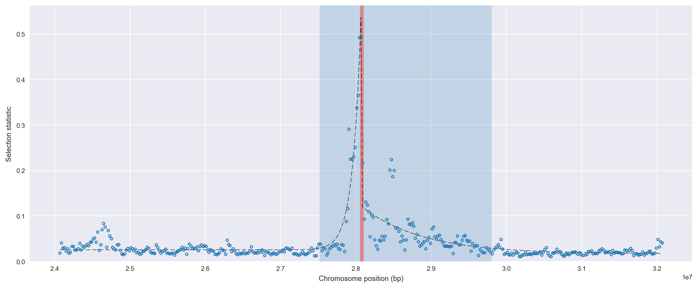
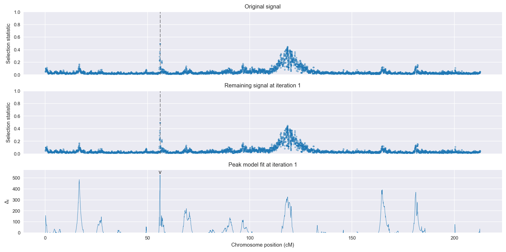
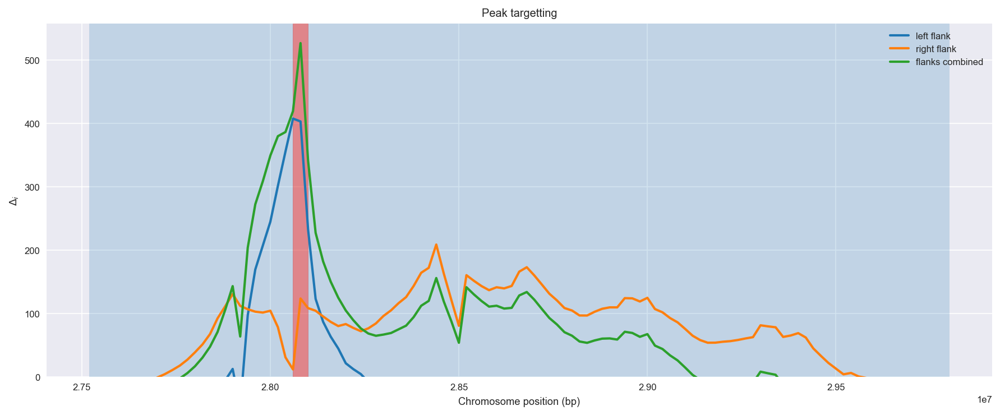
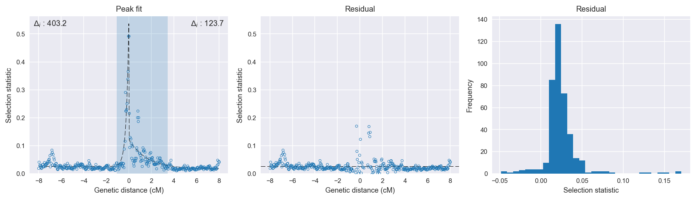

:orphan:

Angola *An. coluzzii* | H12 | Chromosome 2 | Signal #1
================================================================================

This page describes a signal of selection found in the
:doc:`/population/AOM` population using the
:doc:`/method/H12` statistic.The inferred focus of this signal is on chromosome arm
**2R** between positions **28,060,001** and
**28,100,000**.

The following 6 genes overlap the focal region: :doc:`/gene/AGAP002828`,  :doc:`/gene/AGAP002829` (SPN-E - ATP-dependent RNA helicase spindle-E),  :doc:`/gene/AGAP002830` (C-1-tetrahydrofolate synthase, mitochondrial precursor),  :doc:`/gene/AGAP002831` (ribosomal RNA small subunit methyltransferase H),  :doc:`/gene/AGAP013130`,  :doc:`/gene/AGAP002832` (protein-tyrosine phosphatase).

The following 3 genes are within 50 kbp of the focal
region: :doc:`/gene/AGAP002824` (GPRTAK1 - putative tachykinin receptor 1),  :doc:`/gene/AGAP002825` (PPO1 - prophenoloxidase 1),  :doc:`/gene/AGAP002826`.

    **Figure 1**. Location of the signal of selection. Blue markers show the
    value of the selection statistic in non-overlapping 20 kbp windows. The
    dashed black line shows the fitted peak model. The vertical red bar shows
    the inferred focus of the selection signal. The shaded blue area shows the
    inferred genomic region affected by the selection event.

Overlapping signals
-------------------

No overlapping signals.

Diagnostics
-----------

The information below provides some diagnostics from the
:doc:`/method/peak_modelling` algorithm.

    **Figure 2**. Chromosome-wide selection statistic and results from peak
    modelling. **a**, TODO. **b**, TODO.

    **Figure 3**. Diagnostics from targetting the selection signal to a focal
    region. TODO.

    **Figure 4**. Diagnostics from fitting a peak model to the selection signal.
    **a**, TODO. **b**, TODO. **c**, TODO.

Model fit reports
~~~~~~~~~~~~~~~~~

Left flank, peak model::

    [[Model]]
        Model(exponential)
    [[Fit Statistics]]
        # function evals   = 31
        # data points      = 201
        # variables        = 3
        chi-square         = 0.066
        reduced chi-square = 0.000
        Akaike info crit   = -1605.461
        Bayesian info crit = -1595.551
    [[Variables]]
        amplitude:   0.51064878 +/- 0.013118 (2.57%) (init= 0.5)
        decay:       0.22201650 +/- 0.009068 (4.08%) (init= 0.5)
        c:           0.02578251 +/- 0.001368 (5.31%) (init= 0.03)
        cap:         1 (fixed)
    [[Correlations]] (unreported correlations are <  0.100)
        C(amplitude, decay)          = -0.614 
        C(decay, c)                  = -0.242 

Right flank, peak model::

    [[Model]]
        Model(exponential)
    [[Fit Statistics]]
        # function evals   = 35
        # data points      = 199
        # variables        = 3
        chi-square         = 0.114
        reduced chi-square = 0.001
        Akaike info crit   = -1478.638
        Bayesian info crit = -1468.758
    [[Variables]]
        amplitude:   0.10489720 +/- 0.007855 (7.49%) (init= 0.5)
        decay:       1.59869992 +/- 0.255201 (15.96%) (init= 0.5)
        c:           0.01716838 +/- 0.003360 (19.57%) (init= 0.03)
        cap:         1 (fixed)
    [[Correlations]] (unreported correlations are <  0.100)
        C(decay, c)                  = -0.755 
        C(amplitude, decay)          = -0.443 

Left flank, null model::

    [[Model]]
        Model(constant)
    [[Fit Statistics]]
        # function evals   = 6
        # data points      = 199
        # variables        = 1
        chi-square         = 0.468
        reduced chi-square = 0.002
        Akaike info crit   = -1202.273
        Bayesian info crit = -1198.980
    [[Variables]]
        c:   0.03665340 +/- 0.003448 (9.41%) (init= 0.03)

Right flank, null model::

    [[Model]]
        Model(constant)
    [[Fit Statistics]]
        # function evals   = 6
        # data points      = 198
        # variables        = 1
        chi-square         = 0.209
        reduced chi-square = 0.001
        Akaike info crit   = -1354.950
        Bayesian info crit = -1351.662
    [[Variables]]
        c:   0.03687920 +/- 0.002315 (6.28%) (init= 0.03)

Comments
--------

.. raw:: html

    

    
    <noscript>Please enable JavaScript to view the <a href="https://disqus.com/?ref_noscript">comments powered by Disqus.</a></noscript>
