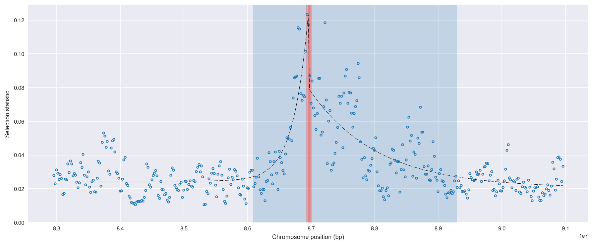
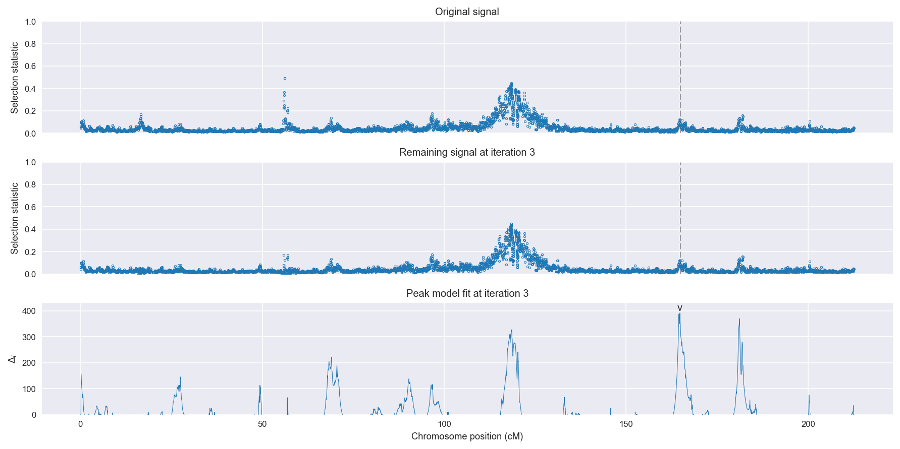
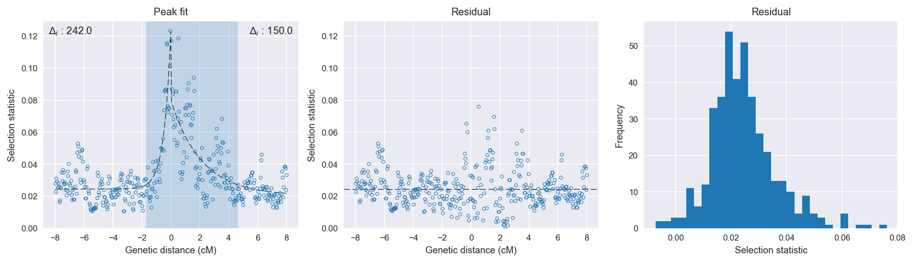

:orphan:

Angola *An. coluzzii* | H12 | Chromosome 2 | Signal #3
================================================================================

This page describes a signal of selection found in the
:doc:`/population/AOM` population using the
:doc:`/method/H12` statistic.The inferred focus of this signal is on chromosome arm
**2L between position 25,380,001 and
25,460,000**.

The following 3 genes overlap the focal region: :doc:`/gene/AGAP006028` (Rdl - GABA-gated chloride channel subunit),  :doc:`/gene/AGAP006029`,  :doc:`/gene/AGAP006030` (mfrn - mitoferrin).

The following 4 genes are within 40 kbp of the focal
region: :doc:`/gene/AGAP006031` (nuclear pore complex protein Nup54),  :doc:`/gene/AGAP006032`,  :doc:`/gene/AGAP006033`,  :doc:`/gene/AGAP006034`.

    **Figure 1**. Location of the signal of selection. Blue markers show the
    value of the selection statistic in non-overlapping 20 kbp windows. The
    dashed black line shows the fitted peak model. The vertical red bar shows
    the inferred focus of the selection signal. The shaded blue area shows the
    inferred genomic region affected by the selection event.

Overlapping signals
-------------------

The following selection signals have an inferred focus which overlaps with the
focus of this signal:

.. cssclass:: table-hover
.. csv-table::
    :widths: auto
    :header: Signal, Focus, Score

    :doc:`/signal/H12/BFM/chr2/2/index`,":25400001-25500000",1180
    :doc:`/signal/H12/BFS/chr2/5/index`,":25380001-25440000",365
    

Diagnostics
-----------

The information below provides some diagnostics from the
:doc:`/method/peak_modelling` algorithm.

    **Figure 2**. Chromosome-wide selection statistic and results from peak
    modelling. **a**, TODO. **b**, TODO.

.. figure:: peak_targetting.png

    **Figure 3**. Diagnostics from targetting the selection signal to a focal
    region. TODO.

    **Figure 4**. Diagnostics from fitting a peak model to the selection signal.
    **a**, TODO. **b**, TODO. **c**, TODO.

Model fit reports
~~~~~~~~~~~~~~~~~

Left flank, peak model::

    [[Model]]
        Model(exponential)
    [[Fit Statistics]]
        # function evals   = 27
        # data points      = 201
        # variables        = 3
        chi-square         = 0.021
        reduced chi-square = 0.000
        Akaike info crit   = -1839.589
        Bayesian info crit = -1829.679
    [[Variables]]
        amplitude:   0.09838622 +/- 0.005458 (5.55%) (init= 0.5)
        decay:       0.47672672 +/- 0.041888 (8.79%) (init= 0.5)
        c:           0.02451441 +/- 0.000825 (3.37%) (init= 0.03)
        cap:         1 (fixed)
    [[Correlations]] (unreported correlations are <  0.100)
        C(amplitude, decay)          = -0.621 
        C(decay, c)                  = -0.367 

Right flank, peak model::

    [[Model]]
        Model(exponential)
    [[Fit Statistics]]
        # function evals   = 31
        # data points      = 200
        # variables        = 3
        chi-square         = 0.036
        reduced chi-square = 0.000
        Akaike info crit   = -1718.842
        Bayesian info crit = -1708.947
    [[Variables]]
        amplitude:   0.05934914 +/- 0.003862 (6.51%) (init= 0.5)
        decay:       2.12598213 +/- 0.365931 (17.21%) (init= 0.5)
        c:           0.02048246 +/- 0.002586 (12.63%) (init= 0.03)
        cap:         1 (fixed)
    [[Correlations]] (unreported correlations are <  0.100)
        C(decay, c)                  = -0.851 
        C(amplitude, decay)          = -0.218 
        C(amplitude, c)              = -0.180 

Left flank, null model::

    [[Model]]
        Model(constant)
    [[Fit Statistics]]
        # function evals   = 6
        # data points      = 200
        # variables        = 1
        chi-square         = 0.067
        reduced chi-square = 0.000
        Akaike info crit   = -1597.587
        Bayesian info crit = -1594.288
    [[Variables]]
        c:   0.03013194 +/- 0.001299 (4.31%) (init= 0.03)

Right flank, null model::

    [[Model]]
        Model(constant)
    [[Fit Statistics]]
        # function evals   = 6
        # data points      = 199
        # variables        = 1
        chi-square         = 0.074
        reduced chi-square = 0.000
        Akaike info crit   = -1568.797
        Bayesian info crit = -1565.503
    [[Variables]]
        c:   0.03532733 +/- 0.001372 (3.89%) (init= 0.03)

Comments
--------

.. raw:: html

    

    
    <noscript>Please enable JavaScript to view the <a href="https://disqus.com/?ref_noscript">comments powered by Disqus.</a></noscript>
