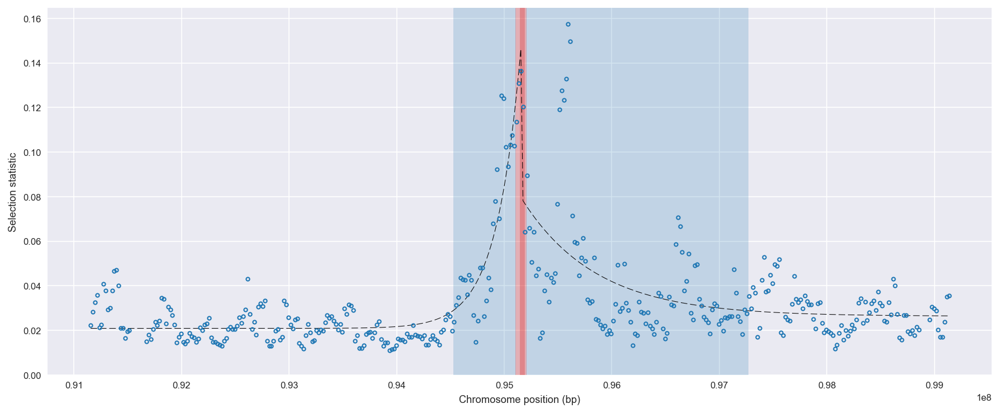
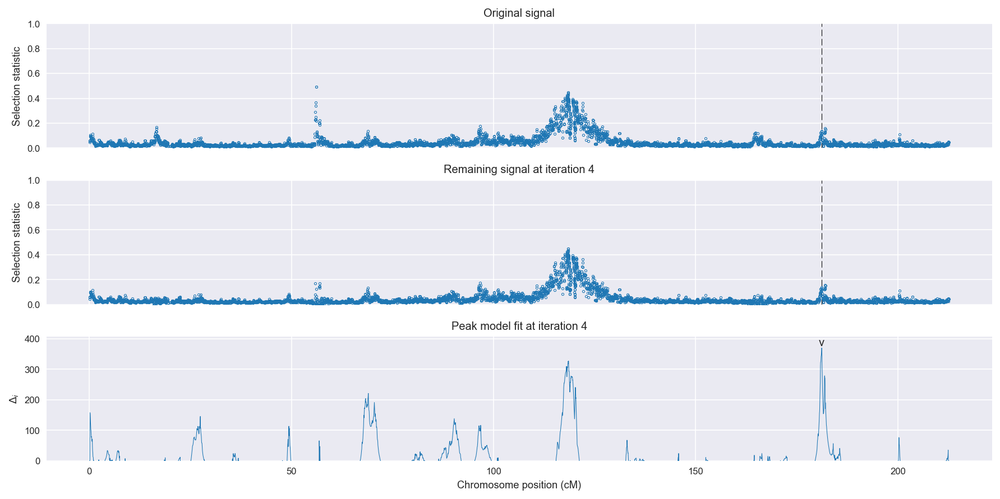
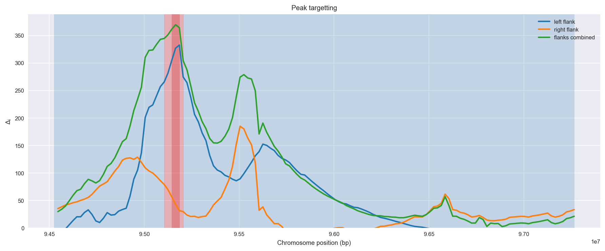
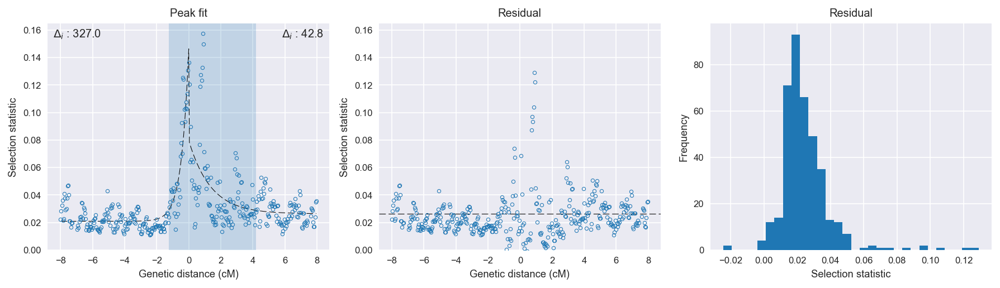

:orphan:

Angola *An. coluzzii* | H12 | Chromosome 2 | Signal #4
================================================================================

This page describes a signal of selection found in the
:doc:`/population/AOM` population using the
:doc:`/method/H12` statistic.The inferred focus of this signal is on chromosome arm
**2L between position 33,560,001 and
33,660,000**.

Gene :doc:`/gene/AGAP006515` (Multiplexin transcript 1) overlaps the focal region.

No genes are within 50 kbp of the focal region.

    **Figure 1**. Location of the signal of selection. Blue markers show the
    value of the selection statistic in non-overlapping 20 kbp windows. The
    dashed black line shows the fitted peak model. The vertical red bar shows
    the inferred focus of the selection signal. The shaded blue area shows the
    inferred genomic region affected by the selection event.

Overlapping signals
-------------------

No overlapping signals.

Diagnostics
-----------

The information below provides some diagnostics from the
:doc:`/method/peak_modelling` algorithm.

    **Figure 2**. Chromosome-wide selection statistic and results from peak
    modelling. **a**, TODO. **b**, TODO.

    **Figure 3**. Diagnostics from targetting the selection signal to a focal
    region. TODO.

    **Figure 4**. Diagnostics from fitting a peak model to the selection signal.
    **a**, TODO. **b**, TODO. **c**, TODO.

Model fit reports
~~~~~~~~~~~~~~~~~

Left flank, peak model::

    [[Model]]
        Model(exponential)
    [[Fit Statistics]]
        # function evals   = 27
        # data points      = 194
        # variables        = 3
        chi-square         = 0.018
        reduced chi-square = 0.000
        Akaike info crit   = -1800.675
        Bayesian info crit = -1790.872
    [[Variables]]
        amplitude:   0.12541324 +/- 0.005206 (4.15%) (init= 0.5)
        decay:       0.45688923 +/- 0.030075 (6.58%) (init= 0.5)
        c:           0.02092277 +/- 0.000786 (3.76%) (init= 0.03)
        cap:         1 (fixed)
    [[Correlations]] (unreported correlations are <  0.100)
        C(amplitude, decay)          = -0.620 
        C(decay, c)                  = -0.365 

Right flank, peak model::

    [[Model]]
        Model(exponential)
    [[Fit Statistics]]
        # function evals   = 31
        # data points      = 195
        # variables        = 3
        chi-square         = 0.074
        reduced chi-square = 0.000
        Akaike info crit   = -1530.012
        Bayesian info crit = -1520.193
    [[Variables]]
        amplitude:   0.05334030 +/- 0.006901 (12.94%) (init= 0.5)
        decay:       1.37445979 +/- 0.349353 (25.42%) (init= 0.5)
        c:           0.02636170 +/- 0.002457 (9.32%) (init= 0.03)
        cap:         1 (fixed)
    [[Correlations]] (unreported correlations are <  0.100)
        C(decay, c)                  = -0.705 
        C(amplitude, decay)          = -0.504 

Left flank, null model::

    [[Model]]
        Model(constant)
    [[Fit Statistics]]
        # function evals   = 6
        # data points      = 193
        # variables        = 1
        chi-square         = 0.092
        reduced chi-square = 0.000
        Akaike info crit   = -1473.723
        Bayesian info crit = -1470.461
    [[Variables]]
        c:   0.02807642 +/- 0.001577 (5.62%) (init= 0.03)

Right flank, null model::

    [[Model]]
        Model(constant)
    [[Fit Statistics]]
        # function evals   = 6
        # data points      = 194
        # variables        = 1
        chi-square         = 0.090
        reduced chi-square = 0.000
        Akaike info crit   = -1487.249
        Bayesian info crit = -1483.981
    [[Variables]]
        c:   0.03496420 +/- 0.001549 (4.43%) (init= 0.03)

Comments
--------

.. raw:: html

    

    
    <noscript>Please enable JavaScript to view the <a href="https://disqus.com/?ref_noscript">comments powered by Disqus.</a></noscript>
