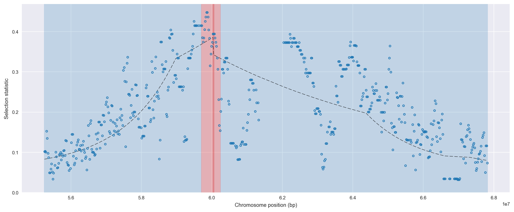
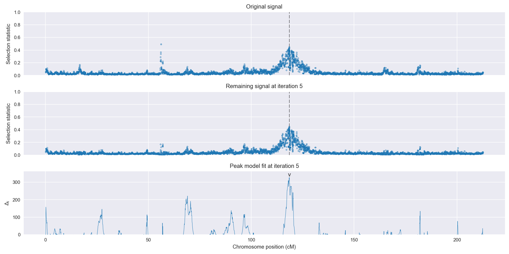
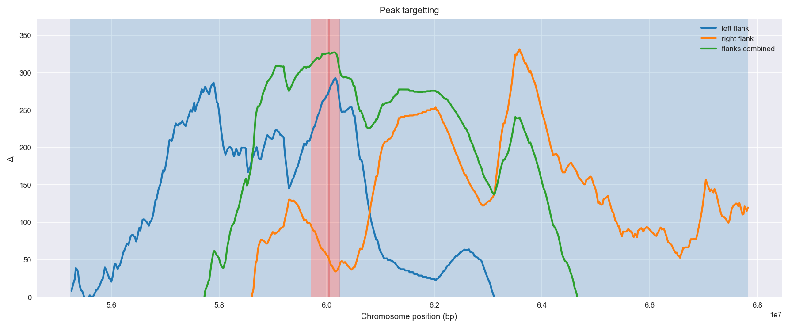
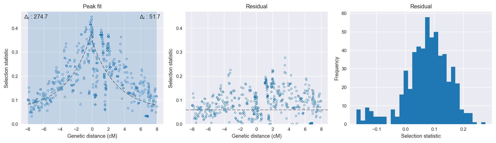

:orphan:

Angola *An. coluzzii* | H12 | Chromosome 2 | Signal #5
================================================================================

This page describes a signal of selection found in the
:doc:`/population/AOM` population using the
:doc:`/method/H12` statistic.The inferred focus of this signal is on chromosome arm
**2R between position 59,700,001 and
60,240,000**.

The following 5 genes overlap the focal region: :doc:`/gene/AGAP004659` (Homeotic antennapedia protein),  :doc:`/gene/AGAP013157` (Antp family),  :doc:`/gene/AGAP004660` (Antennapedia homeotic protein),  :doc:`/gene/AGAP004661` (Antp family, other),  :doc:`/gene/AGAP004662` (homeobox protein abdominal-A homolog).

No genes are within 50 kbp of the focal region.

    **Figure 1**. Location of the signal of selection. Blue markers show the
    value of the selection statistic in non-overlapping 20 kbp windows. The
    dashed black line shows the fitted peak model. The vertical red bar shows
    the inferred focus of the selection signal. The shaded blue area shows the
    inferred genomic region affected by the selection event.

Overlapping signals
-------------------

No overlapping signals.

Diagnostics
-----------

The information below provides some diagnostics from the
:doc:`/method/peak_modelling` algorithm.

    **Figure 2**. Chromosome-wide selection statistic and results from peak
    modelling. **a**, TODO. **b**, TODO.

    **Figure 3**. Diagnostics from targetting the selection signal to a focal
    region. TODO.

    **Figure 4**. Diagnostics from fitting a peak model to the selection signal.
    **a**, TODO. **b**, TODO. **c**, TODO.

Model fit reports
~~~~~~~~~~~~~~~~~

Left flank, peak model::

    [[Model]]
        Model(exponential)
    [[Fit Statistics]]
        # function evals   = 118
        # data points      = 231
        # variables        = 3
        chi-square         = 0.832
        reduced chi-square = 0.004
        Akaike info crit   = -1293.619
        Bayesian info crit = -1283.292
    [[Variables]]
        amplitude:   0.32575182 +/- 0.016642 (5.11%) (init= 0.5)
        decay:       2.99999954 +/- 0.381878 (12.73%) (init= 0.5)
        c:           0.05999999 +/- 0.012391 (20.65%) (init= 0.03)
        cap:         1 (fixed)
    [[Correlations]] (unreported correlations are <  0.100)
        C(decay, c)                  =  0.927 
        C(amplitude, c)              =  0.827 
        C(amplitude, decay)          =  0.640 

Right flank, peak model::

    [[Model]]
        Model(exponential)
    [[Fit Statistics]]
        # function evals   = 97
        # data points      = 333
        # variables        = 3
        chi-square         = 2.762
        reduced chi-square = 0.008
        Akaike info crit   = -1589.838
        Bayesian info crit = -1578.413
    [[Variables]]
        amplitude:   0.28327241 +/- 0.020214 (7.14%) (init= 0.5)
        decay:       2.99999991 +/- 0.566945 (18.90%) (init= 0.5)
        c:           0.05999999 +/- 0.008752 (14.59%) (init= 0.03)
        cap:         1 (fixed)
    [[Correlations]] (unreported correlations are <  0.100)
        C(decay, c)                  =  0.908 
        C(amplitude, c)              =  0.756 
        C(amplitude, decay)          =  0.491 

Left flank, null model::

    [[Model]]
        Model(constant)
    [[Fit Statistics]]
        # function evals   = 6
        # data points      = 229
        # variables        = 1
        chi-square         = 2.653
        reduced chi-square = 0.012
        Akaike info crit   = -1018.906
        Bayesian info crit = -1015.472
    [[Variables]]
        c:   0.20612081 +/- 0.007128 (3.46%) (init= 0.03)

Right flank, null model::

    [[Model]]
        Model(constant)
    [[Fit Statistics]]
        # function evals   = 6
        # data points      = 331
        # variables        = 1
        chi-square         = 3.156
        reduced chi-square = 0.010
        Akaike info crit   = -1538.107
        Bayesian info crit = -1534.304
    [[Variables]]
        c:   0.20718236 +/- 0.005375 (2.59%) (init= 0.03)

Comments
--------

.. raw:: html

    

    
    <noscript>Please enable JavaScript to view the <a href="https://disqus.com/?ref_noscript">comments powered by Disqus.</a></noscript>
