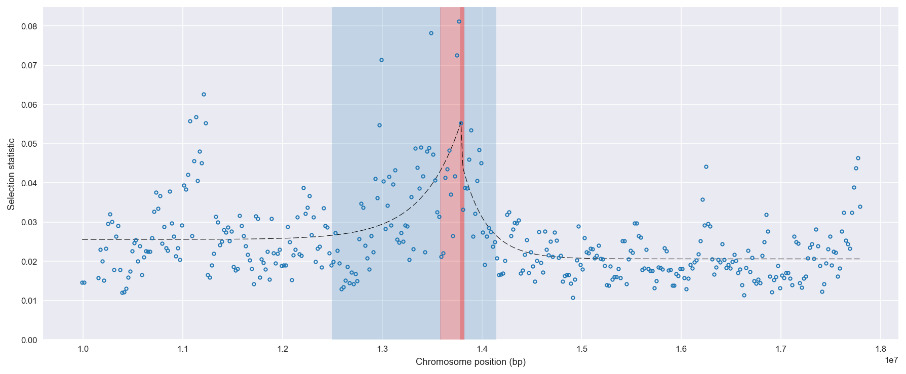
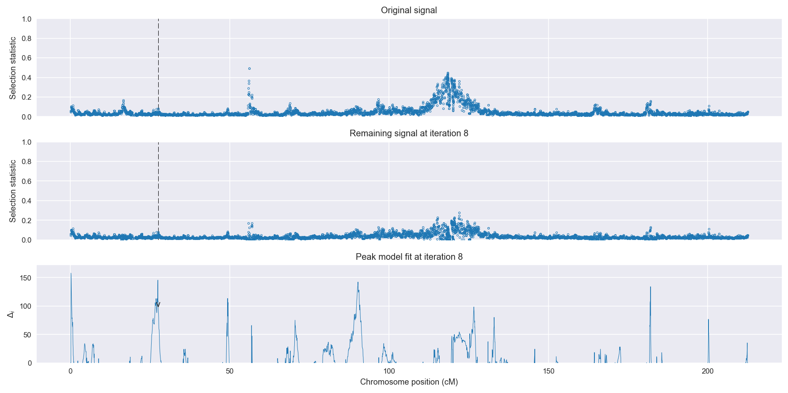
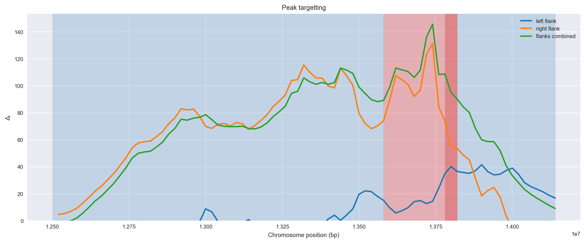
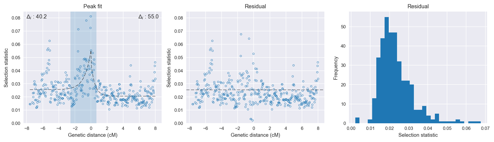

:orphan:

Angola *An. coluzzii* | H12 | Chromosome 2 | Signal #8
================================================================================

This page describes a signal of selection found in the
:doc:`/population/AOM` population using the
:doc:`/method/H12` statistic.The inferred focus of this signal is on chromosome arm
2R between position 13,580,001 and
13,820,000.

Gene :doc:`/gene/AGAP002007` (reticulon/nogo receptor) overlaps the focal region.

The following 3 genes are within 50 kbp of the focal
region: :doc:`/gene/AGAP002005`,  :doc:`/gene/AGAP002006` (reticulon/nogo receptor),  :doc:`/gene/AGAP002008`.

    **Figure 1**. Location of the signal of selection. Blue markers show the
    value of the selection statistic in non-overlapping 20 kbp windows. The
    dashed black line shows the fitted peak model. The vertical red bar shows
    the inferred focus of the selection signal. The shaded blue area shows the
    inferred genomic region affected by the selection event.

Overlapping signals
-------------------

No overlapping signals.

Diagnostics
-----------

The information below provides some diagnostics from the
:doc:`/method/peak_modelling` algorithm.

    **Figure 2**. Chromosome-wide selection statistic and results from peak
    modelling. **a**, TODO. **b**, TODO.

    **Figure 3**. Diagnostics from targetting the selection signal to a focal
    region. TODO.

    **Figure 4**. Diagnostics from fitting a peak model to the selection signal.
    **a**, TODO. **b**, TODO. **c**, TODO.

Model fit reports
~~~~~~~~~~~~~~~~~

Left flank, peak model::

    [[Model]]
        Model(exponential)
    [[Fit Statistics]]
        # function evals   = 31
        # data points      = 185
        # variables        = 3
        chi-square         = 0.022
        reduced chi-square = 0.000
        Akaike info crit   = -1668.570
        Bayesian info crit = -1658.909
    [[Variables]]
        amplitude:   0.02987747 +/- 0.004716 (15.78%) (init= 0.5)
        decay:       0.77450177 +/- 0.206750 (26.69%) (init= 0.5)
        c:           0.02554015 +/- 0.001052 (4.12%) (init= 0.03)
        cap:         1 (fixed)
    [[Correlations]] (unreported correlations are <  0.100)
        C(amplitude, decay)          = -0.579 
        C(decay, c)                  = -0.514 

Right flank, peak model::

    [[Model]]
        Model(exponential)
    [[Fit Statistics]]
        # function evals   = 27
        # data points      = 200
        # variables        = 3
        chi-square         = 0.008
        reduced chi-square = 0.000
        Akaike info crit   = -2021.286
        Bayesian info crit = -2011.391
    [[Variables]]
        amplitude:   0.02521496 +/- 0.003941 (15.63%) (init= 0.5)
        decay:       0.49002984 +/- 0.112039 (22.86%) (init= 0.5)
        c:           0.02057878 +/- 0.000516 (2.51%) (init= 0.03)
        cap:         1 (fixed)
    [[Correlations]] (unreported correlations are <  0.100)
        C(amplitude, decay)          = -0.691 
        C(decay, c)                  = -0.374 

Left flank, null model::

    [[Model]]
        Model(constant)
    [[Fit Statistics]]
        # function evals   = 6
        # data points      = 184
        # variables        = 1
        chi-square         = 0.026
        reduced chi-square = 0.000
        Akaike info crit   = -1628.377
        Bayesian info crit = -1625.162
    [[Variables]]
        c:   0.02846307 +/- 0.000880 (3.09%) (init= 0.03)

Right flank, null model::

    [[Model]]
        Model(constant)
    [[Fit Statistics]]
        # function evals   = 6
        # data points      = 199
        # variables        = 1
        chi-square         = 0.010
        reduced chi-square = 0.000
        Akaike info crit   = -1966.287
        Bayesian info crit = -1962.994
    [[Variables]]
        c:   0.02190326 +/- 0.000506 (2.31%) (init= 0.03)

Comments
--------

.. raw:: html

    

    
    <noscript>Please enable JavaScript to view the <a href="https://disqus.com/?ref_noscript">comments powered by Disqus.</a></noscript>
