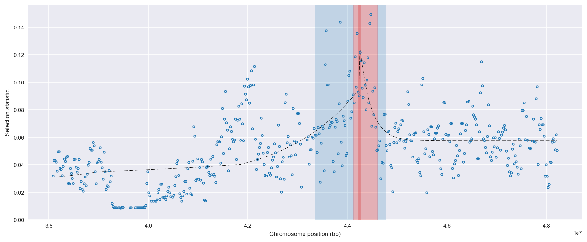
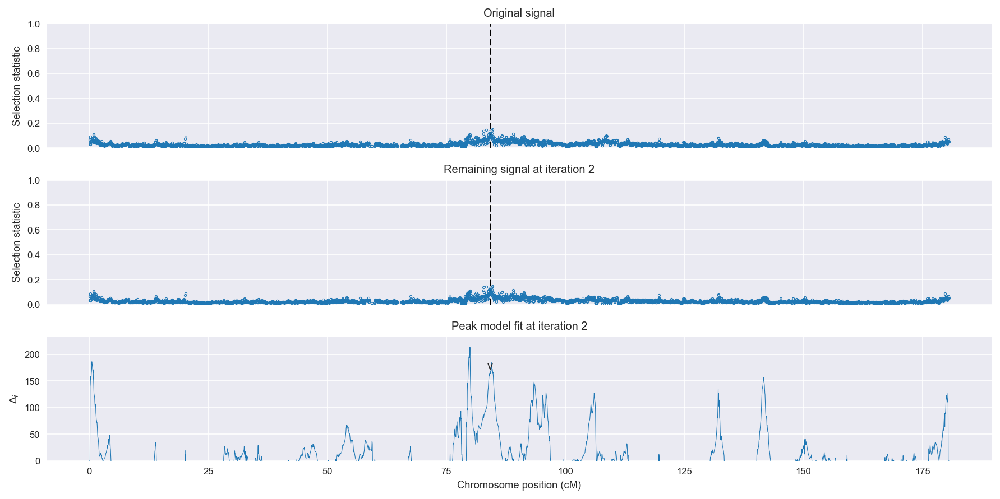
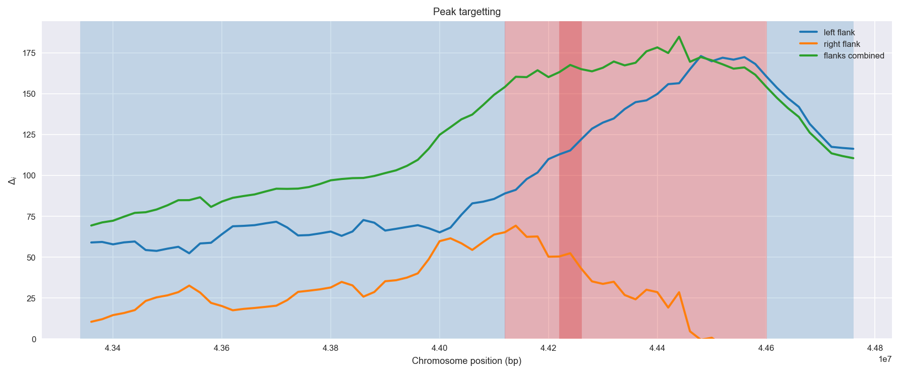
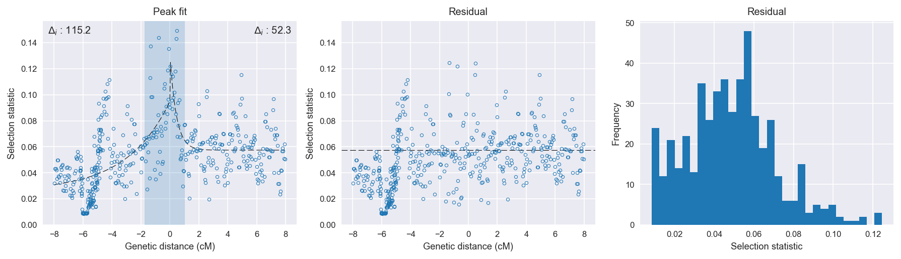

:orphan:

Angola *An. coluzzii* | H12 | Chromosome 3 | Signal #2
================================================================================

This page describes a signal of selection found in the
:doc:`/population/AOM` population using the
:doc:`/method/H12` statistic.The inferred focus of this signal is on chromosome arm
**3R** between positions **44,120,001** and
**44,600,000**.

The following 23 genes overlap the focal region: :doc:`/gene/AGAP009847` (Outspread),  :doc:`/gene/AGAP009848`,  :doc:`/gene/AGAP009849` (SP14D1),  :doc:`/gene/AGAP009850` (ABCG7 - ATP-binding cassette transporter (ABC transporter) family G member 7),  :doc:`/gene/AGAP009851`,  :doc:`/gene/AGAP009852` (mitochondrial fission 1 protein),  :doc:`/gene/AGAP009853` (Gr5 - gustatory receptor 5),  :doc:`/gene/AGAP009854` (Gr6 - gustatory receptor 6),  :doc:`/gene/AGAP009855` (Gr7 - gustatory receptor 7),  :doc:`/gene/AGAP009856` (Gr8 - gustatory receptor 8),  :doc:`/gene/AGAP009857` (Gr4 - gustatory receptor 4),  :doc:`/gene/AGAP009858` (Gr3 - gustatory receptor 3),  :doc:`/gene/AGAP009859`,  :doc:`/gene/AGAP009860`,  :doc:`/gene/AGAP009861` (Profilin protein),  :doc:`/gene/AGAP009862`,  :doc:`/gene/AGAP009863` (eukaryotic translation initiation factor 4A, isoform 2),  :doc:`/gene/AGAP009864`,  :doc:`/gene/AGAP009865` (NADH dehydrogenase (ubiquinone) 1 beta subcomplex 9),  :doc:`/gene/AGAP009866` (dolichol-phosphate mannosyltransferase),  :doc:`/gene/AGAP009867` (AFG1-family ATPase),  :doc:`/gene/AGAP009868` (CPR73 - cuticular protein RR-1 family 73),  :doc:`/gene/AGAP009869` (CPR74 - cuticular protein RR-1 family 74).

The following 17 genes are within 50 kbp of the focal
region: :doc:`/gene/AGAP009836`,  :doc:`/gene/AGAP009837`,  :doc:`/gene/AGAP009838` (Non-imprinted in Prader-Willi/Angelman syndrome region protein 2-like protein),  :doc:`/gene/AGAP009839` (Phosphatase 1 regulatory subunit 7),  :doc:`/gene/AGAP009840` (USO1 vesicle docking protein homolog),  :doc:`/gene/AGAP009841`,  :doc:`/gene/AGAP009842` (ribonuclease T2),  :doc:`/gene/AGAP009843`,  :doc:`/gene/AGAP009844` (CLIPB15 - CLIP-domain serine protease),  :doc:`/gene/AGAP009845`,  :doc:`/gene/AGAP009846` (Ras-related protein Rab-9A),  :doc:`/gene/AGAP009870` (CPR151 - cuticular protein RR-2 family 151),  :doc:`/gene/AGAP009871` (CPR75 - cuticular protein RR-1 family 75),  :doc:`/gene/AGAP009872` (CPR133 - cuticular protein RR-1 family 133),  :doc:`/gene/AGAP009873` (CPR153 - cuticular protein RR-2 family 153),  :doc:`/gene/AGAP028422`,  :doc:`/gene/AGAP009874` (CPR76 - cuticular protein RR-1 family 76).

    **Figure 1**. Location of the signal of selection. Blue markers show the
    value of the selection statistic in non-overlapping 20 kbp windows. The
    dashed black line shows the fitted peak model. The vertical red bar shows
    the inferred focus of the selection signal. The shaded blue area shows the
    inferred genomic region affected by the selection event.

Overlapping signals
-------------------

No overlapping signals.

Diagnostics
-----------

The information below provides some diagnostics from the
:doc:`/method/peak_modelling` algorithm.

    **Figure 2**. Chromosome-wide selection statistic and results from peak
    modelling. **a**, TODO. **b**, TODO.

    **Figure 3**. Diagnostics from targetting the selection signal to a focal
    region. TODO.

    **Figure 4**. Diagnostics from fitting a peak model to the selection signal.
    **a**, TODO. **b**, TODO. **c**, TODO.

Model fit reports
~~~~~~~~~~~~~~~~~

Left flank, peak model::

    [[Model]]
        Model(exponential)
    [[Fit Statistics]]
        # function evals   = 39
        # data points      = 289
        # variables        = 3
        chi-square         = 0.132
        reduced chi-square = 0.000
        Akaike info crit   = -2216.497
        Bayesian info crit = -2205.497
    [[Variables]]
        amplitude:   0.06850651 +/- 0.005921 (8.64%) (init= 0.5)
        decay:       2.99999951 +/- 0.875698 (29.19%) (init= 0.5)
        c:           0.02615185 +/- 0.006608 (25.27%) (init= 0.03)
        cap:         1 (fixed)
    [[Correlations]] (unreported correlations are <  0.100)
        C(decay, c)                  = -0.952 
        C(amplitude, c)              = -0.573 
        C(amplitude, decay)          =  0.367 

Right flank, peak model::

    [[Model]]
        Model(exponential)
    [[Fit Statistics]]
        # function evals   = 35
        # data points      = 196
        # variables        = 3
        chi-square         = 0.062
        reduced chi-square = 0.000
        Akaike info crit   = -1574.999
        Bayesian info crit = -1565.165
    [[Variables]]
        amplitude:   0.07385539 +/- 0.011719 (15.87%) (init= 0.5)
        decay:       0.44700179 +/- 0.102623 (22.96%) (init= 0.5)
        c:           0.05742324 +/- 0.001451 (2.53%) (init= 0.03)
        cap:         1 (fixed)
    [[Correlations]] (unreported correlations are <  0.100)
        C(amplitude, decay)          = -0.697 
        C(decay, c)                  = -0.359 

Left flank, null model::

    [[Model]]
        Model(constant)
    [[Fit Statistics]]
        # function evals   = 6
        # data points      = 288
        # variables        = 1
        chi-square         = 0.194
        reduced chi-square = 0.001
        Akaike info crit   = -2101.273
        Bayesian info crit = -2097.610
    [[Variables]]
        c:   0.04557484 +/- 0.001531 (3.36%) (init= 0.03)

Right flank, null model::

    [[Model]]
        Model(constant)
    [[Fit Statistics]]
        # function evals   = 6
        # data points      = 195
        # variables        = 1
        chi-square         = 0.078
        reduced chi-square = 0.000
        Akaike info crit   = -1522.680
        Bayesian info crit = -1519.407
    [[Variables]]
        c:   0.06099715 +/- 0.001439 (2.36%) (init= 0.03)

Comments
--------

.. raw:: html

    

    
    <noscript>Please enable JavaScript to view the <a href="https://disqus.com/?ref_noscript">comments powered by Disqus.</a></noscript>
