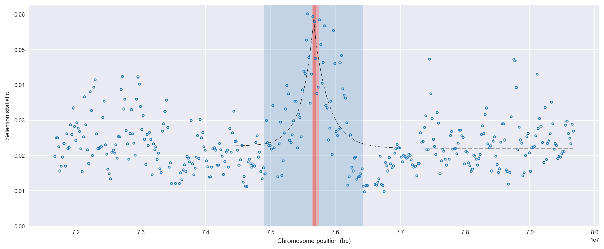
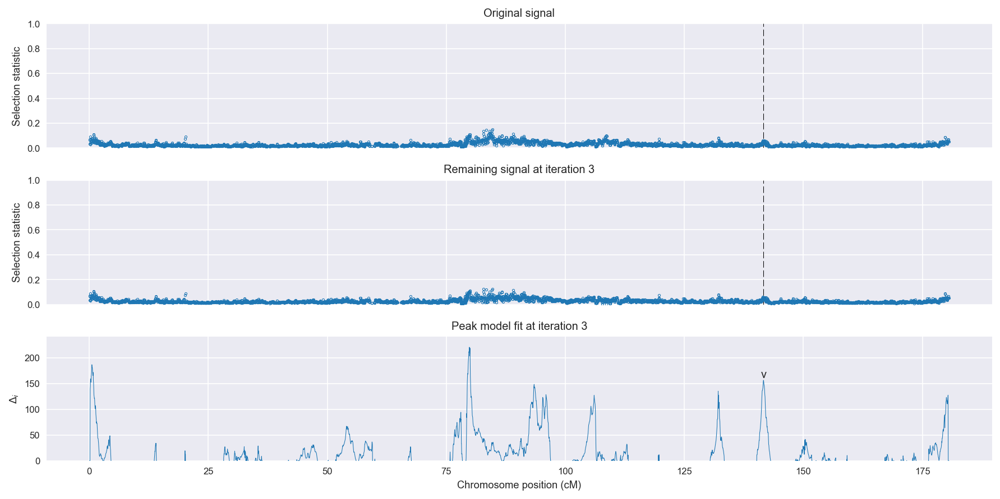
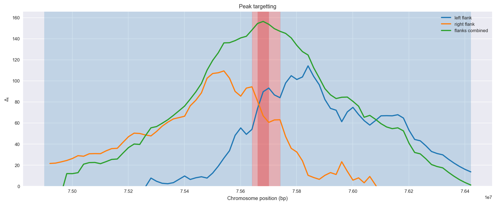
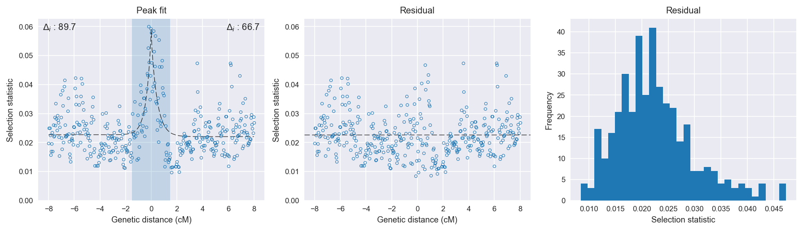

:orphan:

Angola *An. coluzzii* | H12 | Chromosome 3 | Signal #3
================================================================================

This page describes a signal of selection found in the
:doc:`/population/AOM` population using the
:doc:`/method/H12` statistic.The inferred focus of this signal is on chromosome arm
**3L between position 22,440,001 and
22,540,000**.

The following 2 genes overlap the focal region: :doc:`/gene/AGAP011376`,  :doc:`/gene/AGAP011377`.

The following 2 genes are within 40 kbp of the focal
region: :doc:`/gene/AGAP011374` (AP-1 complex subunit mu),  :doc:`/gene/AGAP011375` (Selenophosphate synthetase 2).

    **Figure 1**. Location of the signal of selection. Blue markers show the
    value of the selection statistic in non-overlapping 20 kbp windows. The
    dashed black line shows the fitted peak model. The vertical red bar shows
    the inferred focus of the selection signal. The shaded blue area shows the
    inferred genomic region affected by the selection event.

Overlapping signals
-------------------

No overlapping signals.

Diagnostics
-----------

The information below provides some diagnostics from the
:doc:`/method/peak_modelling` algorithm.

    **Figure 2**. Chromosome-wide selection statistic and results from peak
    modelling. **a**, TODO. **b**, TODO.

    **Figure 3**. Diagnostics from targetting the selection signal to a focal
    region. TODO.

    **Figure 4**. Diagnostics from fitting a peak model to the selection signal.
    **a**, TODO. **b**, TODO. **c**, TODO.

Model fit reports
~~~~~~~~~~~~~~~~~

Left flank, peak model::

    [[Model]]
        Model(exponential)
    [[Fit Statistics]]
        # function evals   = 27
        # data points      = 195
        # variables        = 3
        chi-square         = 0.009
        reduced chi-square = 0.000
        Akaike info crit   = -1933.545
        Bayesian info crit = -1923.726
    [[Variables]]
        amplitude:   0.03627823 +/- 0.004111 (11.33%) (init= 0.5)
        decay:       0.37820572 +/- 0.067786 (17.92%) (init= 0.5)
        c:           0.02270548 +/- 0.000554 (2.44%) (init= 0.03)
        cap:         1 (fixed)
    [[Correlations]] (unreported correlations are <  0.100)
        C(amplitude, decay)          = -0.627 
        C(decay, c)                  = -0.317 

Right flank, peak model::

    [[Model]]
        Model(exponential)
    [[Fit Statistics]]
        # function evals   = 41
        # data points      = 193
        # variables        = 3
        chi-square         = 0.011
        reduced chi-square = 0.000
        Akaike info crit   = -1872.374
        Bayesian info crit = -1862.585
    [[Variables]]
        amplitude:   0.03395799 +/- 0.005005 (14.74%) (init= 0.5)
        decay:       0.46334982 +/- 0.099305 (21.43%) (init= 0.5)
        c:           0.02205737 +/- 0.000635 (2.88%) (init= 0.03)
        cap:         1 (fixed)
    [[Correlations]] (unreported correlations are <  0.100)
        C(amplitude, decay)          = -0.697 
        C(decay, c)                  = -0.349 

Left flank, null model::

    [[Model]]
        Model(constant)
    [[Fit Statistics]]
        # function evals   = 6
        # data points      = 194
        # variables        = 1
        chi-square         = 0.014
        reduced chi-square = 0.000
        Akaike info crit   = -1843.886
        Bayesian info crit = -1840.618
    [[Variables]]
        c:   0.02435925 +/- 0.000618 (2.54%) (init= 0.03)

Right flank, null model::

    [[Model]]
        Model(constant)
    [[Fit Statistics]]
        # function evals   = 6
        # data points      = 192
        # variables        = 1
        chi-square         = 0.016
        reduced chi-square = 0.000
        Akaike info crit   = -1805.638
        Bayesian info crit = -1802.380
    [[Variables]]
        c:   0.02380931 +/- 0.000653 (2.74%) (init= 0.03)

Comments
--------

.. raw:: html

    

    
    <noscript>Please enable JavaScript to view the <a href="https://disqus.com/?ref_noscript">comments powered by Disqus.</a></noscript>
