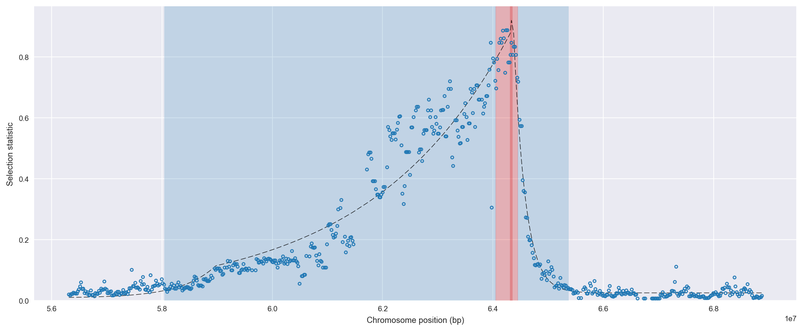
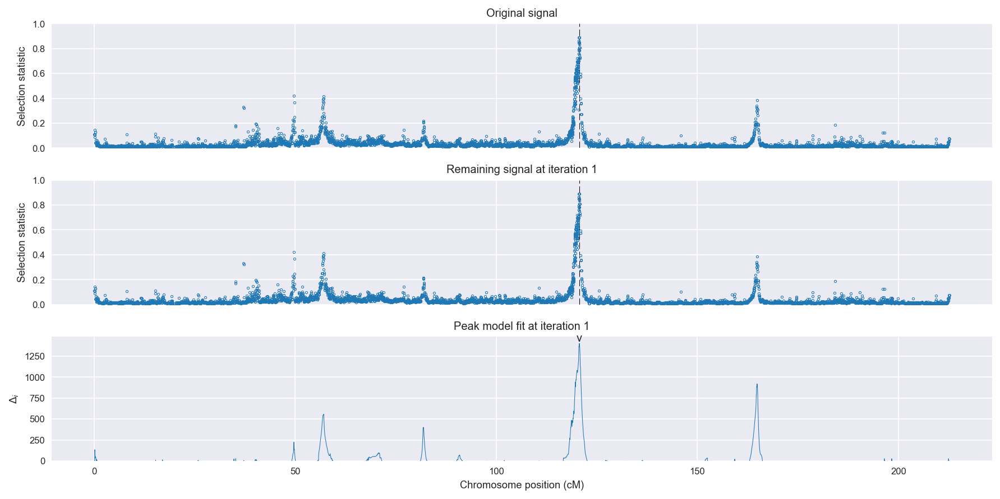
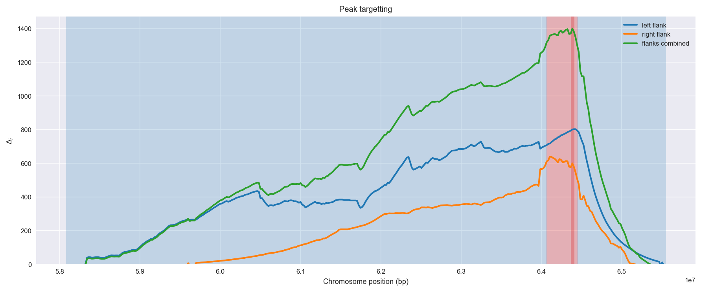
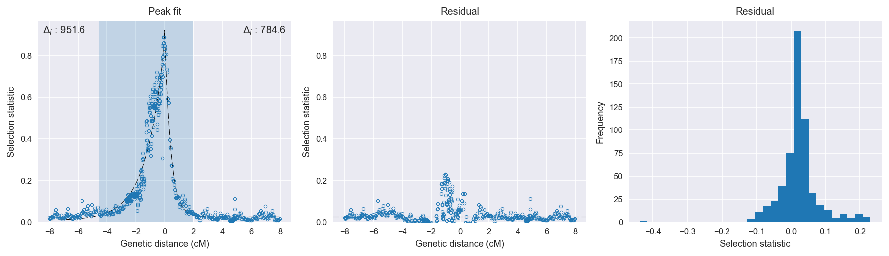

:orphan:

Burkina Faso *An. coluzzii* | H12 | Chromosome 2 | Signal #1
================================================================================

This page describes a signal of selection found in the
:doc:`/population/BFM` population using the
:doc:`/method/H12` statistic.The inferred focus of this signal is on chromosome arm
**2L between position 2,500,001 and
2,900,000**.

The following 21 genes overlap the focal region: :doc:`/gene/AGAP004712`,  :doc:`/gene/AGAP004713`,  :doc:`/gene/AGAP004714`,  :doc:`/gene/AGAP004715` (Pyruvate dehydrogenase phosphatase regulatory subunit, mitochondrial),  :doc:`/gene/AGAP004716` (Gr57 - gustatory receptor 57),  :doc:`/gene/AGAP004717`,  :doc:`/gene/AGAP004718`,  :doc:`/gene/AGAP004719` (CLIPC9 - CLIP-domain serine protease),  :doc:`/gene/AGAP004720`,  :doc:`/gene/AGAP004721` (N-acetylglucosamine-6-sulfatase),  :doc:`/gene/AGAP004722`,  :doc:`/gene/AGAP004723` (chromobox protein homolog 1),  :doc:`/gene/AGAP004724` (Intraflagellar transport 74 homolog),  :doc:`/gene/AGAP004725` (eIF3c - Eukaryotic translation initiation factor 3 subunit C),  :doc:`/gene/AGAP004726` (Uncharacterized protein CG3556),  :doc:`/gene/AGAP004727` (Gr25 - gustatory receptor 25),  :doc:`/gene/AGAP004728`,  :doc:`/gene/AGAP004729`,  :doc:`/gene/AGAP004730` (phospholipase A2, venom),  :doc:`/gene/AGAP004731` (secretory phospholipase A2),  :doc:`/gene/AGAP029113`.

The following 5 genes are within 40 kbp of the focal
region: :doc:`/gene/AGAP004708` (arginyl-tRNA synthetase),  :doc:`/gene/AGAP004709` (mRpL18 - 39S ribosomal protein L18, mitochondrial),  :doc:`/gene/AGAP004710` (ubiquinol-cytochrome c reductase subunit 9),  :doc:`/gene/AGAP004711` (ATP-dependent RNA helicase DDX41),  :doc:`/gene/AGAP004733`.

    **Figure 1**. Location of the signal of selection. Blue markers show the
    value of the selection statistic in non-overlapping 20 kbp windows. The
    dashed black line shows the fitted peak model. The vertical red bar shows
    the inferred focus of the selection signal. The shaded blue area shows the
    inferred genomic region affected by the selection event.

Overlapping signals
-------------------

The following selection signals have an inferred focus which overlaps with the
focus of this signal:

.. cssclass:: table-hover
.. csv-table::
    :widths: auto
    :header: Signal, Focus, Score

    :doc:`/signal/H12/BFS/chr2/1/index`,":2420001-2720000",1728
    :doc:`/signal/H12/GNS/chr2/1/index`,":1720001-2700000",1554
    :doc:`/signal/H12/UGS/chr2/2/index`,":1940001-3080000",1332
    :doc:`/signal/H12/CMS/chr2/2/index`,":2460001-2960000",635
    :doc:`/signal/H12/GAS/chr2/2/index`,":2600001-2640000",321
    

Diagnostics
-----------

The information below provides some diagnostics from the
:doc:`/method/peak_modelling` algorithm.

    **Figure 2**. Chromosome-wide selection statistic and results from peak
    modelling. **a**, TODO. **b**, TODO.

    **Figure 3**. Diagnostics from targetting the selection signal to a focal
    region. TODO.

    **Figure 4**. Diagnostics from fitting a peak model to the selection signal.
    **a**, TODO. **b**, TODO. **c**, TODO.

Model fit reports
~~~~~~~~~~~~~~~~~

Left flank, peak model::

    [[Model]]
        Model(exponential)
    [[Fit Statistics]]
        # function evals   = 36
        # data points      = 373
        # variables        = 3
        chi-square         = 1.816
        reduced chi-square = 0.005
        Akaike info crit   = -1980.163
        Bayesian info crit = -1968.398
    [[Variables]]
        amplitude:   0.86999827 +/- 0.013531 (1.56%) (init= 0.5)
        decay:       1.26590384 +/- 0.043571 (3.44%) (init= 0.5)
        c:           0.00870821 +/- 0.007521 (86.37%) (init= 0.03)
        cap:         1 (fixed)
    [[Correlations]] (unreported correlations are <  0.100)
        C(decay, c)                  = -0.722 
        C(amplitude, decay)          = -0.282 
        C(amplitude, c)              = -0.271 

Right flank, peak model::

    [[Model]]
        Model(exponential)
    [[Fit Statistics]]
        # function evals   = 23
        # data points      = 216
        # variables        = 3
        chi-square         = 0.126
        reduced chi-square = 0.001
        Akaike info crit   = -1603.203
        Bayesian info crit = -1593.077
    [[Variables]]
        amplitude:   0.91726899 +/- 0.011996 (1.31%) (init= 0.5)
        decay:       0.42062242 +/- 0.009403 (2.24%) (init= 0.5)
        c:           0.02519707 +/- 0.001845 (7.32%) (init= 0.03)
        cap:         1 (fixed)
    [[Correlations]] (unreported correlations are <  0.100)
        C(amplitude, decay)          = -0.581 
        C(decay, c)                  = -0.330 

Left flank, null model::

    [[Model]]
        Model(constant)
    [[Fit Statistics]]
        # function evals   = 6
        # data points      = 371
        # variables        = 1
        chi-square         = 23.064
        reduced chi-square = 0.062
        Akaike info crit   = -1028.609
        Bayesian info crit = -1024.693
    [[Variables]]
        c:   0.25450694 +/- 0.012962 (5.09%) (init= 0.03)

Right flank, null model::

    [[Model]]
        Model(constant)
    [[Fit Statistics]]
        # function evals   = 6
        # data points      = 215
        # variables        = 1
        chi-square         = 4.730
        reduced chi-square = 0.022
        Akaike info crit   = -818.614
        Bayesian info crit = -815.243
    [[Variables]]
        c:   0.07337573 +/- 0.010138 (13.82%) (init= 0.03)

Comments
--------

.. raw:: html

    

    
    <noscript>Please enable JavaScript to view the <a href="https://disqus.com/?ref_noscript">comments powered by Disqus.</a></noscript>
