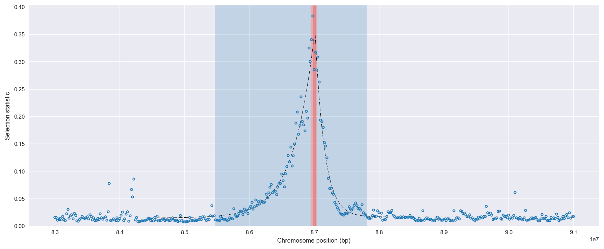
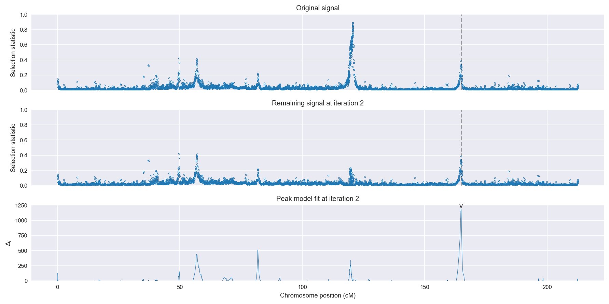
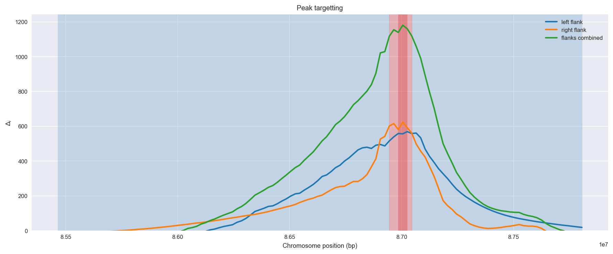
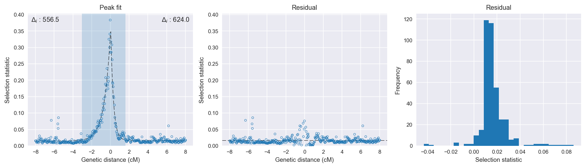

:orphan:

Burkina Faso *An. coluzzii* | H12 | Chromosome 2 | Signal #2
================================================================================

This page describes a signal of selection found in the
:doc:`/population/BFM` population using the
:doc:`/method/H12` statistic.The inferred focus of this signal is on chromosome arm
**2L between position 25,400,001 and
25,500,000**.

The following 7 genes overlap the focal region: :doc:`/gene/AGAP006028` (Rdl - GABA-gated chloride channel subunit),  :doc:`/gene/AGAP006029`,  :doc:`/gene/AGAP006030` (mfrn - mitoferrin),  :doc:`/gene/AGAP006031` (nuclear pore complex protein Nup54),  :doc:`/gene/AGAP006032`,  :doc:`/gene/AGAP006033`,  :doc:`/gene/AGAP006034`.

The following 6 genes are within 40 kbp of the focal
region: :doc:`/gene/AGAP006035` (Ras-related protein Rab-36),  :doc:`/gene/AGAP006036` (axonemal dynein intermediate chain inner arm i1),  :doc:`/gene/AGAP006037` (RpL24 - 60S ribosomal protein L24),  :doc:`/gene/AGAP006038` (serine/arginine repetitive matrix protein 2),  :doc:`/gene/AGAP006039`,  :doc:`/gene/AGAP006040` (peroxisomal membrane protein 2).

    **Figure 1**. Location of the signal of selection. Blue markers show the
    value of the selection statistic in non-overlapping 20 kbp windows. The
    dashed black line shows the fitted peak model. The vertical red bar shows
    the inferred focus of the selection signal. The shaded blue area shows the
    inferred genomic region affected by the selection event.

Overlapping signals
-------------------

The following selection signals have an inferred focus which overlaps with the
focus of this signal:

.. cssclass:: table-hover
.. csv-table::
    :widths: auto
    :header: Signal, Focus, Score

    :doc:`/signal/H12/GAS/chr2/1/index`,":25460001-25540000",568
    :doc:`/signal/H12/AOM/chr2/3/index`,":25380001-25460000",392
    :doc:`/signal/H12/BFS/chr2/5/index`,":25380001-25440000",365
    

Diagnostics
-----------

The information below provides some diagnostics from the
:doc:`/method/peak_modelling` algorithm.

    **Figure 2**. Chromosome-wide selection statistic and results from peak
    modelling. **a**, TODO. **b**, TODO.

    **Figure 3**. Diagnostics from targetting the selection signal to a focal
    region. TODO.

    **Figure 4**. Diagnostics from fitting a peak model to the selection signal.
    **a**, TODO. **b**, TODO. **c**, TODO.

Model fit reports
~~~~~~~~~~~~~~~~~

Left flank, peak model::

    [[Model]]
        Model(exponential)
    [[Fit Statistics]]
        # function evals   = 19
        # data points      = 201
        # variables        = 3
        chi-square         = 0.046
        reduced chi-square = 0.000
        Akaike info crit   = -1680.703
        Bayesian info crit = -1670.793
    [[Variables]]
        amplitude:   0.32820719 +/- 0.007042 (2.15%) (init= 0.5)
        decay:       0.65972277 +/- 0.023007 (3.49%) (init= 0.5)
        c:           0.01493003 +/- 0.001305 (8.75%) (init= 0.03)
        cap:         1 (fixed)
    [[Correlations]] (unreported correlations are <  0.100)
        C(amplitude, decay)          = -0.605 
        C(decay, c)                  = -0.443 

Right flank, peak model::

    [[Model]]
        Model(exponential)
    [[Fit Statistics]]
        # function evals   = 23
        # data points      = 200
        # variables        = 3
        chi-square         = 0.016
        reduced chi-square = 0.000
        Akaike info crit   = -1882.106
        Bayesian info crit = -1872.211
    [[Variables]]
        amplitude:   0.38085828 +/- 0.007734 (2.03%) (init= 0.5)
        decay:       0.28854378 +/- 0.008035 (2.78%) (init= 0.5)
        c:           0.01678378 +/- 0.000687 (4.09%) (init= 0.03)
        cap:         1 (fixed)
    [[Correlations]] (unreported correlations are <  0.100)
        C(amplitude, decay)          = -0.732 
        C(decay, c)                  = -0.279 

Left flank, null model::

    [[Model]]
        Model(constant)
    [[Fit Statistics]]
        # function evals   = 6
        # data points      = 200
        # variables        = 1
        chi-square         = 0.717
        reduced chi-square = 0.004
        Akaike info crit   = -1124.192
        Bayesian info crit = -1120.893
    [[Variables]]
        c:   0.04097983 +/- 0.004244 (10.36%) (init= 0.03)

Right flank, null model::

    [[Model]]
        Model(constant)
    [[Fit Statistics]]
        # function evals   = 6
        # data points      = 199
        # variables        = 1
        chi-square         = 0.354
        reduced chi-square = 0.002
        Akaike info crit   = -1258.105
        Bayesian info crit = -1254.812
    [[Variables]]
        c:   0.02814429 +/- 0.002996 (10.65%) (init= 0.03)

Comments
--------

.. raw:: html

    

    
    <noscript>Please enable JavaScript to view the <a href="https://disqus.com/?ref_noscript">comments powered by Disqus.</a></noscript>
