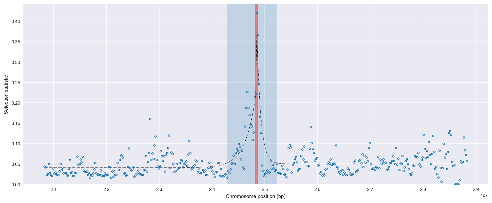
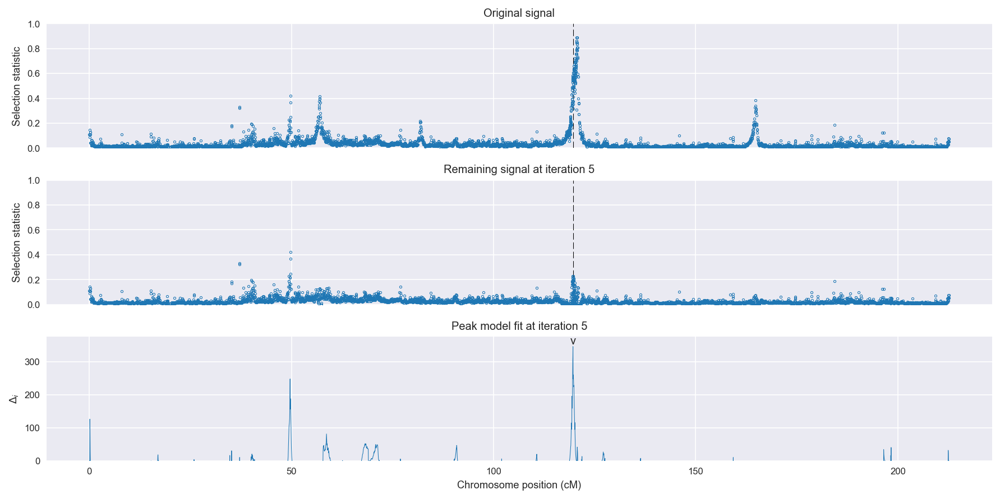
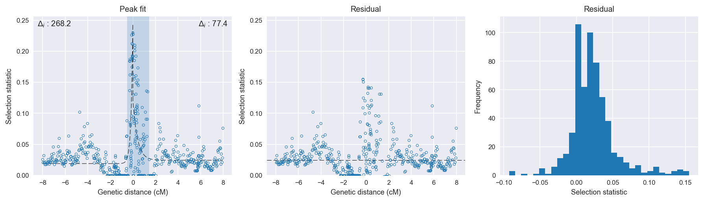

:orphan:

Burkina Faso *An. coluzzii* | H12 | Chromosome 2 | Signal #5
================================================================================

This page describes a signal of selection found in the
:doc:`/population/BFM` population using the
:doc:`/method/H12` statistic.The inferred focus of this signal is on chromosome arm
**2L between position 740,001 and
820,000**.

The following 2 genes overlap the focal region: :doc:`/gene/AGAP004686`,  :doc:`/gene/AGAP004687`.

No genes are within 50 kbp of the focal region.

    **Figure 1**. Location of the signal of selection. Blue markers show the
    value of the selection statistic in non-overlapping 20 kbp windows. The
    dashed black line shows the fitted peak model. The vertical red bar shows
    the inferred focus of the selection signal. The shaded blue area shows the
    inferred genomic region affected by the selection event.

Overlapping signals
-------------------

No overlapping signals.

Diagnostics
-----------

The information below provides some diagnostics from the
:doc:`/method/peak_modelling` algorithm.

    **Figure 2**. Chromosome-wide selection statistic and results from peak
    modelling. **a**, TODO. **b**, TODO.

.. figure:: peak_targetting.png

    **Figure 3**. Diagnostics from targetting the selection signal to a focal
    region. TODO.

    **Figure 4**. Diagnostics from fitting a peak model to the selection signal.
    **a**, TODO. **b**, TODO. **c**, TODO.

Model fit reports
~~~~~~~~~~~~~~~~~

Left flank, peak model::

    [[Model]]
        Model(exponential)
    [[Fit Statistics]]
        # function evals   = 27
        # data points      = 300
        # variables        = 3
        chi-square         = 0.231
        reduced chi-square = 0.001
        Akaike info crit   = -2144.392
        Bayesian info crit = -2133.281
    [[Variables]]
        amplitude:   0.22470128 +/- 0.013660 (6.08%) (init= 0.5)
        decay:       0.15575859 +/- 0.015806 (10.15%) (init= 0.5)
        c:           0.01897882 +/- 0.001758 (9.27%) (init= 0.03)
        cap:         1 (fixed)
    [[Correlations]] (unreported correlations are <  0.100)
        C(amplitude, decay)          = -0.654 
        C(decay, c)                  = -0.285 

Right flank, peak model::

    [[Model]]
        Model(exponential)
    [[Fit Statistics]]
        # function evals   = 39
        # data points      = 288
        # variables        = 3
        chi-square         = 0.364
        reduced chi-square = 0.001
        Akaike info crit   = -1915.827
        Bayesian info crit = -1904.838
    [[Variables]]
        amplitude:   0.09716035 +/- 0.011972 (12.32%) (init= 0.5)
        decay:       0.40785483 +/- 0.080818 (19.82%) (init= 0.5)
        c:           0.02437690 +/- 0.002678 (10.99%) (init= 0.03)
        cap:         1 (fixed)
    [[Correlations]] (unreported correlations are <  0.100)
        C(amplitude, decay)          = -0.620 
        C(decay, c)                  = -0.427 

Left flank, null model::

    [[Model]]
        Model(constant)
    [[Fit Statistics]]
        # function evals   = 6
        # data points      = 299
        # variables        = 1
        chi-square         = 0.559
        reduced chi-square = 0.002
        Akaike info crit   = -1876.150
        Bayesian info crit = -1872.449
    [[Variables]]
        c:   0.02911329 +/- 0.002505 (8.61%) (init= 0.03)

Right flank, null model::

    [[Model]]
        Model(constant)
    [[Fit Statistics]]
        # function evals   = 6
        # data points      = 287
        # variables        = 1
        chi-square         = 0.471
        reduced chi-square = 0.002
        Akaike info crit   = -1838.383
        Bayesian info crit = -1834.724
    [[Variables]]
        c:   0.03613673 +/- 0.002395 (6.63%) (init= 0.03)

Comments
--------

.. raw:: html

    

    
    <noscript>Please enable JavaScript to view the <a href="https://disqus.com/?ref_noscript">comments powered by Disqus.</a></noscript>
