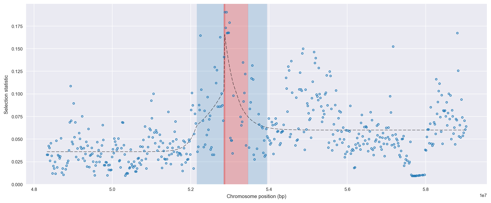
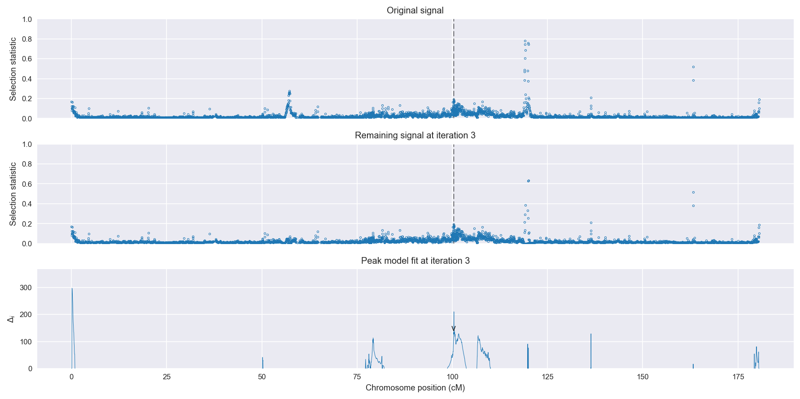
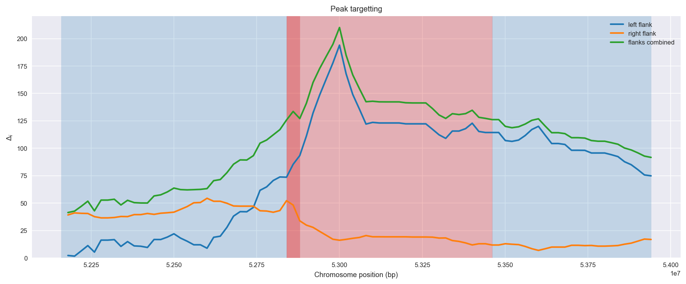
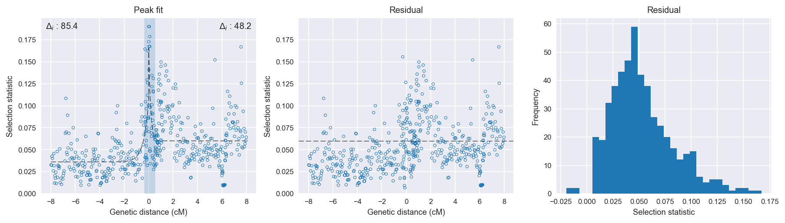

:orphan:

Burkina Faso *An. coluzzii* | H12 | Chromosome 3 | Signal #3
================================================================================

This page describes a signal of selection found in the
:doc:`/population/BFM` population using the
:doc:`/method/H12` statistic.The inferred focus of this signal is between
3R:52,840,001 and
3L:260,000.

The following 10 genes overlap the focal region: :doc:`/gene/AGAP010301`,  :doc:`/gene/AGAP010302`,  :doc:`/gene/AGAP010303` (autophagy-related protein 7),  :doc:`/gene/AGAP010304`,  :doc:`/gene/AGAP010305` (WD repeat and SOF domain-containing protein 1),  :doc:`/gene/AGAP010306`,  :doc:`/gene/AGAP010307` (Pleckstrin homology domain containing, family F (with FYVE domain) member 2),  :doc:`/gene/AGAP010308` (nucleolar complex protein 3),  :doc:`/gene/AGAP010309`,  :doc:`/gene/AGAP027986`.

The following 2 genes are within 50 kbp of the focal
region: :doc:`/gene/AGAP010299`,  :doc:`/gene/AGAP010300`.

    **Figure 1**. Location of the signal of selection. Blue markers show the
    value of the selection statistic in non-overlapping 20 kbp windows. The
    dashed black line shows the fitted peak model. The vertical red bar shows
    the inferred focus of the selection signal. The shaded blue area shows the
    inferred genomic region affected by the selection event.

Overlapping signals
-------------------

No overlapping signals.

Diagnostics
-----------

The information below provides some diagnostics from the
:doc:`/method/peak_modelling` algorithm.

    **Figure 2**. Chromosome-wide selection statistic and results from peak
    modelling. **a**, TODO. **b**, TODO.

    **Figure 3**. Diagnostics from targetting the selection signal to a focal
    region. TODO.

    **Figure 4**. Diagnostics from fitting a peak model to the selection signal.
    **a**, TODO. **b**, TODO. **c**, TODO.

Model fit reports
~~~~~~~~~~~~~~~~~

Left flank, peak model::

    [[Model]]
        Model(exponential)
    [[Fit Statistics]]
        # function evals   = 27
        # data points      = 218
        # variables        = 3
        chi-square         = 0.100
        reduced chi-square = 0.000
        Akaike info crit   = -1670.563
        Bayesian info crit = -1660.410
    [[Variables]]
        amplitude:   0.06794670 +/- 0.007640 (11.24%) (init= 0.5)
        decay:       0.41109717 +/- 0.097269 (23.66%) (init= 0.5)
        c:           0.03605275 +/- 0.001708 (4.74%) (init= 0.03)
        cap:         1 (fixed)
    [[Correlations]] (unreported correlations are <  0.100)
        C(amplitude, decay)          = -0.620 
        C(decay, c)                  = -0.339 
        C(amplitude, c)              = -0.101 

Right flank, peak model::

    [[Model]]
        Model(exponential)
    [[Fit Statistics]]
        # function evals   = 117
        # data points      = 282
        # variables        = 3
        chi-square         = 0.284
        reduced chi-square = 0.001
        Akaike info crit   = -1940.290
        Bayesian info crit = -1929.365
    [[Variables]]
        amplitude:   0.11279621 +/- 0.018097 (16.04%) (init= 0.5)
        decay:       0.15000037 +/- 0.033175 (22.12%) (init= 0.5)
        c:           0.05999999 +/- 0.002900 (4.83%) (init= 0.03)
        cap:         1 (fixed)
    [[Correlations]] (unreported correlations are <  0.100)
        C(amplitude, decay)          = -0.666 
        C(decay, c)                  =  0.306 

Left flank, null model::

    [[Model]]
        Model(constant)
    [[Fit Statistics]]
        # function evals   = 6
        # data points      = 217
        # variables        = 1
        chi-square         = 0.145
        reduced chi-square = 0.001
        Akaike info crit   = -1585.198
        Bayesian info crit = -1581.819
    [[Variables]]
        c:   0.04316368 +/- 0.001755 (4.07%) (init= 0.03)

Right flank, null model::

    [[Model]]
        Model(constant)
    [[Fit Statistics]]
        # function evals   = 6
        # data points      = 281
        # variables        = 1
        chi-square         = 0.332
        reduced chi-square = 0.001
        Akaike info crit   = -1892.096
        Bayesian info crit = -1888.457
    [[Variables]]
        c:   0.06625974 +/- 0.002054 (3.10%) (init= 0.03)

Comments
--------

.. raw:: html

    

    
    <noscript>Please enable JavaScript to view the <a href="https://disqus.com/?ref_noscript">comments powered by Disqus.</a></noscript>
