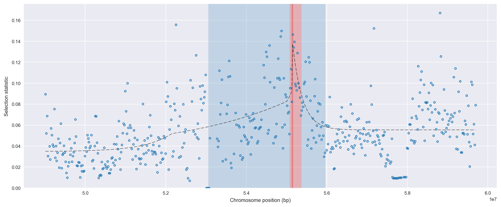
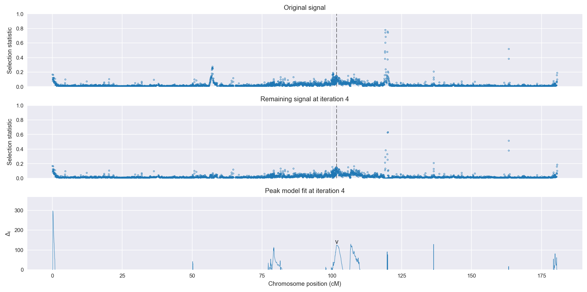
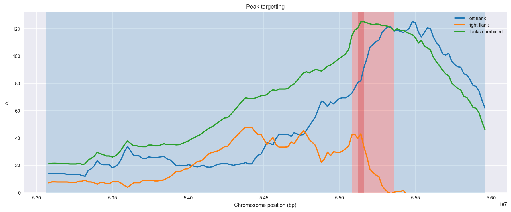
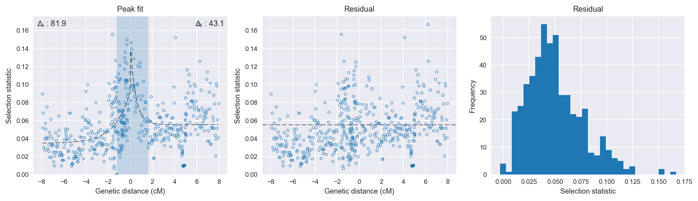

:orphan:

Burkina Faso *An. coluzzii* | H12 | Chromosome 3 | Signal #4
================================================================================

This page describes a signal of selection found in the
:doc:`/population/BFM` population using the
:doc:`/method/H12` statistic.The inferred focus of this signal is on chromosome arm
**3L between position 1,880,001 and
2,160,000**.

The following 15 genes overlap the focal region: :doc:`/gene/AGAP010343` (CTL-like protein 2),  :doc:`/gene/AGAP010344` (solute carrier family 26, other),  :doc:`/gene/AGAP010345` (OTU domain-containing protein 7),  :doc:`/gene/AGAP010346` (Mer - merlin (moesin-ezrin-radixin-like protein)),  :doc:`/gene/AGAP010347` (CuSOD3 - copper-zinc superoxide dismutase 3),  :doc:`/gene/AGAP010348`,  :doc:`/gene/AGAP010349`,  :doc:`/gene/AGAP010350`,  :doc:`/gene/AGAP010351` (insulysin),  :doc:`/gene/AGAP010352` (DNA/RNA-binding protein KIN17),  :doc:`/gene/AGAP010353` (DNA cross-link repair 1A protein),  :doc:`/gene/AGAP010354` (osiris 21),  :doc:`/gene/AGAP010355`,  :doc:`/gene/AGAP010356` (Ring finger protein 130),  :doc:`/gene/AGAP010357`.

The following 2 genes are within 40 kbp of the focal
region: :doc:`/gene/AGAP010358` (paired box protein 3/7),  :doc:`/gene/AGAP010359` (Pairberry).

    **Figure 1**. Location of the signal of selection. Blue markers show the
    value of the selection statistic in non-overlapping 20 kbp windows. The
    dashed black line shows the fitted peak model. The vertical red bar shows
    the inferred focus of the selection signal. The shaded blue area shows the
    inferred genomic region affected by the selection event.

Overlapping signals
-------------------

No overlapping signals.

Diagnostics
-----------

The information below provides some diagnostics from the
:doc:`/method/peak_modelling` algorithm.

    **Figure 2**. Chromosome-wide selection statistic and results from peak
    modelling. **a**, TODO. **b**, TODO.

    **Figure 3**. Diagnostics from targetting the selection signal to a focal
    region. TODO.

    **Figure 4**. Diagnostics from fitting a peak model to the selection signal.
    **a**, TODO. **b**, TODO. **c**, TODO.

Model fit reports
~~~~~~~~~~~~~~~~~

Left flank, peak model::

    [[Model]]
        Model(exponential)
    [[Fit Statistics]]
        # function evals   = 27
        # data points      = 278
        # variables        = 3
        chi-square         = 0.178
        reduced chi-square = 0.001
        Akaike info crit   = -2038.652
        Bayesian info crit = -2027.770
    [[Variables]]
        amplitude:   0.05724119 +/- 0.006420 (11.22%) (init= 0.5)
        decay:       1.38639014 +/- 0.341182 (24.61%) (init= 0.5)
        c:           0.03477721 +/- 0.003000 (8.63%) (init= 0.03)
        cap:         1 (fixed)
    [[Correlations]] (unreported correlations are <  0.100)
        C(decay, c)                  = -0.691 
        C(amplitude, decay)          = -0.500 

Right flank, peak model::

    [[Model]]
        Model(exponential)
    [[Fit Statistics]]
        # function evals   = 23
        # data points      = 223
        # variables        = 3
        chi-square         = 0.148
        reduced chi-square = 0.001
        Akaike info crit   = -1625.902
        Bayesian info crit = -1615.681
    [[Variables]]
        amplitude:   0.08895513 +/- 0.016113 (18.11%) (init= 0.5)
        decay:       0.49022049 +/- 0.128743 (26.26%) (init= 0.5)
        c:           0.05542435 +/- 0.001966 (3.55%) (init= 0.03)
        cap:         1 (fixed)
    [[Correlations]] (unreported correlations are <  0.100)
        C(amplitude, decay)          = -0.696 
        C(decay, c)                  = -0.352 

Left flank, null model::

    [[Model]]
        Model(constant)
    [[Fit Statistics]]
        # function evals   = 6
        # data points      = 277
        # variables        = 1
        chi-square         = 0.235
        reduced chi-square = 0.001
        Akaike info crit   = -1956.752
        Bayesian info crit = -1953.128
    [[Variables]]
        c:   0.05028593 +/- 0.001754 (3.49%) (init= 0.03)

Right flank, null model::

    [[Model]]
        Model(constant)
    [[Fit Statistics]]
        # function evals   = 6
        # data points      = 222
        # variables        = 1
        chi-square         = 0.176
        reduced chi-square = 0.001
        Akaike info crit   = -1582.843
        Bayesian info crit = -1579.441
    [[Variables]]
        c:   0.05963453 +/- 0.001894 (3.18%) (init= 0.03)

Comments
--------

.. raw:: html

    

    
    <noscript>Please enable JavaScript to view the <a href="https://disqus.com/?ref_noscript">comments powered by Disqus.</a></noscript>
