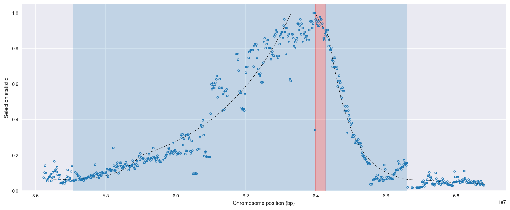
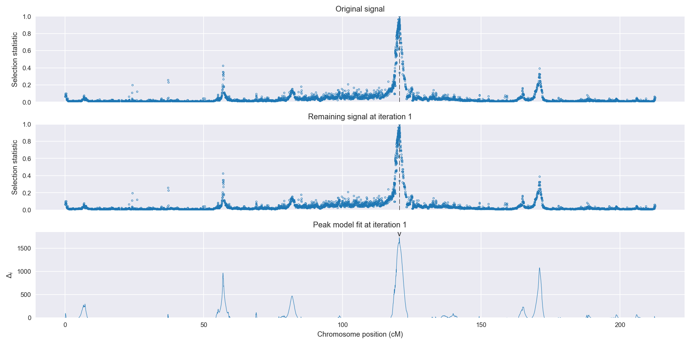
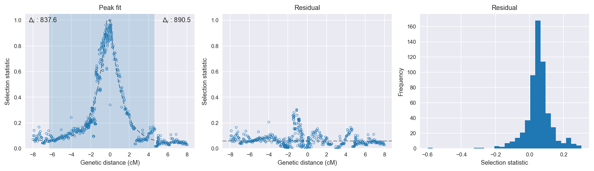

:orphan:

Burkina Faso *An. gambiae* | H12 | Chromosome 2 | Signal #1
================================================================================

This page describes a signal of selection found in the
:doc:`/population/BFS` population using the
:doc:`/method/H12` statistic.The inferred focus of this signal is on chromosome arm
**2L** between positions **2,420,001** and
**2,720,000**.

The following 13 genes overlap the focal region: :doc:`/gene/AGAP004707` (para - voltage-gated sodium channel),  :doc:`/gene/AGAP004708` (arginyl-tRNA synthetase),  :doc:`/gene/AGAP004709` (mRpL18 - 39S ribosomal protein L18, mitochondrial),  :doc:`/gene/AGAP004710` (ubiquinol-cytochrome c reductase subunit 9),  :doc:`/gene/AGAP004711` (ATP-dependent RNA helicase DDX41),  :doc:`/gene/AGAP004712`,  :doc:`/gene/AGAP004713`,  :doc:`/gene/AGAP004714`,  :doc:`/gene/AGAP004715` (Pyruvate dehydrogenase phosphatase regulatory subunit, mitochondrial),  :doc:`/gene/AGAP004716` (Gr57 - gustatory receptor 57),  :doc:`/gene/AGAP004717`,  :doc:`/gene/AGAP004718`,  :doc:`/gene/AGAP004719` (CLIPC9 - CLIP-domain serine protease).

The following 4 genes are within 50 kbp of the focal
region: :doc:`/gene/AGAP004720`,  :doc:`/gene/AGAP004721` (N-acetylglucosamine-6-sulfatase),  :doc:`/gene/AGAP004722`,  :doc:`/gene/AGAP004723` (chromobox protein homolog 1).

    **Figure 1**. Location of the signal of selection. Blue markers show the
    value of the selection statistic in non-overlapping 20 kbp windows. The
    dashed black line shows the fitted peak model. The vertical red bar shows
    the inferred focus of the selection signal. The shaded blue area shows the
    inferred genomic region affected by the selection event.

Overlapping signals
-------------------

The following selection signals have an inferred focus which overlaps with the
focus of this signal:

.. cssclass:: table-hover
.. csv-table::
    :widths: auto
    :header: Signal, Focus, Score

    :doc:`/signal/H12/BFM/chr2/1/index`,"2L:2,500,001-2,900,000",1736
    :doc:`/signal/H12/GNS/chr2/1/index`,"2L:1,720,001-2,700,000",1554
    :doc:`/signal/H12/UGS/chr2/2/index`,"2L:1,940,001-3,080,000",1332
    :doc:`/signal/H12/CMS/chr2/2/index`,"2L:2,460,001-2,960,000",635
    :doc:`/signal/H12/GAS/chr2/2/index`,"2L:2,600,001-2,640,000",321
    

Diagnostics
-----------

The information below provides some diagnostics from the
:doc:`/method/peak_modelling` algorithm.

    **Figure 2**. Chromosome-wide selection statistic and results from peak
    modelling. **a**, TODO. **b**, TODO.

.. figure:: peak_targetting.png

    **Figure 3**. Diagnostics from targetting the selection signal to a focal
    region. TODO.

    **Figure 4**. Diagnostics from fitting a peak model to the selection signal.
    **a**, TODO. **b**, TODO. **c**, TODO.

Model fit reports
~~~~~~~~~~~~~~~~~

Left flank, peak model::

    [[Model]]
        Model(exponential)
    [[Fit Statistics]]
        # function evals   = 75
        # data points      = 360
        # variables        = 3
        chi-square         = 3.347
        reduced chi-square = 0.009
        Akaike info crit   = -1678.122
        Bayesian info crit = -1666.463
    [[Variables]]
        amplitude:   1.26894765 +/- 0.037116 (2.92%) (init= 0.5)
        decay:       1.12435644 +/- 0.051512 (4.58%) (init= 0.5)
        c:           0.05999999 +/- 0.004510 (7.52%) (init= 0.03)
        cap:         1 (fixed)
    [[Correlations]] (unreported correlations are <  0.100)
        C(amplitude, decay)          = -0.720 
        C(decay, c)                  = -0.683 
        C(amplitude, c)              =  0.139 

Right flank, peak model::

    [[Model]]
        Model(exponential)
    [[Fit Statistics]]
        # function evals   = 32
        # data points      = 229
        # variables        = 3
        chi-square         = 0.363
        reduced chi-square = 0.002
        Akaike info crit   = -1470.279
        Bayesian info crit = -1459.978
    [[Variables]]
        amplitude:   0.96328898 +/- 0.009514 (0.99%) (init= 0.5)
        decay:       1.28451219 +/- 0.031312 (2.44%) (init= 0.5)
        c:           0.03775303 +/- 0.004321 (11.45%) (init= 0.03)
        cap:         1 (fixed)
    [[Correlations]] (unreported correlations are <  0.100)
        C(decay, c)                  = -0.670 
        C(amplitude, decay)          = -0.289 
        C(amplitude, c)              = -0.208 

Left flank, null model::

    [[Model]]
        Model(constant)
    [[Fit Statistics]]
        # function evals   = 6
        # data points      = 358
        # variables        = 1
        chi-square         = 34.023
        reduced chi-square = 0.095
        Akaike info crit   = -840.557
        Bayesian info crit = -836.676
    [[Variables]]
        c:   0.36698423 +/- 0.016315 (4.45%) (init= 0.03)

Right flank, null model::

    [[Model]]
        Model(constant)
    [[Fit Statistics]]
        # function evals   = 6
        # data points      = 228
        # variables        = 1
        chi-square         = 17.774
        reduced chi-square = 0.078
        Akaike info crit   = -579.767
        Bayesian info crit = -576.338
    [[Variables]]
        c:   0.22607039 +/- 0.018531 (8.20%) (init= 0.03)

Comments
--------

.. raw:: html

    

    
    <noscript>Please enable JavaScript to view the <a href="https://disqus.com/?ref_noscript">comments powered by Disqus.</a></noscript>
