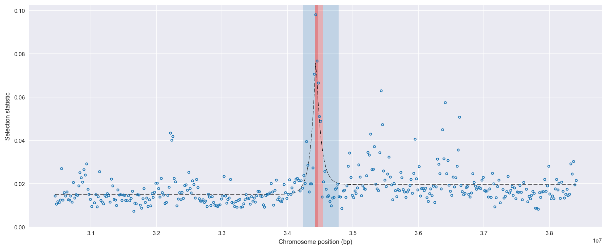
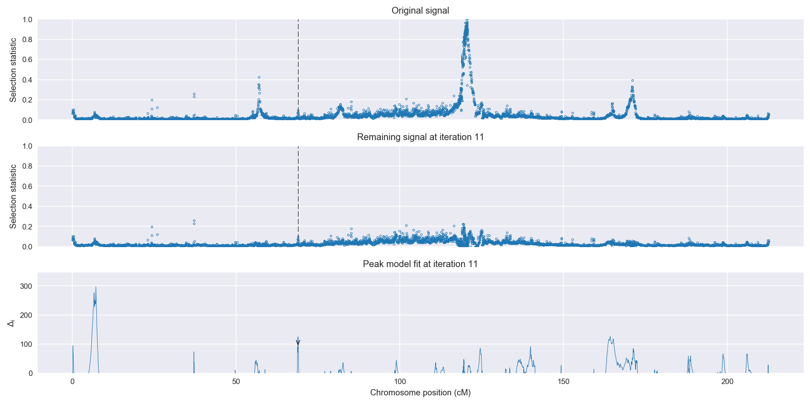
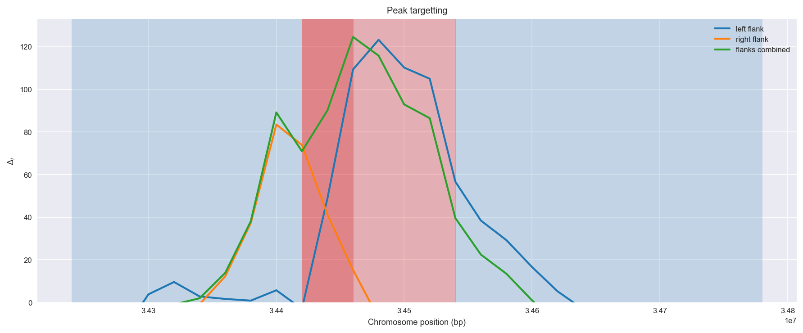
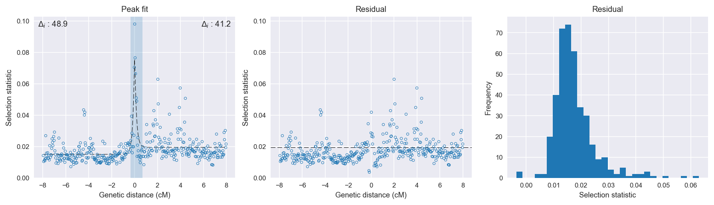

:orphan:

Burkina Faso *An. gambiae* | H12 | Chromosome 2 | Signal #11
================================================================================

This page describes a signal of selection found in the
:doc:`/population/BFS` population using the
:doc:`/method/H12` statistic.The inferred focus of this signal is on chromosome arm
**2R between position 34,420,001 and
34,540,000**.

The following 19 genes overlap the focal region: :doc:`/gene/AGAP003244` (GPRGHP2 - putative growth hormone releasing hormone receptor 2),  :doc:`/gene/AGAP003245` (CLIPA19 - CLIP-domain serine protease),  :doc:`/gene/AGAP003246` (CLIPB2 - CLIP-domain serine protease),  :doc:`/gene/AGAP003247` (CLIPB19 - CLIP-domain serine protease),  :doc:`/gene/AGAP003248`,  :doc:`/gene/AGAP013487`,  :doc:`/gene/AGAP003249` (CLIPB3 - CLIP-domain serine protease),  :doc:`/gene/AGAP003250` (CLIPB4 - CLIP-domain serine protease),  :doc:`/gene/AGAP003251` (CLIPB1 - CLIP-domain serine protease),  :doc:`/gene/AGAP003252` (CLIPB6 - CLIP-domain serine protease),  :doc:`/gene/AGAP013184` (CLIPB36 - CLIP-domain serine protease),  :doc:`/gene/AGAP003253` (Gr15 - gustatory receptor 15),  :doc:`/gene/AGAP003254` (Gr16 - gustatory receptor 16),  :doc:`/gene/AGAP003255` (Gr17 - gustatory receptor 17),  :doc:`/gene/AGAP003256` (Gr18 - gustatory receptor 18),  :doc:`/gene/AGAP003257` (GSTU2 - glutathione S-transferase unclassified 2),  :doc:`/gene/AGAP003258` (Gustatory receptor),  :doc:`/gene/AGAP003259` (Gr20 - gustatory receptor 20),  :doc:`/gene/AGAP003260` (Gr21 - gustatory receptor 21).

The following 8 genes are within 40 kbp of the focal
region: :doc:`/gene/AGAP003239` (meiotic chromosome segregation protein),  :doc:`/gene/AGAP003240` (Protein jagunal),  :doc:`/gene/AGAP003241`,  :doc:`/gene/AGAP003242` (RNA polymerase-associated protein LEO1),  :doc:`/gene/AGAP003243`,  :doc:`/gene/AGAP003261`,  :doc:`/gene/AGAP003262` (integrator complex subunit 10),  :doc:`/gene/AGAP003263` (CDC42 small effector protein-like protein).

    **Figure 1**. Location of the signal of selection. Blue markers show the
    value of the selection statistic in non-overlapping 20 kbp windows. The
    dashed black line shows the fitted peak model. The vertical red bar shows
    the inferred focus of the selection signal. The shaded blue area shows the
    inferred genomic region affected by the selection event.

Overlapping signals
-------------------

The following selection signals have an inferred focus which overlaps with the
focus of this signal:

.. cssclass:: table-hover
.. csv-table::
    :widths: auto
    :header: Signal, Focus, Score

    :doc:`/signal/H12/AOM/chr2/6/index`,":34440001-34540000",205
    

Diagnostics
-----------

The information below provides some diagnostics from the
:doc:`/method/peak_modelling` algorithm.

    **Figure 2**. Chromosome-wide selection statistic and results from peak
    modelling. **a**, TODO. **b**, TODO.

    **Figure 3**. Diagnostics from targetting the selection signal to a focal
    region. TODO.

    **Figure 4**. Diagnostics from fitting a peak model to the selection signal.
    **a**, TODO. **b**, TODO. **c**, TODO.

Model fit reports
~~~~~~~~~~~~~~~~~

Left flank, peak model::

    [[Model]]
        Model(exponential)
    [[Fit Statistics]]
        # function evals   = 40
        # data points      = 199
        # variables        = 3
        chi-square         = 0.008
        reduced chi-square = 0.000
        Akaike info crit   = -2016.640
        Bayesian info crit = -2006.761
    [[Variables]]
        amplitude:   0.06051253 +/- 0.005068 (8.38%) (init= 0.5)
        decay:       0.15000000 +/- 0.069938 (46.63%) (init= 0.5)
        c:           0.01507559 +/- 0.000461 (3.06%) (init= 0.03)
        cap:         1 (fixed)
    [[Correlations]] (unreported correlations are <  0.100)
        C(amplitude, decay)          =  0.588 
        C(decay, c)                  =  0.199 

Right flank, peak model::

    [[Model]]
        Model(exponential)
    [[Fit Statistics]]
        # function evals   = 52
        # data points      = 197
        # variables        = 3
        chi-square         = 0.014
        reduced chi-square = 0.000
        Akaike info crit   = -1876.088
        Bayesian info crit = -1866.238
    [[Variables]]
        amplitude:   0.06555497 +/- 0.011680 (17.82%) (init= 0.5)
        decay:       0.15000000 +/- 0.011272 (7.51%) (init= 0.5)
        c:           0.01956810 +/- 0.000629 (3.21%) (init= 0.03)
        cap:         1 (fixed)
    [[Correlations]] (unreported correlations are <  0.100)
        C(amplitude, decay)          = -0.783 
        C(decay, c)                  = -0.196 

Left flank, null model::

    [[Model]]
        Model(constant)
    [[Fit Statistics]]
        # function evals   = 6
        # data points      = 198
        # variables        = 1
        chi-square         = 0.009
        reduced chi-square = 0.000
        Akaike info crit   = -1967.709
        Bayesian info crit = -1964.421
    [[Variables]]
        c:   0.01596166 +/- 0.000493 (3.09%) (init= 0.03)

Right flank, null model::

    [[Model]]
        Model(constant)
    [[Fit Statistics]]
        # function evals   = 6
        # data points      = 196
        # variables        = 1
        chi-square         = 0.017
        reduced chi-square = 0.000
        Akaike info crit   = -1834.866
        Bayesian info crit = -1831.588
    [[Variables]]
        c:   0.02037083 +/- 0.000661 (3.24%) (init= 0.03)

Comments
--------

.. raw:: html

    

    
    <noscript>Please enable JavaScript to view the <a href="https://disqus.com/?ref_noscript">comments powered by Disqus.</a></noscript>
