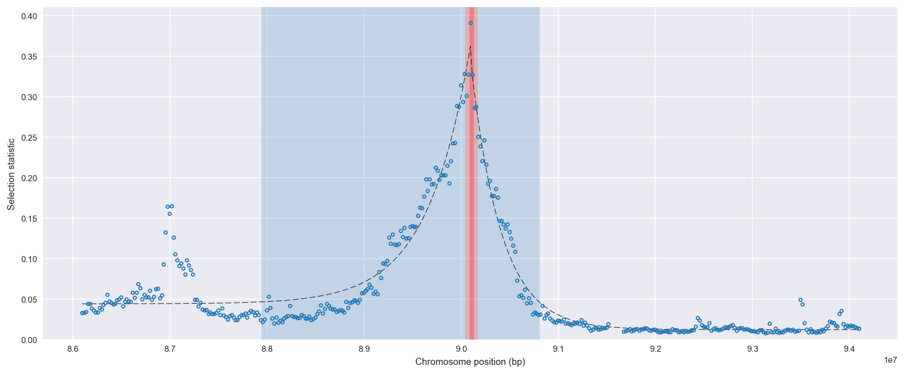
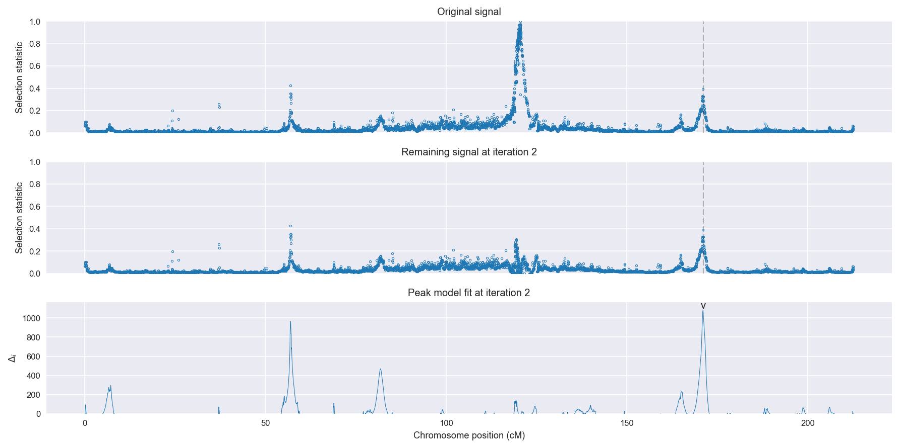
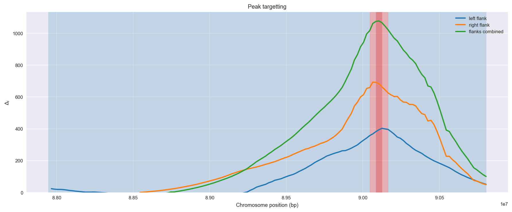
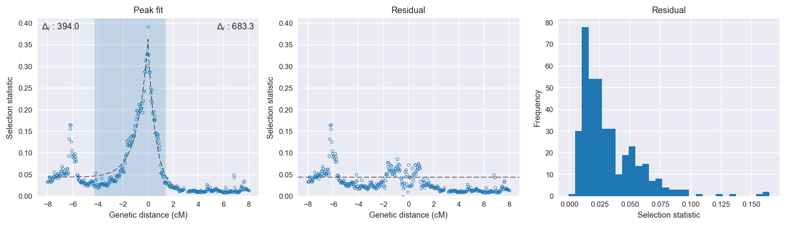

:orphan:

Burkina Faso *An. gambiae* | H12 | Chromosome 2 | Signal #2
================================================================================

This page describes a signal of selection found in the
:doc:`/population/BFS` population using the
:doc:`/method/H12` statistic.The inferred focus of this signal is on chromosome arm
**2L between position 28,500,001 and
28,620,000**.

The following 34 genes overlap the focal region: :doc:`/gene/AGAP006219` (receptor tyrosine kinase-like orphan receptor 1),  :doc:`/gene/AGAP006220` (aldehyde oxidase),  :doc:`/gene/AGAP006221` (aldehyde oxidase),  :doc:`/gene/AGAP006222` (glucosyl/glucuronosyl transferases),  :doc:`/gene/AGAP006223` (glucosyl/glucuronosyl transferases),  :doc:`/gene/AGAP006224` (aldehyde oxidase),  :doc:`/gene/AGAP006225` (aldehyde oxidase),  :doc:`/gene/AGAP006226` (Aldehyde_oxidase),  :doc:`/gene/AGAP006227` (alpha esterase),  :doc:`/gene/AGAP006228` (COEAE2F - carboxylesterase),  :doc:`/gene/AGAP006229` (Vps20 - vacuolar protein sorting 20),  :doc:`/gene/AGAP006231` (serine/threonine-protein phosphatase dullard homolog),  :doc:`/gene/AGAP006232` (peroxin-14),  :doc:`/gene/AGAP006233`,  :doc:`/gene/AGAP006234` (protein SHQ1),  :doc:`/gene/AGAP006235`,  :doc:`/gene/AGAP006236`,  :doc:`/gene/AGAP006237` (Negative elongation factor E),  :doc:`/gene/AGAP006238` (ubiquitin-conjugating enzyme E2 C),  :doc:`/gene/AGAP006239` (Protein TSSC1),  :doc:`/gene/AGAP006240` (splicing factor 3B subunit 2),  :doc:`/gene/AGAP006241` (Innexin inx2),  :doc:`/gene/AGAP006242`,  :doc:`/gene/AGAP006243` (phosphatidylinositol-4,5-bisphosphate 4-phosphatase),  :doc:`/gene/AGAP029069`,  :doc:`/gene/AGAP006244` (CTL-like protein 1),  :doc:`/gene/AGAP006245` (zinc finger matrin-type protein 2),  :doc:`/gene/AGAP006246` (Sorcin),  :doc:`/gene/AGAP006247` (Survival of motor neuron-related-splicing factor 30),  :doc:`/gene/AGAP006248` (Med10 - Mediator of RNA polymerase II transcription subunit 10),  :doc:`/gene/AGAP006249` (solute carrier family 12 (potassium/chloride transporters), member 8),  :doc:`/gene/AGAP006250` (eukaryotic elongation factor, selenocysteine-tRNA-specific),  :doc:`/gene/AGAP006251` (syntaxin 6),  :doc:`/gene/AGAP006252` (Cysteine-rich venom protein).

The following 11 genes are within 40 kbp of the focal
region: :doc:`/gene/AGAP028453`,  :doc:`/gene/AGAP006214`,  :doc:`/gene/AGAP006215` (GPRMTH1 - methuselah receptor 1),  :doc:`/gene/AGAP006216` (GPRMTH2 - methuselah receptor 2),  :doc:`/gene/AGAP006217`,  :doc:`/gene/AGAP006218` (GPRMTH4 - methuselah receptor 4),  :doc:`/gene/AGAP006253` (Cysteine-rich venom protein),  :doc:`/gene/AGAP006254` (polypeptide N-acetylglucosaminyltransferase),  :doc:`/gene/AGAP006255`,  :doc:`/gene/AGAP006256` (Cad74A),  :doc:`/gene/AGAP028399`.

    **Figure 1**. Location of the signal of selection. Blue markers show the
    value of the selection statistic in non-overlapping 20 kbp windows. The
    dashed black line shows the fitted peak model. The vertical red bar shows
    the inferred focus of the selection signal. The shaded blue area shows the
    inferred genomic region affected by the selection event.

Overlapping signals
-------------------

No overlapping signals.

Diagnostics
-----------

The information below provides some diagnostics from the
:doc:`/method/peak_modelling` algorithm.

    **Figure 2**. Chromosome-wide selection statistic and results from peak
    modelling. **a**, TODO. **b**, TODO.

    **Figure 3**. Diagnostics from targetting the selection signal to a focal
    region. TODO.

    **Figure 4**. Diagnostics from fitting a peak model to the selection signal.
    **a**, TODO. **b**, TODO. **c**, TODO.

Model fit reports
~~~~~~~~~~~~~~~~~

Left flank, peak model::

    [[Model]]
        Model(exponential)
    [[Fit Statistics]]
        # function evals   = 35
        # data points      = 201
        # variables        = 3
        chi-square         = 0.136
        reduced chi-square = 0.001
        Akaike info crit   = -1461.033
        Bayesian info crit = -1451.123
    [[Variables]]
        amplitude:   0.31849123 +/- 0.010653 (3.35%) (init= 0.5)
        decay:       0.88609190 +/- 0.050554 (5.71%) (init= 0.5)
        c:           0.04415383 +/- 0.002469 (5.59%) (init= 0.03)
        cap:         1 (fixed)
    [[Correlations]] (unreported correlations are <  0.100)
        C(amplitude, decay)          = -0.574 
        C(decay, c)                  = -0.531 

Right flank, peak model::

    [[Model]]
        Model(exponential)
    [[Fit Statistics]]
        # function evals   = 27
        # data points      = 193
        # variables        = 3
        chi-square         = 0.018
        reduced chi-square = 0.000
        Akaike info crit   = -1782.306
        Bayesian info crit = -1772.518
    [[Variables]]
        amplitude:   0.33485561 +/- 0.005315 (1.59%) (init= 0.5)
        decay:       0.62195091 +/- 0.014950 (2.40%) (init= 0.5)
        c:           0.01225445 +/- 0.000851 (6.94%) (init= 0.03)
        cap:         1 (fixed)
    [[Correlations]] (unreported correlations are <  0.100)
        C(amplitude, decay)          = -0.666 
        C(decay, c)                  = -0.425 

Left flank, null model::

    [[Model]]
        Model(constant)
    [[Fit Statistics]]
        # function evals   = 6
        # data points      = 200
        # variables        = 1
        chi-square         = 0.954
        reduced chi-square = 0.005
        Akaike info crit   = -1066.983
        Bayesian info crit = -1063.685
    [[Variables]]
        c:   0.07849146 +/- 0.004897 (6.24%) (init= 0.03)

Right flank, null model::

    [[Model]]
        Model(constant)
    [[Fit Statistics]]
        # function evals   = 6
        # data points      = 192
        # variables        = 1
        chi-square         = 0.621
        reduced chi-square = 0.003
        Akaike info crit   = -1099.010
        Bayesian info crit = -1095.752
    [[Variables]]
        c:   0.03677189 +/- 0.004114 (11.19%) (init= 0.03)

Comments
--------

.. raw:: html

    

    
    <noscript>Please enable JavaScript to view the <a href="https://disqus.com/?ref_noscript">comments powered by Disqus.</a></noscript>
