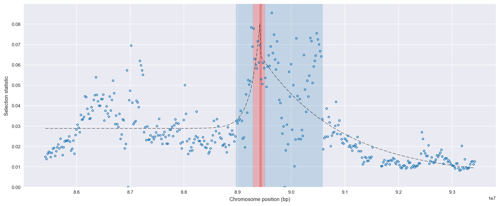
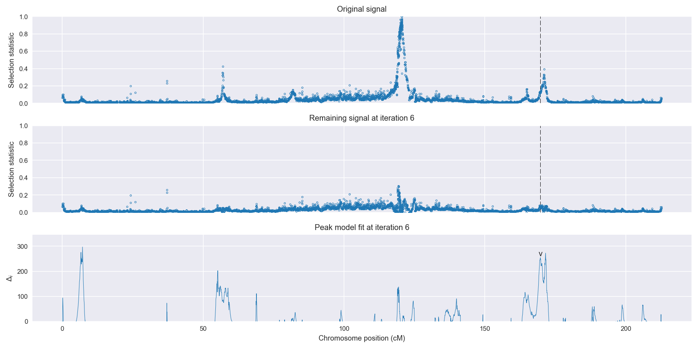
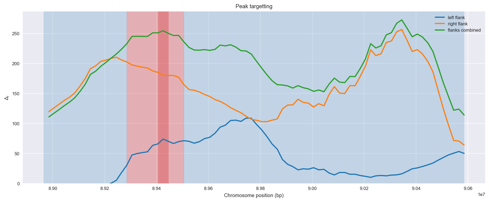
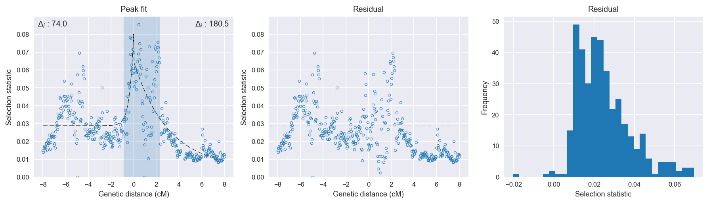

:orphan:

Burkina Faso *An. gambiae* | H12 | Chromosome 2 | Signal #6
================================================================================

This page describes a signal of selection found in the
:doc:`/population/BFS` population using the
:doc:`/method/H12` statistic.The inferred focus of this signal is on chromosome arm
**2L between position 27,740,001 and
27,960,000**.

The following 13 genes overlap the focal region: :doc:`/gene/AGAP006176`,  :doc:`/gene/AGAP006177`,  :doc:`/gene/AGAP006178` (troponin C),  :doc:`/gene/AGAP006179` (troponin C),  :doc:`/gene/AGAP006180`,  :doc:`/gene/AGAP006181` (troponin C),  :doc:`/gene/AGAP006182` (troponin C),  :doc:`/gene/AGAP006183` (slit protein),  :doc:`/gene/AGAP006184`,  :doc:`/gene/AGAP006185`,  :doc:`/gene/AGAP006186` (Ca-P60A - Calcium-transporting ATPase sarcoplasmic/endoplasmic reticulum type),  :doc:`/gene/AGAP006187` (Protein G12),  :doc:`/gene/AGAP006188`.

No genes are within 50 kbp of the focal region.

    **Figure 1**. Location of the signal of selection. Blue markers show the
    value of the selection statistic in non-overlapping 20 kbp windows. The
    dashed black line shows the fitted peak model. The vertical red bar shows
    the inferred focus of the selection signal. The shaded blue area shows the
    inferred genomic region affected by the selection event.

Overlapping signals
-------------------

No overlapping signals.

Diagnostics
-----------

The information below provides some diagnostics from the
:doc:`/method/peak_modelling` algorithm.

    **Figure 2**. Chromosome-wide selection statistic and results from peak
    modelling. **a**, TODO. **b**, TODO.

    **Figure 3**. Diagnostics from targetting the selection signal to a focal
    region. TODO.

    **Figure 4**. Diagnostics from fitting a peak model to the selection signal.
    **a**, TODO. **b**, TODO. **c**, TODO.

Model fit reports
~~~~~~~~~~~~~~~~~

Left flank, peak model::

    [[Model]]
        Model(exponential)
    [[Fit Statistics]]
        # function evals   = 51
        # data points      = 201
        # variables        = 3
        chi-square         = 0.023
        reduced chi-square = 0.000
        Akaike info crit   = -1814.386
        Bayesian info crit = -1804.476
    [[Variables]]
        amplitude:   0.05138170 +/- 0.006608 (12.86%) (init= 0.5)
        decay:       0.34785836 +/- 0.070350 (20.22%) (init= 0.5)
        c:           0.02878544 +/- 0.000844 (2.93%) (init= 0.03)
        cap:         1 (fixed)
    [[Correlations]] (unreported correlations are <  0.100)
        C(amplitude, decay)          = -0.625 
        C(decay, c)                  = -0.308 

Right flank, peak model::

    [[Model]]
        Model(exponential)
    [[Fit Statistics]]
        # function evals   = 39
        # data points      = 193
        # variables        = 3
        chi-square         = 0.028
        reduced chi-square = 0.000
        Akaike info crit   = -1698.601
        Bayesian info crit = -1688.813
    [[Variables]]
        amplitude:   0.05974518 +/- 0.003581 (5.99%) (init= 0.5)
        decay:       2.99999971 +/- 0.394105 (13.14%) (init= 0.5)
        c:           0.00519229 +/- 0.003893 (75.00%) (init= 0.03)
        cap:         1 (fixed)
    [[Correlations]] (unreported correlations are <  0.100)
        C(decay, c)                  =  0.924 
        C(amplitude, c)              = -0.571 
        C(amplitude, decay)          = -0.300 

Left flank, null model::

    [[Model]]
        Model(constant)
    [[Fit Statistics]]
        # function evals   = 6
        # data points      = 200
        # variables        = 1
        chi-square         = 0.033
        reduced chi-square = 0.000
        Akaike info crit   = -1740.356
        Bayesian info crit = -1737.057
    [[Variables]]
        c:   0.03090224 +/- 0.000909 (2.94%) (init= 0.03)

Right flank, null model::

    [[Model]]
        Model(constant)
    [[Fit Statistics]]
        # function evals   = 6
        # data points      = 192
        # variables        = 1
        chi-square         = 0.070
        reduced chi-square = 0.000
        Akaike info crit   = -1518.136
        Bayesian info crit = -1514.879
    [[Variables]]
        c:   0.02583598 +/- 0.001381 (5.35%) (init= 0.03)

Comments
--------

.. raw:: html

    

    
    <noscript>Please enable JavaScript to view the <a href="https://disqus.com/?ref_noscript">comments powered by Disqus.</a></noscript>
