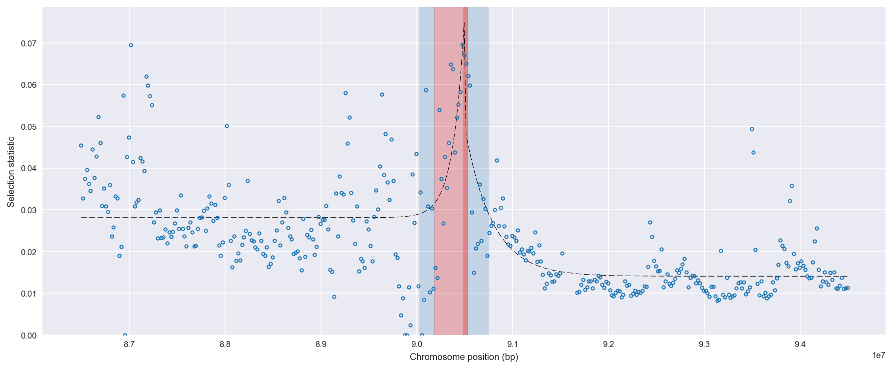
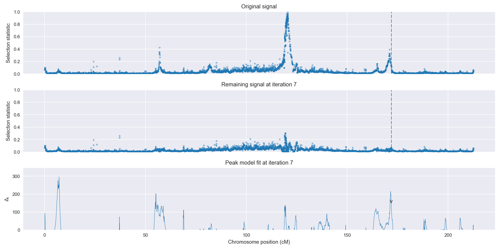
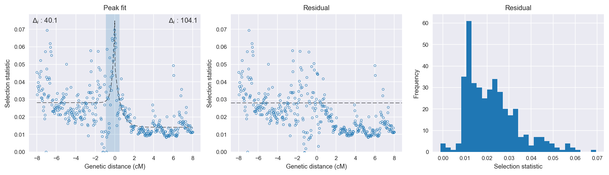

:orphan:

Burkina Faso *An. gambiae* | H12 | Chromosome 2 | Signal #7
================================================================================

This page describes a signal of selection found in the
:doc:`/population/BFS` population using the
:doc:`/method/H12` statistic.The inferred focus of this signal is on chromosome arm
**2L between position 28,640,001 and
28,980,000**.

The following 20 genes overlap the focal region: :doc:`/gene/AGAP006254` (polypeptide N-acetylglucosaminyltransferase),  :doc:`/gene/AGAP006255`,  :doc:`/gene/AGAP006256` (Cad74A),  :doc:`/gene/AGAP028399`,  :doc:`/gene/AGAP028454`,  :doc:`/gene/AGAP006257`,  :doc:`/gene/AGAP006258` (PPO2 - prophenoloxidase 2),  :doc:`/gene/AGAP006259`,  :doc:`/gene/AGAP006260` (Z band alternatively spliced PDZ-motif protein 66),  :doc:`/gene/AGAP006261` (CPR135 - cuticular protein RR-2 family 135),  :doc:`/gene/AGAP006262`,  :doc:`/gene/AGAP006263` (ARR2 - arrestin Arr2-like),  :doc:`/gene/AGAP006264` (Peroxisomal targeting signal 2 receptor),  :doc:`/gene/AGAP006265`,  :doc:`/gene/AGAP006266` (HIV Tat-specific factor 1),  :doc:`/gene/AGAP006267` (CTL6 - C-type lectin (CTL)),  :doc:`/gene/AGAP006268`,  :doc:`/gene/AGAP006269` (phosphatidylinositol glycan, class O),  :doc:`/gene/AGAP006270` (fyn-related kinase),  :doc:`/gene/AGAP006271`.

The following 14 genes are within 40 kbp of the focal
region: :doc:`/gene/AGAP006243` (phosphatidylinositol-4,5-bisphosphate 4-phosphatase),  :doc:`/gene/AGAP029069`,  :doc:`/gene/AGAP006244` (CTL-like protein 1),  :doc:`/gene/AGAP006245` (zinc finger matrin-type protein 2),  :doc:`/gene/AGAP006246` (Sorcin),  :doc:`/gene/AGAP006247` (Survival of motor neuron-related-splicing factor 30),  :doc:`/gene/AGAP006248` (Med10 - Mediator of RNA polymerase II transcription subunit 10),  :doc:`/gene/AGAP006249` (solute carrier family 12 (potassium/chloride transporters), member 8),  :doc:`/gene/AGAP006250` (eukaryotic elongation factor, selenocysteine-tRNA-specific),  :doc:`/gene/AGAP006251` (syntaxin 6),  :doc:`/gene/AGAP006252` (Cysteine-rich venom protein),  :doc:`/gene/AGAP006253` (Cysteine-rich venom protein),  :doc:`/gene/AGAP006272`,  :doc:`/gene/AGAP006273` (ABCB3 - ATP-binding cassette transporter (ABC transporter) family B member 3).

    **Figure 1**. Location of the signal of selection. Blue markers show the
    value of the selection statistic in non-overlapping 20 kbp windows. The
    dashed black line shows the fitted peak model. The vertical red bar shows
    the inferred focus of the selection signal. The shaded blue area shows the
    inferred genomic region affected by the selection event.

Overlapping signals
-------------------

The following selection signals have an inferred focus which overlaps with the
focus of this signal:

.. cssclass:: table-hover
.. csv-table::
    :widths: auto
    :header: Signal, Focus, Score

    :doc:`/signal/H12/GNS/chr2/3/index`,":28740001-28840000",352
    

Diagnostics
-----------

The information below provides some diagnostics from the
:doc:`/method/peak_modelling` algorithm.

    **Figure 2**. Chromosome-wide selection statistic and results from peak
    modelling. **a**, TODO. **b**, TODO.

.. figure:: peak_targetting.png

    **Figure 3**. Diagnostics from targetting the selection signal to a focal
    region. TODO.

    **Figure 4**. Diagnostics from fitting a peak model to the selection signal.
    **a**, TODO. **b**, TODO. **c**, TODO.

Model fit reports
~~~~~~~~~~~~~~~~~

Left flank, peak model::

    [[Model]]
        Model(exponential)
    [[Fit Statistics]]
        # function evals   = 67
        # data points      = 201
        # variables        = 3
        chi-square         = 0.030
        reduced chi-square = 0.000
        Akaike info crit   = -1767.299
        Bayesian info crit = -1757.390
    [[Variables]]
        amplitude:   0.04668485 +/- 0.008579 (18.38%) (init= 0.5)
        decay:       0.23672170 +/- 0.068962 (29.13%) (init= 0.5)
        c:           0.02813536 +/- 0.000919 (3.27%) (init= 0.03)
        cap:         1 (fixed)
    [[Correlations]] (unreported correlations are <  0.100)
        C(amplitude, decay)          = -0.617 
        C(decay, c)                  = -0.250 

Right flank, peak model::

    [[Model]]
        Model(exponential)
    [[Fit Statistics]]
        # function evals   = 31
        # data points      = 193
        # variables        = 3
        chi-square         = 0.008
        reduced chi-square = 0.000
        Akaike info crit   = -1943.483
        Bayesian info crit = -1933.695
    [[Variables]]
        amplitude:   0.03635076 +/- 0.003673 (10.11%) (init= 0.5)
        decay:       0.57505166 +/- 0.086843 (15.10%) (init= 0.5)
        c:           0.01408674 +/- 0.000547 (3.88%) (init= 0.03)
        cap:         1 (fixed)
    [[Correlations]] (unreported correlations are <  0.100)
        C(amplitude, decay)          = -0.678 
        C(decay, c)                  = -0.393 

Left flank, null model::

    [[Model]]
        Model(constant)
    [[Fit Statistics]]
        # function evals   = 6
        # data points      = 200
        # variables        = 1
        chi-square         = 0.035
        reduced chi-square = 0.000
        Akaike info crit   = -1727.178
        Bayesian info crit = -1723.879
    [[Variables]]
        c:   0.02942927 +/- 0.000940 (3.19%) (init= 0.03)

Right flank, null model::

    [[Model]]
        Model(constant)
    [[Fit Statistics]]
        # function evals   = 6
        # data points      = 192
        # variables        = 1
        chi-square         = 0.013
        reduced chi-square = 0.000
        Akaike info crit   = -1839.360
        Bayesian info crit = -1836.102
    [[Variables]]
        c:   0.01642054 +/- 0.000598 (3.64%) (init= 0.03)

Comments
--------

.. raw:: html

    

    
    <noscript>Please enable JavaScript to view the <a href="https://disqus.com/?ref_noscript">comments powered by Disqus.</a></noscript>
