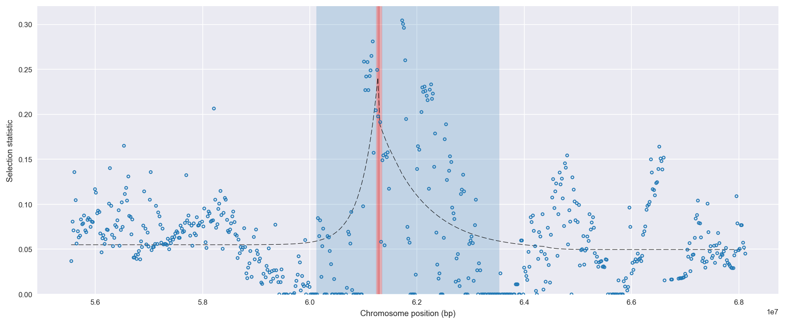
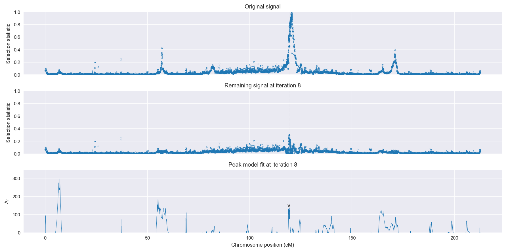
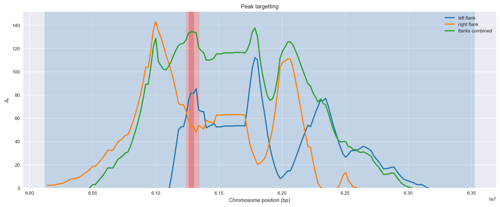
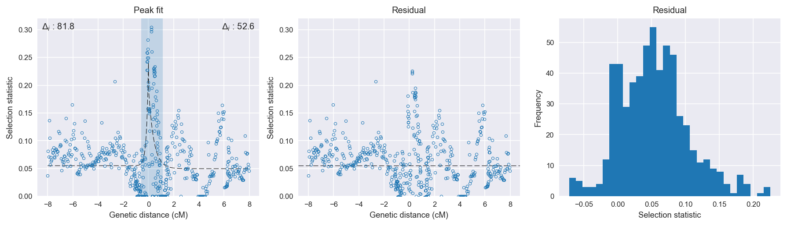

:orphan:

Burkina Faso *An. gambiae* | H12 | Chromosome 2 | Signal #8
================================================================================

This page describes a signal of selection found in the
:doc:`/population/BFS` population using the
:doc:`/method/H12` statistic.The inferred focus of this signal is on chromosome arm
2R between position 61,240,001 and
61,340,000.

The following 2 genes overlap the focal region: :doc:`/gene/AGAP004672`,  :doc:`/gene/AGAP004674` (Phenoloxidase inhibitor protein).

Gene :doc:`/gene/AGAP004671` (nuclear pore complex protein Nup160) is within 50 kbp of the focal region.

    **Figure 1**. Location of the signal of selection. Blue markers show the
    value of the selection statistic in non-overlapping 20 kbp windows. The
    dashed black line shows the fitted peak model. The vertical red bar shows
    the inferred focus of the selection signal. The shaded blue area shows the
    inferred genomic region affected by the selection event.

Overlapping signals
-------------------

No overlapping signals.

Diagnostics
-----------

The information below provides some diagnostics from the
:doc:`/method/peak_modelling` algorithm.

    **Figure 2**. Chromosome-wide selection statistic and results from peak
    modelling. **a**, TODO. **b**, TODO.

    **Figure 3**. Diagnostics from targetting the selection signal to a focal
    region. TODO.

    **Figure 4**. Diagnostics from fitting a peak model to the selection signal.
    **a**, TODO. **b**, TODO. **c**, TODO.

Model fit reports
~~~~~~~~~~~~~~~~~

Left flank, peak model::

    [[Model]]
        Model(exponential)
    [[Fit Statistics]]
        # function evals   = 50
        # data points      = 274
        # variables        = 3
        chi-square         = 0.530
        reduced chi-square = 0.002
        Akaike info crit   = -1705.984
        Bayesian info crit = -1695.145
    [[Variables]]
        amplitude:   0.18582771 +/- 0.022721 (12.23%) (init= 0.5)
        decay:       0.15000003 +/- 0.028239 (18.83%) (init= 0.5)
        c:           0.05497251 +/- 0.002982 (5.43%) (init= 0.03)
        cap:         1 (fixed)
    [[Correlations]] (unreported correlations are <  0.100)
        C(amplitude, decay)          = -0.645 
        C(decay, c)                  = -0.330 

Right flank, peak model::

    [[Model]]
        Model(exponential)
    [[Fit Statistics]]
        # function evals   = 41
        # data points      = 314
        # variables        = 3
        chi-square         = 0.979
        reduced chi-square = 0.003
        Akaike info crit   = -1805.933
        Bayesian info crit = -1794.685
    [[Variables]]
        amplitude:   0.14537453 +/- 0.021800 (15.00%) (init= 0.5)
        decay:       0.41264205 +/- 0.087098 (21.11%) (init= 0.5)
        c:           0.04965187 +/- 0.004093 (8.24%) (init= 0.03)
        cap:         1 (fixed)
    [[Correlations]] (unreported correlations are <  0.100)
        C(amplitude, decay)          = -0.620 
        C(decay, c)                  = -0.485 

Left flank, null model::

    [[Model]]
        Model(constant)
    [[Fit Statistics]]
        # function evals   = 6
        # data points      = 273
        # variables        = 1
        chi-square         = 0.707
        reduced chi-square = 0.003
        Akaike info crit   = -1624.185
        Bayesian info crit = -1620.576
    [[Variables]]
        c:   0.06368429 +/- 0.003084 (4.84%) (init= 0.03)

Right flank, null model::

    [[Model]]
        Model(constant)
    [[Fit Statistics]]
        # function evals   = 6
        # data points      = 313
        # variables        = 1
        chi-square         = 1.148
        reduced chi-square = 0.004
        Akaike info crit   = -1753.316
        Bayesian info crit = -1749.570
    [[Variables]]
        c:   0.06309911 +/- 0.003428 (5.43%) (init= 0.03)

Comments
--------

.. raw:: html

    

    
    <noscript>Please enable JavaScript to view the <a href="https://disqus.com/?ref_noscript">comments powered by Disqus.</a></noscript>
