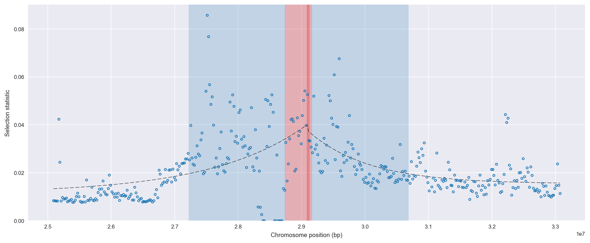
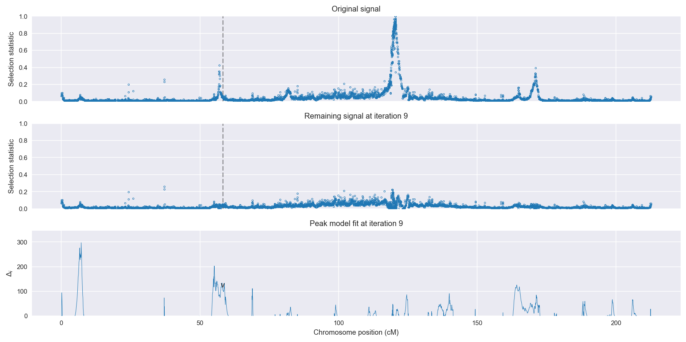
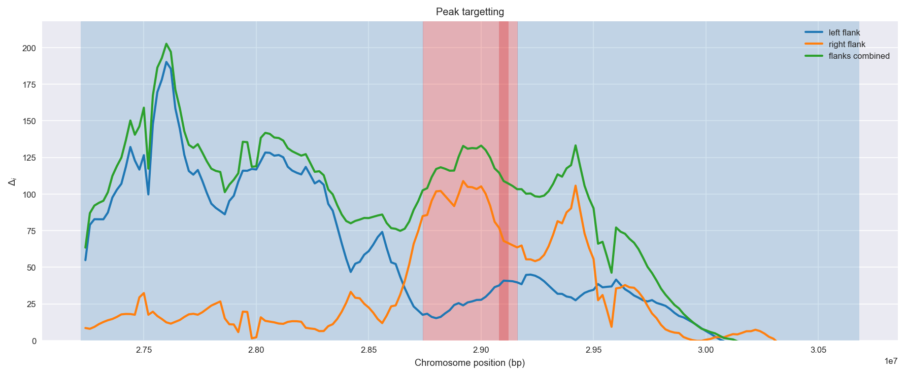
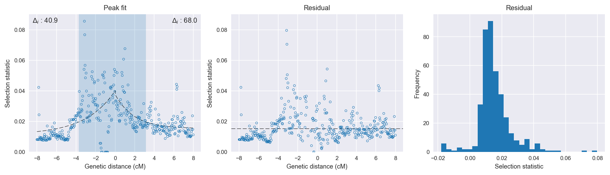

:orphan:

Burkina Faso *An. gambiae* | H12 | Chromosome 2 | Signal #9
================================================================================

This page describes a signal of selection found in the
:doc:`/population/BFS` population using the
:doc:`/method/H12` statistic.The inferred focus of this signal is on chromosome arm
**2R between position 28,740,001 and
29,160,000**.

The following 34 genes overlap the focal region: :doc:`/gene/AGAP002886` (GPRNNA2 - putative GPCR class a orphan receptor 2),  :doc:`/gene/AGAP002888` (GPRNNA3 - putative GPCR class a orphan receptor 3),  :doc:`/gene/AGAP013540`,  :doc:`/gene/AGAP002889` (NADH dehydrogenase (ubiquinone) 1 subcomplex unknown 2),  :doc:`/gene/AGAP002890` (Lipid storage droplets surface-binding protein 1),  :doc:`/gene/AGAP002891` (GPRMGL4 - putative metabotropic glutamate receptor 4),  :doc:`/gene/AGAP002892` (heterogeneous nuclear ribonucleoprotein F/H),  :doc:`/gene/AGAP002893` (mRpS23 - 28S ribosomal protein S23, mitochondrial),  :doc:`/gene/AGAP002894` (CYP6Z4 - cytochrome P450),  :doc:`/gene/AGAP002895` (mRNA (2'-O-methyladenosine-N6-)-methyltransferase),  :doc:`/gene/AGAP002896` (RNA-binding protein Nova),  :doc:`/gene/AGAP002898` (GSTZ1 - glutathione S-transferase zeta class 1),  :doc:`/gene/AGAP013090`,  :doc:`/gene/AGAP013313`,  :doc:`/gene/AGAP013272`,  :doc:`/gene/AGAP013083`,  :doc:`/gene/AGAP013471`,  :doc:`/gene/AGAP012948`,  :doc:`/gene/AGAP013261`,  :doc:`/gene/AGAP013347`,  :doc:`/gene/AGAP013114`,  :doc:`/gene/AGAP013212` (Import inner membrane translocase subunit Tim16),  :doc:`/gene/AGAP013394`,  :doc:`/gene/AGAP002899`,  :doc:`/gene/AGAP002900` (ubiquitin carboxyl-terminal hydrolase 8),  :doc:`/gene/AGAP002901` (Protein unc-50 homolog),  :doc:`/gene/AGAP002902` (mothers against decapentaplegic homolog 4),  :doc:`/gene/AGAP002903`,  :doc:`/gene/AGAP002904` (IR41a - ionotropic receptor IR41a),  :doc:`/gene/AGAP002905` (OBP13 - odorant-binding protein 13),  :doc:`/gene/AGAP002906` (Uncharacterized aarF domain-containing protein kinase 4),  :doc:`/gene/AGAP002907`,  :doc:`/gene/AGAP013354`,  :doc:`/gene/AGAP002908` (splicing factor U2AF 65 kDa subunit).

Gene :doc:`/gene/AGAP002909` (Control protein HCTL029) is within 40 kbp of the focal region.

    **Figure 1**. Location of the signal of selection. Blue markers show the
    value of the selection statistic in non-overlapping 20 kbp windows. The
    dashed black line shows the fitted peak model. The vertical red bar shows
    the inferred focus of the selection signal. The shaded blue area shows the
    inferred genomic region affected by the selection event.

Overlapping signals
-------------------

No overlapping signals.

Diagnostics
-----------

The information below provides some diagnostics from the
:doc:`/method/peak_modelling` algorithm.

    **Figure 2**. Chromosome-wide selection statistic and results from peak
    modelling. **a**, TODO. **b**, TODO.

    **Figure 3**. Diagnostics from targetting the selection signal to a focal
    region. TODO.

    **Figure 4**. Diagnostics from fitting a peak model to the selection signal.
    **a**, TODO. **b**, TODO. **c**, TODO.

Model fit reports
~~~~~~~~~~~~~~~~~

Left flank, peak model::

    [[Model]]
        Model(exponential)
    [[Fit Statistics]]
        # function evals   = 59
        # data points      = 201
        # variables        = 3
        chi-square         = 0.035
        reduced chi-square = 0.000
        Akaike info crit   = -1733.273
        Bayesian info crit = -1723.363
    [[Variables]]
        amplitude:   0.02875827 +/- 0.003889 (13.52%) (init= 0.5)
        decay:       2.99999882 +/- 1.287369 (42.91%) (init= 0.5)
        c:           0.01131813 +/- 0.004206 (37.17%) (init= 0.03)
        cap:         1 (fixed)
    [[Correlations]] (unreported correlations are <  0.100)
        C(decay, c)                  = -0.926 
        C(amplitude, c)              = -0.599 
        C(amplitude, decay)          =  0.337 

Right flank, peak model::

    [[Model]]
        Model(exponential)
    [[Fit Statistics]]
        # function evals   = 31
        # data points      = 198
        # variables        = 3
        chi-square         = 0.011
        reduced chi-square = 0.000
        Akaike info crit   = -1935.500
        Bayesian info crit = -1925.636
    [[Variables]]
        amplitude:   0.02229446 +/- 0.002233 (10.02%) (init= 0.5)
        decay:       1.91098883 +/- 0.468035 (24.49%) (init= 0.5)
        c:           0.01536112 +/- 0.001267 (8.25%) (init= 0.03)
        cap:         1 (fixed)
    [[Correlations]] (unreported correlations are <  0.100)
        C(decay, c)                  = -0.819 
        C(amplitude, decay)          = -0.318 
        C(amplitude, c)              = -0.111 

Left flank, null model::

    [[Model]]
        Model(constant)
    [[Fit Statistics]]
        # function evals   = 6
        # data points      = 200
        # variables        = 1
        chi-square         = 0.042
        reduced chi-square = 0.000
        Akaike info crit   = -1692.386
        Bayesian info crit = -1689.088
    [[Variables]]
        c:   0.02105773 +/- 0.001025 (4.87%) (init= 0.03)

Right flank, null model::

    [[Model]]
        Model(constant)
    [[Fit Statistics]]
        # function evals   = 6
        # data points      = 197
        # variables        = 1
        chi-square         = 0.015
        reduced chi-square = 0.000
        Akaike info crit   = -1867.489
        Bayesian info crit = -1864.206
    [[Variables]]
        c:   0.02034790 +/- 0.000621 (3.05%) (init= 0.03)

Comments
--------

.. raw:: html

    

    
    <noscript>Please enable JavaScript to view the <a href="https://disqus.com/?ref_noscript">comments powered by Disqus.</a></noscript>
