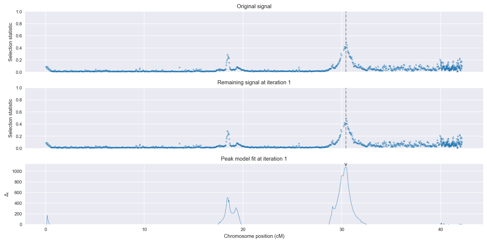
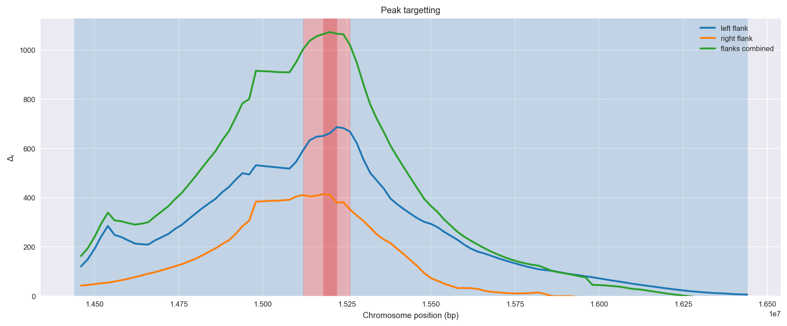
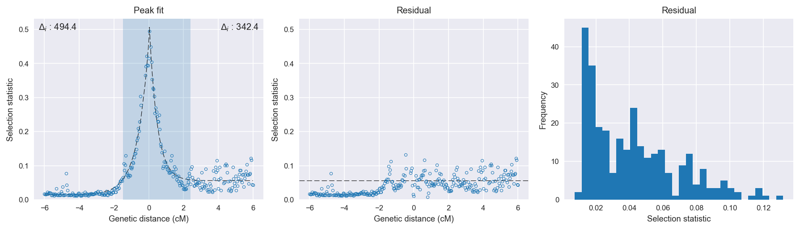

:orphan:

Burkina Faso *An. gambiae* | H12 | Chromosome X | Signal #1
================================================================================

This page describes a signal of selection found in the
:doc:`/population/BFS` population using the
:doc:`/method/H12` statistic.The inferred focus of this signal is on chromosome arm
**X** between positions **15,120,001** and
**15,260,000**.

.. raw:: html
    :file: peak_location.html

.. raw:: html

    

    <strong>Figure 1</strong>. Location of the signal of selection. Blue markers
    show the values of the selection statistic.
    The dashed black line shows the fitted peak model. The shaded red area
    shows the focus of the selection signal. The shaded blue area shows
    the genomic region in linkage with the selection event. Use the
    mouse wheel or the controls at the right of the plot to zoom in, and hover
    over genes to see gene names and descriptions.
    

The following 3 genes overlap the focal region: :doc:`/gene/AGAP012997`,  :doc:`/gene/AGAP000818` (CYP9K1 - cytochrome P450),  :doc:`/gene/AGAP000819` (nuclear receptor subfamily 2 group E member (Tailless)).

The following 3 genes are within 50 kbp of the focal
region: :doc:`/gene/AGAP013424`,  :doc:`/gene/AGAP000820` (CPR125 - cuticular protein RR-2 family 125),  :doc:`/gene/AGAP000821`.

Overlapping signals
-------------------

No overlapping signals.

Diagnostics
-----------

The information below provides some diagnostics from the
:doc:`/method/peak_modelling` algorithm.

    **Figure 2**. Chromosome-wide selection statistic and results from peak
    modelling. **a**, TODO. **b**, TODO.

    **Figure 3**. Diagnostics from targetting the selection signal to a focal
    region. TODO.

    **Figure 4**. Diagnostics from fitting a peak model to the selection signal.
    **a**, TODO. **b**, TODO. **c**, TODO.

Model fit reports
~~~~~~~~~~~~~~~~~

Left flank, peak model::

    [[Model]]
        Model(exponential)
    [[Fit Statistics]]
        # function evals   = 19
        # data points      = 195
        # variables        = 3
        chi-square         = 0.035
        reduced chi-square = 0.000
        Akaike info crit   = -1675.472
        Bayesian info crit = -1665.653
    [[Variables]]
        amplitude:   0.44522572 +/- 0.006781 (1.52%) (init= 0.5)
        decay:       0.64673082 +/- 0.014980 (2.32%) (init= 0.5)
        c:           0.01548482 +/- 0.001163 (7.52%) (init= 0.03)
        cap:         1 (fixed)
    [[Correlations]] (unreported correlations are <  0.100)
        C(amplitude, decay)          = -0.557 
        C(decay, c)                  = -0.440 

Right flank, peak model::

    [[Model]]
        Model(exponential)
    [[Fit Statistics]]
        # function evals   = 23
        # data points      = 196
        # variables        = 3
        chi-square         = 0.112
        reduced chi-square = 0.001
        Akaike info crit   = -1458.202
        Bayesian info crit = -1448.367
    [[Variables]]
        amplitude:   0.49168227 +/- 0.017545 (3.57%) (init= 0.5)
        decay:       0.45351876 +/- 0.021865 (4.82%) (init= 0.5)
        c:           0.05657645 +/- 0.001955 (3.46%) (init= 0.03)
        cap:         1 (fixed)
    [[Correlations]] (unreported correlations are <  0.100)
        C(amplitude, decay)          = -0.726 
        C(decay, c)                  = -0.359 

Left flank, null model::

    [[Model]]
        Model(constant)
    [[Fit Statistics]]
        # function evals   = 6
        # data points      = 194
        # variables        = 1
        chi-square         = 1.035
        reduced chi-square = 0.005
        Akaike info crit   = -1013.361
        Bayesian info crit = -1010.093
    [[Variables]]
        c:   0.04463175 +/- 0.005256 (11.78%) (init= 0.03)

Right flank, null model::

    [[Model]]
        Model(constant)
    [[Fit Statistics]]
        # function evals   = 6
        # data points      = 195
        # variables        = 1
        chi-square         = 0.900
        reduced chi-square = 0.005
        Akaike info crit   = -1046.726
        Bayesian info crit = -1043.453
    [[Variables]]
        c:   0.07956298 +/- 0.004878 (6.13%) (init= 0.03)

Comments
--------

.. raw:: html

    

    
    <noscript>Please enable JavaScript to view the <a href="https://disqus.com/?ref_noscript">comments powered by Disqus.</a></noscript>
