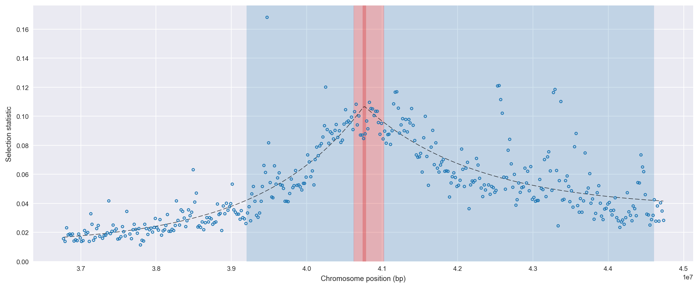
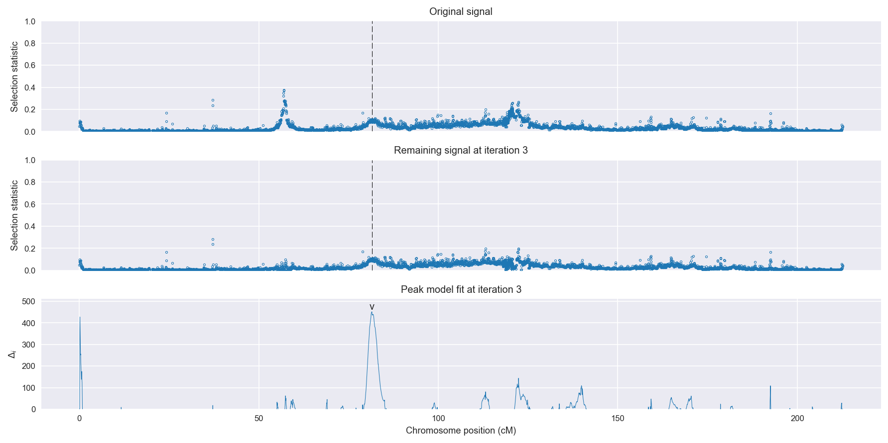
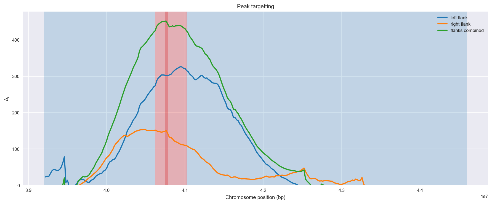
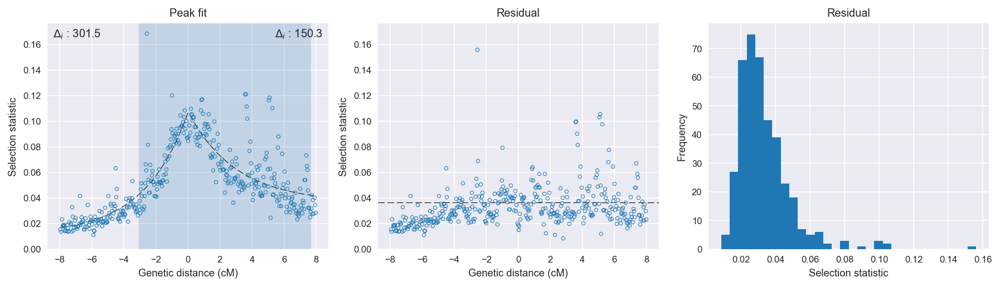

:orphan:

Cameroon *An. gambiae* | H12 | Chromosome 2 | Signal #3
================================================================================

This page describes a signal of selection found in the
:doc:`/population/CMS` population using the
:doc:`/method/H12` statistic.The inferred focus of this signal is on chromosome arm
**2R between position 40,620,001 and
41,020,000**.

The following 29 genes overlap the focal region: :doc:`/gene/AGAP003623` (long-chain acyl-CoA synthetase),  :doc:`/gene/AGAP003624`,  :doc:`/gene/AGAP029110`,  :doc:`/gene/AGAP003626`,  :doc:`/gene/AGAP013221`,  :doc:`/gene/AGAP012946`,  :doc:`/gene/AGAP003627`,  :doc:`/gene/AGAP003629`,  :doc:`/gene/AGAP003630`,  :doc:`/gene/AGAP003631` (GPRGRP2 - putative gastrin/bombesin receptor 2),  :doc:`/gene/AGAP003632` (U3 small nucleolar RNA-associated protein 14),  :doc:`/gene/AGAP003633`,  :doc:`/gene/AGAP003635`,  :doc:`/gene/AGAP003636` (inositol oxygenase),  :doc:`/gene/AGAP003638`,  :doc:`/gene/AGAP003639` (Prolylcarboxypeptidase),  :doc:`/gene/AGAP003640` (SP8905),  :doc:`/gene/AGAP003641` (SP8907),  :doc:`/gene/AGAP003642` (SP8898),  :doc:`/gene/AGAP003643` (ubiquitin carboxyl-terminal hydrolase 34),  :doc:`/gene/AGAP003644` (mRpS11 - 28S ribosomal protein S11, mitochondrial),  :doc:`/gene/AGAP003645` (kelch-like protein 19),  :doc:`/gene/AGAP013307`,  :doc:`/gene/AGAP003646`,  :doc:`/gene/AGAP003647`,  :doc:`/gene/AGAP003648` (DNA-directed RNA polymerase II subunit RPB2),  :doc:`/gene/AGAP003649`,  :doc:`/gene/AGAP003650` (translation initiation factor eIF-2B subunit alpha),  :doc:`/gene/AGAP003651` (Tyrosine-protein kinase Fes/Fps).

The following 9 genes are within 40 kbp of the focal
region: :doc:`/gene/AGAP003618` (serine/threonine-protein kinase LATS1/2),  :doc:`/gene/AGAP003619` (transcription elongation factor SPT6),  :doc:`/gene/AGAP003620`,  :doc:`/gene/AGAP003621` (coiled-coil domain-containing protein 25),  :doc:`/gene/AGAP003622` (Queuine tRNA-ribosyltransferase catalytic subunit 1),  :doc:`/gene/AGAP012992`,  :doc:`/gene/AGAP013502`,  :doc:`/gene/AGAP003652` (aldehyde dehydrogenase (NAD )),  :doc:`/gene/AGAP003654` (GPRCAL3 - putative calcitonin receptor 3).

    **Figure 1**. Location of the signal of selection. Blue markers show the
    value of the selection statistic in non-overlapping 20 kbp windows. The
    dashed black line shows the fitted peak model. The vertical red bar shows
    the inferred focus of the selection signal. The shaded blue area shows the
    inferred genomic region affected by the selection event.

Overlapping signals
-------------------

The following selection signals have an inferred focus which overlaps with the
focus of this signal:

.. cssclass:: table-hover
.. csv-table::
    :widths: auto
    :header: Signal, Focus, Score

    :doc:`/signal/H12/BFM/chr2/3/index`,":40880001-40980000",512
    :doc:`/signal/H12/BFS/chr2/4/index`,":40800001-41020000",469
    

Diagnostics
-----------

The information below provides some diagnostics from the
:doc:`/method/peak_modelling` algorithm.

    **Figure 2**. Chromosome-wide selection statistic and results from peak
    modelling. **a**, TODO. **b**, TODO.

    **Figure 3**. Diagnostics from targetting the selection signal to a focal
    region. TODO.

    **Figure 4**. Diagnostics from fitting a peak model to the selection signal.
    **a**, TODO. **b**, TODO. **c**, TODO.

Model fit reports
~~~~~~~~~~~~~~~~~

Left flank, peak model::

    [[Model]]
        Model(exponential)
    [[Fit Statistics]]
        # function evals   = 27
        # data points      = 198
        # variables        = 3
        chi-square         = 0.030
        reduced chi-square = 0.000
        Akaike info crit   = -1738.236
        Bayesian info crit = -1728.371
    [[Variables]]
        amplitude:   0.09483588 +/- 0.003460 (3.65%) (init= 0.5)
        decay:       2.75098977 +/- 0.312158 (11.35%) (init= 0.5)
        c:           0.01148258 +/- 0.003453 (30.08%) (init= 0.03)
        cap:         1 (fixed)
    [[Correlations]] (unreported correlations are <  0.100)
        C(decay, c)                  = -0.912 
        C(amplitude, c)              = -0.505 
        C(amplitude, decay)          =  0.206 

Right flank, peak model::

    [[Model]]
        Model(exponential)
    [[Fit Statistics]]
        # function evals   = 43
        # data points      = 197
        # variables        = 3
        chi-square         = 0.055
        reduced chi-square = 0.000
        Akaike info crit   = -1606.748
        Bayesian info crit = -1596.898
    [[Variables]]
        amplitude:   0.07094326 +/- 0.004985 (7.03%) (init= 0.5)
        decay:       2.99999753 +/- 0.680307 (22.68%) (init= 0.5)
        c:           0.03663034 +/- 0.005447 (14.87%) (init= 0.03)
        cap:         1 (fixed)
    [[Correlations]] (unreported correlations are <  0.100)
        C(decay, c)                  = -0.928 
        C(amplitude, c)              = -0.582 
        C(amplitude, decay)          =  0.320 

Left flank, null model::

    [[Model]]
        Model(constant)
    [[Fit Statistics]]
        # function evals   = 6
        # data points      = 197
        # variables        = 1
        chi-square         = 0.133
        reduced chi-square = 0.001
        Akaike info crit   = -1436.740
        Bayesian info crit = -1433.457
    [[Variables]]
        c:   0.04212701 +/- 0.001853 (4.40%) (init= 0.03)

Right flank, null model::

    [[Model]]
        Model(constant)
    [[Fit Statistics]]
        # function evals   = 6
        # data points      = 196
        # variables        = 1
        chi-square         = 0.115
        reduced chi-square = 0.001
        Akaike info crit   = -1456.427
        Bayesian info crit = -1453.149
    [[Variables]]
        c:   0.06094295 +/- 0.001734 (2.85%) (init= 0.03)

Comments
--------

.. raw:: html

    

    
    <noscript>Please enable JavaScript to view the <a href="https://disqus.com/?ref_noscript">comments powered by Disqus.</a></noscript>
