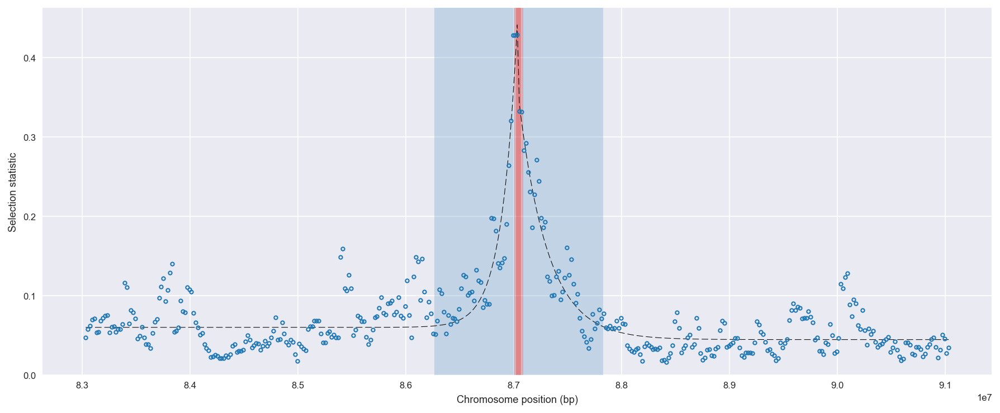
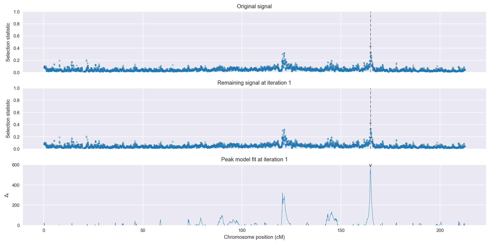
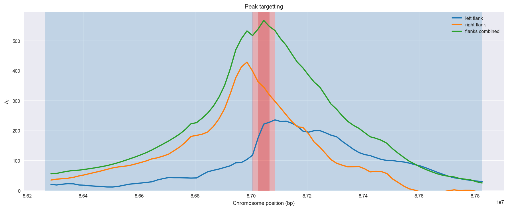
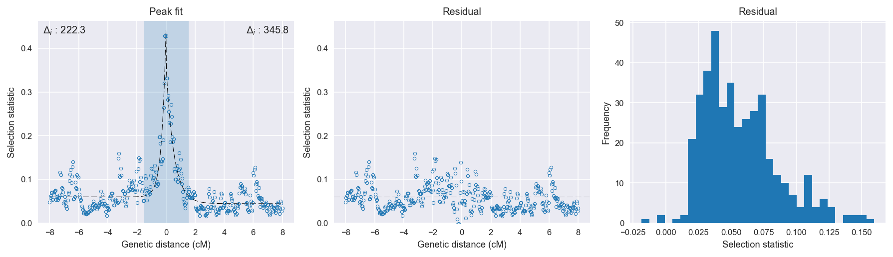

:orphan:

Gabon *An. gambiae* | H12 | Chromosome 2 | Signal #1
================================================================================

This page describes a signal of selection found in the
:doc:`/population/GAS` population using the
:doc:`/method/H12` statistic.The inferred focus of this signal is on chromosome arm
**2L between position 25,460,001 and
25,540,000**.

The following 10 genes overlap the focal region: :doc:`/gene/AGAP006030` (mfrn - mitoferrin),  :doc:`/gene/AGAP006031` (nuclear pore complex protein Nup54),  :doc:`/gene/AGAP006032`,  :doc:`/gene/AGAP006033`,  :doc:`/gene/AGAP006034`,  :doc:`/gene/AGAP006035` (Ras-related protein Rab-36),  :doc:`/gene/AGAP006036` (axonemal dynein intermediate chain inner arm i1),  :doc:`/gene/AGAP006037` (RpL24 - 60S ribosomal protein L24),  :doc:`/gene/AGAP006038` (serine/arginine repetitive matrix protein 2),  :doc:`/gene/AGAP006039`.

The following 8 genes are within 40 kbp of the focal
region: :doc:`/gene/AGAP006028` (Rdl - GABA-gated chloride channel subunit),  :doc:`/gene/AGAP006029`,  :doc:`/gene/AGAP006040` (peroxisomal membrane protein 2),  :doc:`/gene/AGAP006041` (E3 ubiquitin-protein ligase RNF5),  :doc:`/gene/AGAP006042`,  :doc:`/gene/AGAP029130`,  :doc:`/gene/AGAP029102`,  :doc:`/gene/AGAP006045` (protein yorkie).

    **Figure 1**. Location of the signal of selection. Blue markers show the
    value of the selection statistic in non-overlapping 20 kbp windows. The
    dashed black line shows the fitted peak model. The vertical red bar shows
    the inferred focus of the selection signal. The shaded blue area shows the
    inferred genomic region affected by the selection event.

Overlapping signals
-------------------

The following selection signals have an inferred focus which overlaps with the
focus of this signal:

.. cssclass:: table-hover
.. csv-table::
    :widths: auto
    :header: Signal, Focus, Score

    :doc:`/signal/H12/BFM/chr2/2/index`,":25400001-25500000",1180
    

Diagnostics
-----------

The information below provides some diagnostics from the
:doc:`/method/peak_modelling` algorithm.

    **Figure 2**. Chromosome-wide selection statistic and results from peak
    modelling. **a**, TODO. **b**, TODO.

    **Figure 3**. Diagnostics from targetting the selection signal to a focal
    region. TODO.

    **Figure 4**. Diagnostics from fitting a peak model to the selection signal.
    **a**, TODO. **b**, TODO. **c**, TODO.

Model fit reports
~~~~~~~~~~~~~~~~~

Left flank, peak model::

    [[Model]]
        Model(exponential)
    [[Fit Statistics]]
        # function evals   = 63
        # data points      = 201
        # variables        = 3
        chi-square         = 0.202
        reduced chi-square = 0.001
        Akaike info crit   = -1381.476
        Bayesian info crit = -1371.567
    [[Variables]]
        amplitude:   0.38109357 +/- 0.020845 (5.47%) (init= 0.5)
        decay:       0.28853985 +/- 0.024858 (8.62%) (init= 0.5)
        c:           0.06000000 +/- 0.000326 (0.54%) (init= 0.03)
        cap:         1 (fixed)
    [[Correlations]] (unreported correlations are <  0.100)
        C(amplitude, decay)          = -0.623 
        C(decay, c)                  = -0.278 

Right flank, peak model::

    [[Model]]
        Model(exponential)
    [[Fit Statistics]]
        # function evals   = 19
        # data points      = 200
        # variables        = 3
        chi-square         = 0.105
        reduced chi-square = 0.001
        Akaike info crit   = -1505.272
        Bayesian info crit = -1495.377
    [[Variables]]
        amplitude:   0.31916589 +/- 0.013593 (4.26%) (init= 0.5)
        decay:       0.53587555 +/- 0.033791 (6.31%) (init= 0.5)
        c:           0.04459538 +/- 0.001904 (4.27%) (init= 0.03)
        cap:         1 (fixed)
    [[Correlations]] (unreported correlations are <  0.100)
        C(amplitude, decay)          = -0.683 
        C(decay, c)                  = -0.393 

Left flank, null model::

    [[Model]]
        Model(constant)
    [[Fit Statistics]]
        # function evals   = 6
        # data points      = 200
        # variables        = 1
        chi-square         = 0.602
        reduced chi-square = 0.003
        Akaike info crit   = -1159.185
        Bayesian info crit = -1155.887
    [[Variables]]
        c:   0.07789062 +/- 0.003888 (4.99%) (init= 0.03)

Right flank, null model::

    [[Model]]
        Model(constant)
    [[Fit Statistics]]
        # function evals   = 6
        # data points      = 199
        # variables        = 1
        chi-square         = 0.581
        reduced chi-square = 0.003
        Akaike info crit   = -1159.483
        Bayesian info crit = -1156.190
    [[Variables]]
        c:   0.06384521 +/- 0.003839 (6.01%) (init= 0.03)

Comments
--------

.. raw:: html

    

    
    <noscript>Please enable JavaScript to view the <a href="https://disqus.com/?ref_noscript">comments powered by Disqus.</a></noscript>
