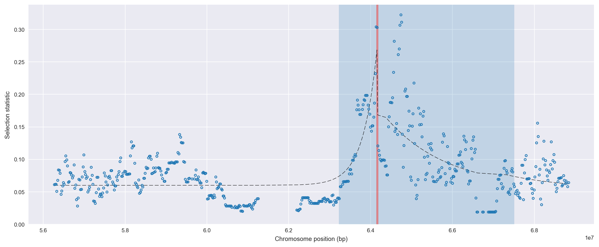
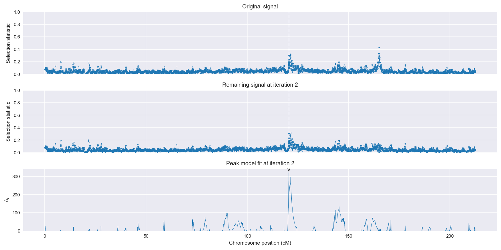
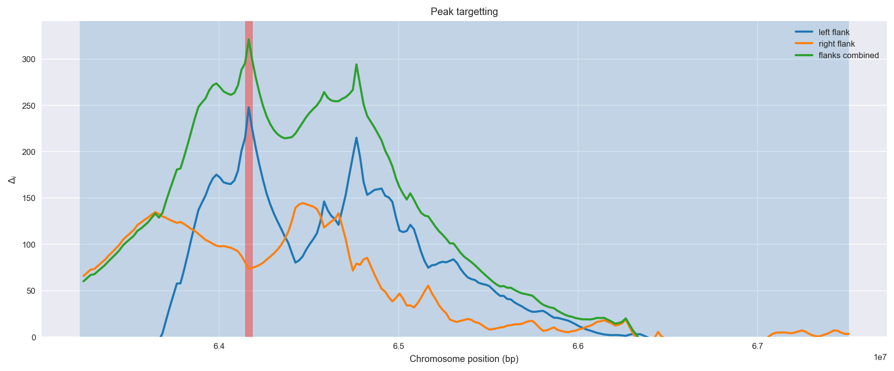
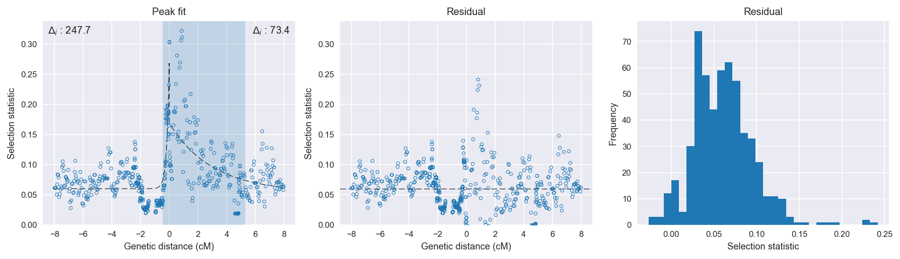

:orphan:

Gabon *An. gambiae* | H12 | Chromosome 2 | Signal #2
================================================================================

This page describes a signal of selection found in the
:doc:`/population/GAS` population using the
:doc:`/method/H12` statistic.The inferred focus of this signal is on chromosome arm
**2L between position 2,600,001 and
2,640,000**.

The following 2 genes overlap the focal region: :doc:`/gene/AGAP004715` (Pyruvate dehydrogenase phosphatase regulatory subunit, mitochondrial),  :doc:`/gene/AGAP004716` (Gr57 - gustatory receptor 57).

The following 4 genes are within 40 kbp of the focal
region: :doc:`/gene/AGAP004713`,  :doc:`/gene/AGAP004714`,  :doc:`/gene/AGAP004717`,  :doc:`/gene/AGAP004718`.

    **Figure 1**. Location of the signal of selection. Blue markers show the
    value of the selection statistic in non-overlapping 20 kbp windows. The
    dashed black line shows the fitted peak model. The vertical red bar shows
    the inferred focus of the selection signal. The shaded blue area shows the
    inferred genomic region affected by the selection event.

Overlapping signals
-------------------

The following selection signals have an inferred focus which overlaps with the
focus of this signal:

.. cssclass:: table-hover
.. csv-table::
    :widths: auto
    :header: Signal, Focus, Score

    :doc:`/signal/H12/BFM/chr2/1/index`,":2500001-2900000",1736
    :doc:`/signal/H12/BFS/chr2/1/index`,":2420001-2720000",1728
    :doc:`/signal/H12/GNS/chr2/1/index`,":1720001-2700000",1554
    :doc:`/signal/H12/UGS/chr2/2/index`,":1940001-3080000",1332
    :doc:`/signal/H12/CMS/chr2/2/index`,":2460001-2960000",635
    

Diagnostics
-----------

The information below provides some diagnostics from the
:doc:`/method/peak_modelling` algorithm.

    **Figure 2**. Chromosome-wide selection statistic and results from peak
    modelling. **a**, TODO. **b**, TODO.

    **Figure 3**. Diagnostics from targetting the selection signal to a focal
    region. TODO.

    **Figure 4**. Diagnostics from fitting a peak model to the selection signal.
    **a**, TODO. **b**, TODO. **c**, TODO.

Model fit reports
~~~~~~~~~~~~~~~~~

Left flank, peak model::

    [[Model]]
        Model(exponential)
    [[Fit Statistics]]
        # function evals   = 40
        # data points      = 334
        # variables        = 3
        chi-square         = 0.270
        reduced chi-square = 0.001
        Akaike info crit   = -2371.892
        Bayesian info crit = -2360.459
    [[Variables]]
        amplitude:   0.20842355 +/- 0.013058 (6.27%) (init= 0.5)
        decay:       0.17167794 +/- 0.016781 (9.78%) (init= 0.5)
        c:           0.05999999 +/- 0.001723 (2.87%) (init= 0.03)
        cap:         1 (fixed)
    [[Correlations]] (unreported correlations are <  0.100)
        C(amplitude, decay)          = -0.639 
        C(decay, c)                  = -0.321 

Right flank, peak model::

    [[Model]]
        Model(exponential)
    [[Fit Statistics]]
        # function evals   = 44
        # data points      = 222
        # variables        = 3
        chi-square         = 0.435
        reduced chi-square = 0.002
        Akaike info crit   = -1378.217
        Bayesian info crit = -1368.009
    [[Variables]]
        amplitude:   0.11448034 +/- 0.012723 (11.11%) (init= 0.5)
        decay:       2.99999887 +/- 1.163246 (38.77%) (init= 0.5)
        c:           0.05419457 +/- 0.013688 (25.26%) (init= 0.03)
        cap:         1 (fixed)
    [[Correlations]] (unreported correlations are <  0.100)
        C(decay, c)                  =  0.932 
        C(amplitude, c)              = -0.717 
        C(amplitude, decay)          = -0.500 

Left flank, null model::

    [[Model]]
        Model(constant)
    [[Fit Statistics]]
        # function evals   = 6
        # data points      = 333
        # variables        = 1
        chi-square         = 0.562
        reduced chi-square = 0.002
        Akaike info crit   = -2124.219
        Bayesian info crit = -2120.411
    [[Variables]]
        c:   0.07080949 +/- 0.002253 (3.18%) (init= 0.03)

Right flank, null model::

    [[Model]]
        Model(constant)
    [[Fit Statistics]]
        # function evals   = 6
        # data points      = 221
        # variables        = 1
        chi-square         = 0.597
        reduced chi-square = 0.003
        Akaike info crit   = -1304.831
        Bayesian info crit = -1301.433
    [[Variables]]
        c:   0.09433148 +/- 0.003505 (3.72%) (init= 0.03)

Comments
--------

.. raw:: html

    

    
    <noscript>Please enable JavaScript to view the <a href="https://disqus.com/?ref_noscript">comments powered by Disqus.</a></noscript>
