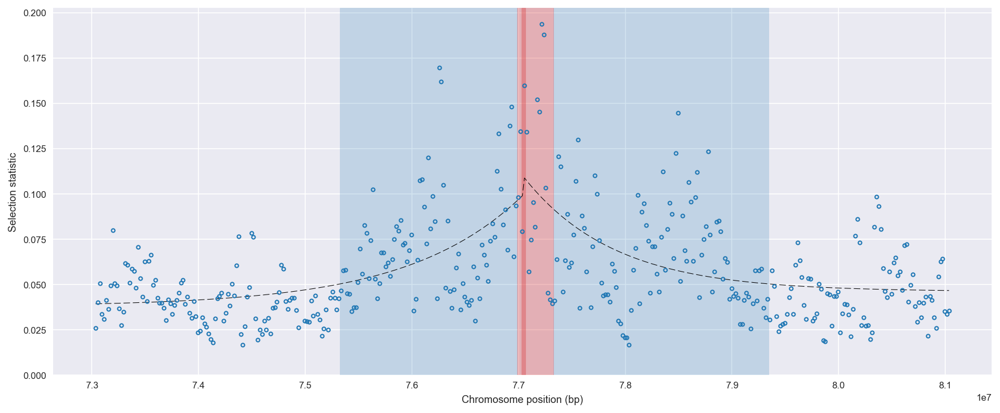
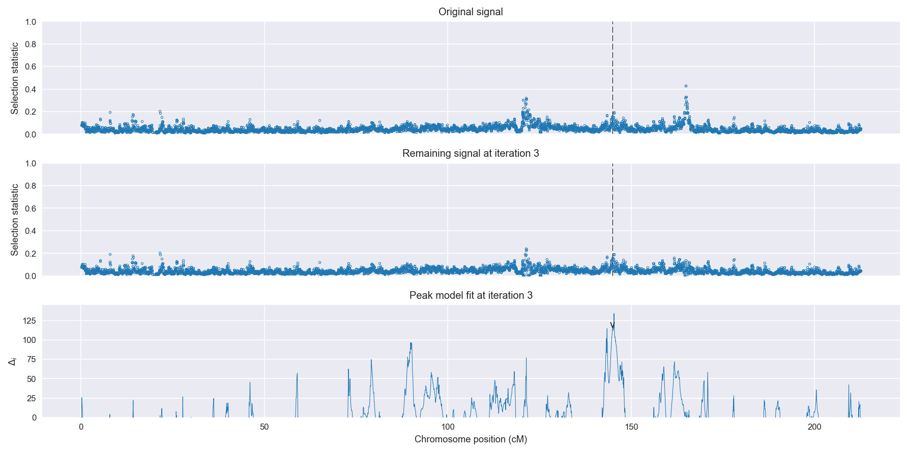
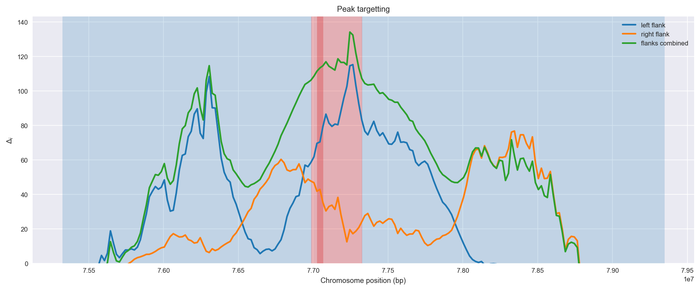
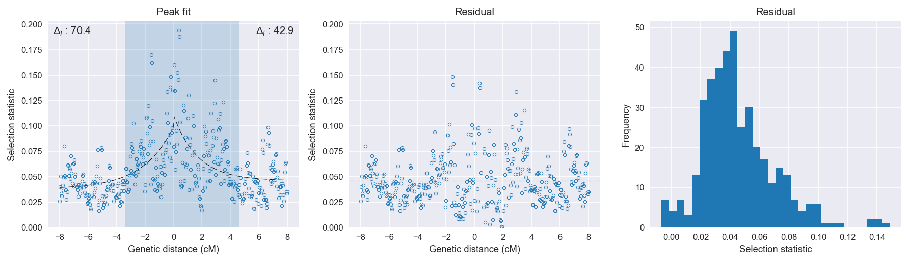

:orphan:

Gabon *An. gambiae* | H12 | Chromosome 2 | Signal #3
================================================================================

This page describes a signal of selection found in the
:doc:`/population/GAS` population using the
:doc:`/method/H12` statistic.The inferred focus of this signal is on chromosome arm
2L between position 15,440,001 and
15,780,000.

The following 22 genes overlap the focal region: :doc:`/gene/AGAP005433`,  :doc:`/gene/AGAP005434` (vitellogenic carboxypeptidase-like protein),  :doc:`/gene/AGAP028445`,  :doc:`/gene/AGAP005435` (Iodotyrosine dehalogenase),  :doc:`/gene/AGAP005437`,  :doc:`/gene/AGAP005438` (ribosome biogenesis protein MAK21),  :doc:`/gene/AGAP005440`,  :doc:`/gene/AGAP005444`,  :doc:`/gene/AGAP005445` (Ras-related C3 botulinum toxin substrate),  :doc:`/gene/AGAP005446`,  :doc:`/gene/AGAP005447` (trimethyllysine dioxygenase),  :doc:`/gene/AGAP005448` (B9 domain-containing protein 2),  :doc:`/gene/AGAP005449` (E3 ubiquitin-protein ligase CBL),  :doc:`/gene/AGAP005450`,  :doc:`/gene/AGAP028446`,  :doc:`/gene/AGAP005451` (CPR11 - cuticular protein RR-1 family 11),  :doc:`/gene/AGAP005453` (CPR12 - cuticular protein RR-1 family 12),  :doc:`/gene/AGAP005454` (CPR13 - cuticular protein RR-1 family 13),  :doc:`/gene/AGAP005455` (CPR14 - cuticular protein RR-1 family 14),  :doc:`/gene/AGAP005456` (CPR15 - cuticular protein RR-1 family 15),  :doc:`/gene/AGAP005457` (Ser/Thr protein phosphatase/nucleotidase),  :doc:`/gene/AGAP005458` (Ser/Thr protein phosphatase/nucleotidase).

The following 12 genes are within 50 kbp of the focal
region: :doc:`/gene/AGAP005425` (actin-binding LIM protein),  :doc:`/gene/AGAP005427` (RpL28 - 60S ribosomal protein L28),  :doc:`/gene/AGAP005428` (transcription elongation factor SPT4 1),  :doc:`/gene/AGAP005429` (Thoc6 - THO complex subunit 6),  :doc:`/gene/AGAP005430`,  :doc:`/gene/AGAP005431` (thioredoxin domain-containing protein),  :doc:`/gene/AGAP005432` (programmed cell death protein 5),  :doc:`/gene/AGAP005459` (CPR16 - cuticular protein RR-1 family 16),  :doc:`/gene/AGAP005460` (phosphopantetheine adenylyltransferase / dephospho-CoA kinase),  :doc:`/gene/AGAP005461`,  :doc:`/gene/AGAP005462`,  :doc:`/gene/AGAP005463`.

    **Figure 1**. Location of the signal of selection. Blue markers show the
    value of the selection statistic in non-overlapping 20 kbp windows. The
    dashed black line shows the fitted peak model. The vertical red bar shows
    the inferred focus of the selection signal. The shaded blue area shows the
    inferred genomic region affected by the selection event.

Overlapping signals
-------------------

No overlapping signals.

Diagnostics
-----------

The information below provides some diagnostics from the
:doc:`/method/peak_modelling` algorithm.

    **Figure 2**. Chromosome-wide selection statistic and results from peak
    modelling. **a**, TODO. **b**, TODO.

    **Figure 3**. Diagnostics from targetting the selection signal to a focal
    region. TODO.

    **Figure 4**. Diagnostics from fitting a peak model to the selection signal.
    **a**, TODO. **b**, TODO. **c**, TODO.

Model fit reports
~~~~~~~~~~~~~~~~~

Left flank, peak model::

    [[Model]]
        Model(exponential)
    [[Fit Statistics]]
        # function evals   = 35
        # data points      = 199
        # variables        = 3
        chi-square         = 0.093
        reduced chi-square = 0.000
        Akaike info crit   = -1520.803
        Bayesian info crit = -1510.923
    [[Variables]]
        amplitude:   0.06109102 +/- 0.006028 (9.87%) (init= 0.5)
        decay:       2.14891843 +/- 0.567759 (26.42%) (init= 0.5)
        c:           0.03780511 +/- 0.004182 (11.06%) (init= 0.03)
        cap:         1 (fixed)
    [[Correlations]] (unreported correlations are <  0.100)
        C(decay, c)                  = -0.850 
        C(amplitude, c)              = -0.228 
        C(amplitude, decay)          = -0.167 

Right flank, peak model::

    [[Model]]
        Model(exponential)
    [[Fit Statistics]]
        # function evals   = 67
        # data points      = 199
        # variables        = 3
        chi-square         = 0.145
        reduced chi-square = 0.001
        Akaike info crit   = -1431.561
        Bayesian info crit = -1421.681
    [[Variables]]
        amplitude:   0.06419196 +/- 0.008592 (13.39%) (init= 0.5)
        decay:       1.69577746 +/- 0.503764 (29.71%) (init= 0.5)
        c:           0.04606060 +/- 0.003998 (8.68%) (init= 0.03)
        cap:         1 (fixed)
    [[Correlations]] (unreported correlations are <  0.100)
        C(decay, c)                  = -0.777 
        C(amplitude, decay)          = -0.406 

Left flank, null model::

    [[Model]]
        Model(constant)
    [[Fit Statistics]]
        # function evals   = 6
        # data points      = 198
        # variables        = 1
        chi-square         = 0.129
        reduced chi-square = 0.001
        Akaike info crit   = -1450.388
        Bayesian info crit = -1447.099
    [[Variables]]
        c:   0.05338300 +/- 0.001819 (3.41%) (init= 0.03)

Right flank, null model::

    [[Model]]
        Model(constant)
    [[Fit Statistics]]
        # function evals   = 6
        # data points      = 198
        # variables        = 1
        chi-square         = 0.176
        reduced chi-square = 0.001
        Akaike info crit   = -1388.650
        Bayesian info crit = -1385.362
    [[Variables]]
        c:   0.05862032 +/- 0.002126 (3.63%) (init= 0.03)

Comments
--------

.. raw:: html

    

    
    <noscript>Please enable JavaScript to view the <a href="https://disqus.com/?ref_noscript">comments powered by Disqus.</a></noscript>
