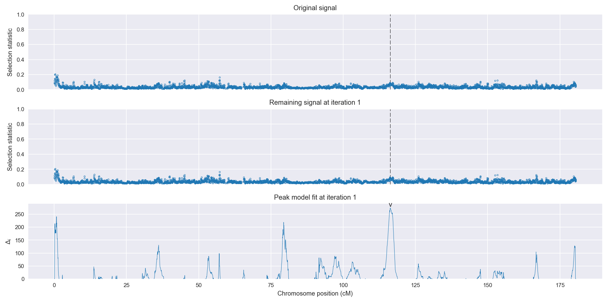
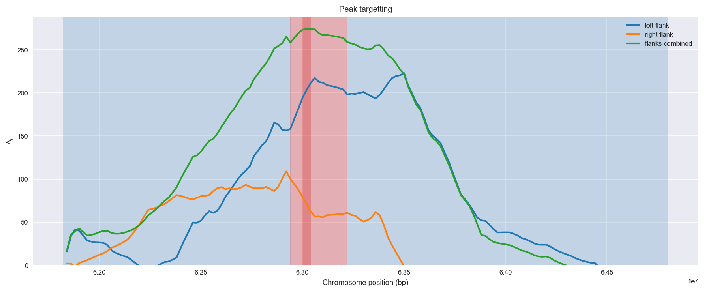
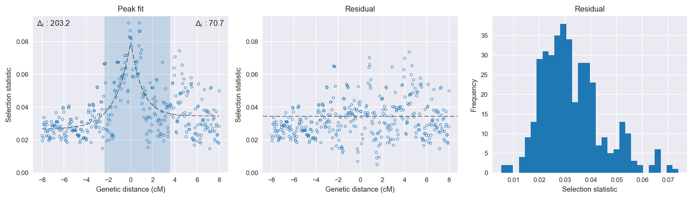

:orphan:

Gabon *An. gambiae* | H12 | Chromosome 3 | Signal #1
================================================================================

This page describes a signal of selection found in the
:doc:`/population/GAS` population using the
:doc:`/method/H12` statistic.The inferred focus of this signal is on chromosome arm
3L between position 9,740,001 and
10,020,000.

The following 16 genes overlap the focal region: :doc:`/gene/AGAP010748`,  :doc:`/gene/AGAP010750` (ryanodine receptor 2),  :doc:`/gene/AGAP010751`,  :doc:`/gene/AGAP010752`,  :doc:`/gene/AGAP010753`,  :doc:`/gene/AGAP010754`,  :doc:`/gene/AGAP010755` (protein mago nashi),  :doc:`/gene/AGAP010756`,  :doc:`/gene/AGAP010757`,  :doc:`/gene/AGAP010758` (Metalloendopeptidase (Fragment)),  :doc:`/gene/AGAP010759`,  :doc:`/gene/AGAP010760`,  :doc:`/gene/AGAP010761`,  :doc:`/gene/AGAP010762`,  :doc:`/gene/AGAP010763`,  :doc:`/gene/AGAP010764` (Metalloendopeptidase).

The following 5 genes are within 50 kbp of the focal
region: :doc:`/gene/AGAP010745`,  :doc:`/gene/AGAP010746`,  :doc:`/gene/AGAP010765`,  :doc:`/gene/AGAP010766`,  :doc:`/gene/AGAP010767`.

.. figure:: peak_location.png
    :alt: signal location

    **Figure 1**. Location of the signal of selection. Blue markers show the
    value of the selection statistic in non-overlapping 20 kbp windows. The
    dashed black line shows the fitted peak model. The vertical red bar shows
    the inferred focus of the selection signal. The shaded blue area shows the
    inferred genomic region affected by the selection event.

Overlapping signals
-------------------

No overlapping signals.

Diagnostics
-----------

The information below provides some diagnostics from the
:doc:`/method/peak_modelling` algorithm.

    **Figure 2**. Chromosome-wide selection statistic and results from peak
    modelling. **a**, TODO. **b**, TODO.

    **Figure 3**. Diagnostics from targetting the selection signal to a focal
    region. TODO.

    **Figure 4**. Diagnostics from fitting a peak model to the selection signal.
    **a**, TODO. **b**, TODO. **c**, TODO.

Model fit reports
~~~~~~~~~~~~~~~~~

Left flank, peak model::

    [[Model]]
        Model(exponential)
    [[Fit Statistics]]
        # function evals   = 27
        # data points      = 196
        # variables        = 3
        chi-square         = 0.017
        reduced chi-square = 0.000
        Akaike info crit   = -1829.614
        Bayesian info crit = -1819.779
    [[Variables]]
        amplitude:   0.05278603 +/- 0.003090 (5.86%) (init= 0.5)
        decay:       1.38614469 +/- 0.162056 (11.69%) (init= 0.5)
        c:           0.02661886 +/- 0.001143 (4.30%) (init= 0.03)
        cap:         1 (fixed)
    [[Correlations]] (unreported correlations are <  0.100)
        C(decay, c)                  = -0.693 
        C(amplitude, decay)          = -0.466 

Right flank, peak model::

    [[Model]]
        Model(exponential)
    [[Fit Statistics]]
        # function evals   = 23
        # data points      = 194
        # variables        = 3
        chi-square         = 0.034
        reduced chi-square = 0.000
        Akaike info crit   = -1674.172
        Bayesian info crit = -1664.369
    [[Variables]]
        amplitude:   0.04628763 +/- 0.006110 (13.20%) (init= 0.5)
        decay:       1.02022397 +/- 0.209740 (20.56%) (init= 0.5)
        c:           0.03463138 +/- 0.001341 (3.87%) (init= 0.03)
        cap:         1 (fixed)
    [[Correlations]] (unreported correlations are <  0.100)
        C(amplitude, decay)          = -0.612 
        C(decay, c)                  = -0.574 

Left flank, null model::

    [[Model]]
        Model(constant)
    [[Fit Statistics]]
        # function evals   = 6
        # data points      = 195
        # variables        = 1
        chi-square         = 0.046
        reduced chi-square = 0.000
        Akaike info crit   = -1626.390
        Bayesian info crit = -1623.117
    [[Variables]]
        c:   0.03571919 +/- 0.001103 (3.09%) (init= 0.03)

Right flank, null model::

    [[Model]]
        Model(constant)
    [[Fit Statistics]]
        # function evals   = 6
        # data points      = 193
        # variables        = 1
        chi-square         = 0.047
        reduced chi-square = 0.000
        Akaike info crit   = -1603.434
        Bayesian info crit = -1600.172
    [[Variables]]
        c:   0.03960194 +/- 0.001127 (2.85%) (init= 0.03)

Comments
--------

.. raw:: html

    

    
    <noscript>Please enable JavaScript to view the <a href="https://disqus.com/?ref_noscript">comments powered by Disqus.</a></noscript>
