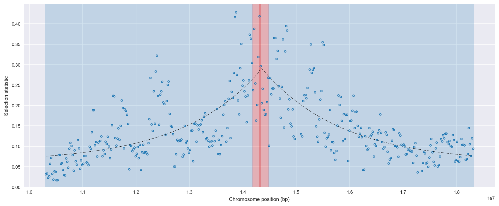
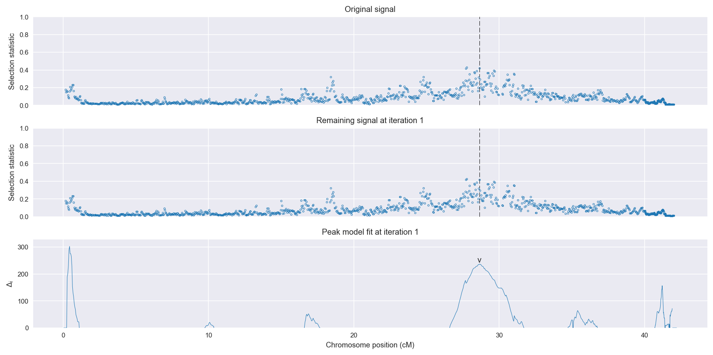
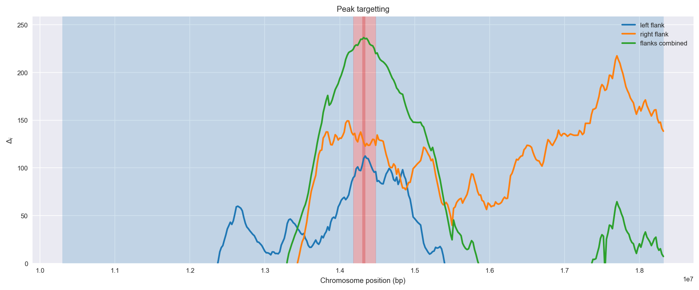
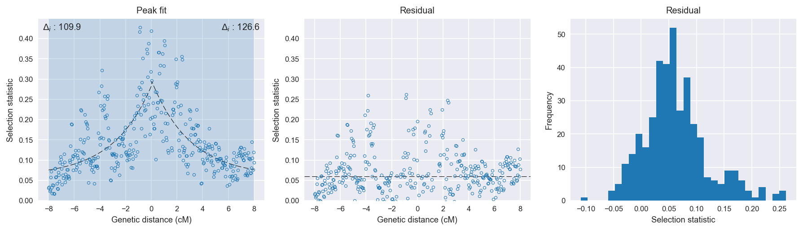

:orphan:

Gabon *An. gambiae* | H12 | Chromosome X | Signal #1
================================================================================

This page describes a signal of selection found in the
:doc:`/population/GAS` population using the
:doc:`/method/H12` statistic.The inferred focus of this signal is on chromosome arm
**X between position 14,180,001 and
14,480,000**.

The following 18 genes overlap the focal region: :doc:`/gene/AGAP000780` (Yippee-like 5),  :doc:`/gene/AGAP000781` (mitochondrial import inner membrane translocase subunit Tim9),  :doc:`/gene/AGAP000782`,  :doc:`/gene/AGAP000783`,  :doc:`/gene/AGAP000784` (abhydrolase domain containing 4),  :doc:`/gene/AGAP000785` (Synaptic vesicle protein),  :doc:`/gene/AGAP000786`,  :doc:`/gene/AGAP000787` (E3 ubiquitin-protein ligase NEDD4),  :doc:`/gene/AGAP000788`,  :doc:`/gene/AGAP013147`,  :doc:`/gene/AGAP000789`,  :doc:`/gene/AGAP000790`,  :doc:`/gene/AGAP000791` (Tango10),  :doc:`/gene/AGAP000792` (Adenosylhomocysteinase),  :doc:`/gene/AGAP000793`,  :doc:`/gene/AGAP000794` (NADH dehydrogenase (ubiquinone) Fe-S protein 2),  :doc:`/gene/AGAP013289`,  :doc:`/gene/AGAP000795`.

No genes are within 50 kbp of the focal region.

    **Figure 1**. Location of the signal of selection. Blue markers show the
    value of the selection statistic in non-overlapping 20 kbp windows. The
    dashed black line shows the fitted peak model. The vertical red bar shows
    the inferred focus of the selection signal. The shaded blue area shows the
    inferred genomic region affected by the selection event.

Overlapping signals
-------------------

No overlapping signals.

Diagnostics
-----------

The information below provides some diagnostics from the
:doc:`/method/peak_modelling` algorithm.

    **Figure 2**. Chromosome-wide selection statistic and results from peak
    modelling. **a**, TODO. **b**, TODO.

    **Figure 3**. Diagnostics from targetting the selection signal to a focal
    region. TODO.

    **Figure 4**. Diagnostics from fitting a peak model to the selection signal.
    **a**, TODO. **b**, TODO. **c**, TODO.

Model fit reports
~~~~~~~~~~~~~~~~~

Left flank, peak model::

    [[Model]]
        Model(exponential)
    [[Fit Statistics]]
        # function evals   = 195
        # data points      = 200
        # variables        = 3
        chi-square         = 0.757
        reduced chi-square = 0.004
        Akaike info crit   = -1109.262
        Bayesian info crit = -1099.367
    [[Variables]]
        amplitude:   0.22269806 +/- 0.018152 (8.15%) (init= 0.5)
        decay:       2.99997496 +/- 0.740451 (24.68%) (init= 0.5)
        c:           0.05999999 +/- 0.000808 (1.35%) (init= 0.03)
        cap:         1 (fixed)
    [[Correlations]] (unreported correlations are <  0.100)
        C(decay, c)                  =  0.926 
        C(amplitude, c)              =  0.600 
        C(amplitude, decay)          =  0.338 

Right flank, peak model::

    [[Model]]
        Model(exponential)
    [[Fit Statistics]]
        # function evals   = 113
        # data points      = 191
        # variables        = 3
        chi-square         = 0.566
        reduced chi-square = 0.003
        Akaike info crit   = -1106.001
        Bayesian info crit = -1096.244
    [[Variables]]
        amplitude:   0.23761368 +/- 0.016575 (6.98%) (init= 0.5)
        decay:       2.99999999 +/- 0.550126 (18.34%) (init= 0.5)
        c:           0.05999999 +/- 0.008024 (13.37%) (init= 0.03)
        cap:         1 (fixed)
    [[Correlations]] (unreported correlations are <  0.100)
        C(decay, c)                  =  0.927 
        C(amplitude, c)              =  0.587 
        C(amplitude, decay)          =  0.325 

Left flank, null model::

    [[Model]]
        Model(constant)
    [[Fit Statistics]]
        # function evals   = 6
        # data points      = 199
        # variables        = 1
        chi-square         = 1.299
        reduced chi-square = 0.007
        Akaike info crit   = -999.378
        Bayesian info crit = -996.085
    [[Variables]]
        c:   0.13759486 +/- 0.005740 (4.17%) (init= 0.03)

Right flank, null model::

    [[Model]]
        Model(constant)
    [[Fit Statistics]]
        # function evals   = 6
        # data points      = 190
        # variables        = 1
        chi-square         = 1.085
        reduced chi-square = 0.006
        Akaike info crit   = -979.356
        Bayesian info crit = -976.109
    [[Variables]]
        c:   0.14332874 +/- 0.005497 (3.84%) (init= 0.03)

Comments
--------

.. raw:: html

    

    
    <noscript>Please enable JavaScript to view the <a href="https://disqus.com/?ref_noscript">comments powered by Disqus.</a></noscript>
