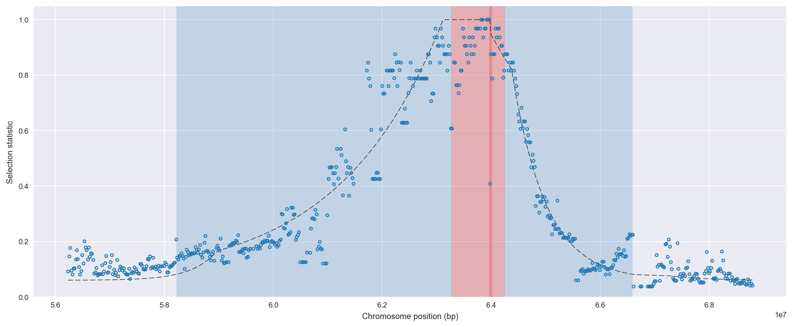
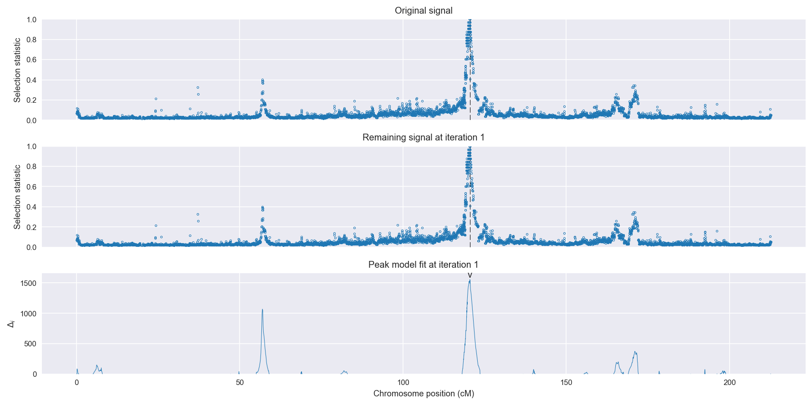
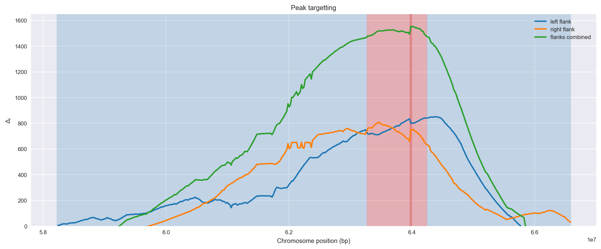
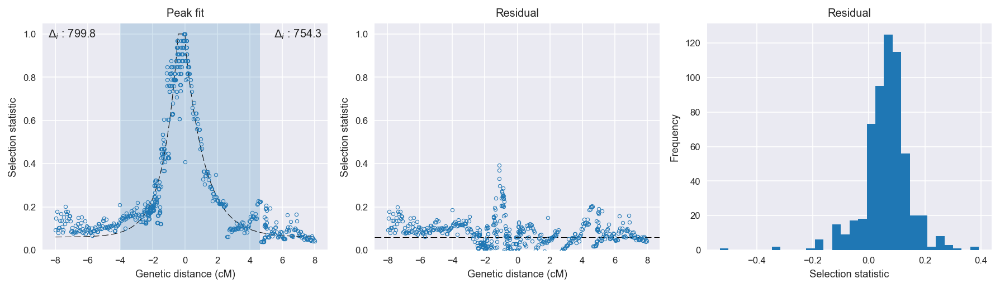

:orphan:

Guinea *An. gambiae* | H12 | Chromosome 2 | Signal #1
================================================================================

This page describes a signal of selection found in the
:doc:`/population/GNS` population using the
:doc:`/method/H12` statistic.The inferred focus of this signal is on chromosome arm
**2L between position 1,720,001 and
2,700,000**.

The following 25 genes overlap the focal region: :doc:`/gene/AGAP028435`,  :doc:`/gene/AGAP004695` (ESCRT-I complex subunit MVB12),  :doc:`/gene/AGAP004696` (exd - Homeobox protein extradenticle),  :doc:`/gene/AGAP004698` (pre-mRNA-splicing factor 38B),  :doc:`/gene/AGAP004699` (RAF proto-oncogene serine/threonine-protein kinase),  :doc:`/gene/AGAP004700`,  :doc:`/gene/AGAP004701`,  :doc:`/gene/AGAP028436`,  :doc:`/gene/AGAP004702`,  :doc:`/gene/AGAP004703` (DNA-directed RNA polymerase III subunit RPC1),  :doc:`/gene/AGAP004704` (COMPASS component SPP1),  :doc:`/gene/AGAP028437`,  :doc:`/gene/AGAP004706`,  :doc:`/gene/AGAP004707` (para - voltage-gated sodium channel),  :doc:`/gene/AGAP004708` (arginyl-tRNA synthetase),  :doc:`/gene/AGAP004709` (mRpL18 - 39S ribosomal protein L18, mitochondrial),  :doc:`/gene/AGAP004710` (ubiquinol-cytochrome c reductase subunit 9),  :doc:`/gene/AGAP004711` (ATP-dependent RNA helicase DDX41),  :doc:`/gene/AGAP004712`,  :doc:`/gene/AGAP004713`,  :doc:`/gene/AGAP004714`,  :doc:`/gene/AGAP004715` (Pyruvate dehydrogenase phosphatase regulatory subunit, mitochondrial),  :doc:`/gene/AGAP004716` (Gr57 - gustatory receptor 57),  :doc:`/gene/AGAP004717`,  :doc:`/gene/AGAP004718`.

The following 4 genes are within 40 kbp of the focal
region: :doc:`/gene/AGAP028434`,  :doc:`/gene/AGAP004719` (CLIPC9 - CLIP-domain serine protease),  :doc:`/gene/AGAP004720`,  :doc:`/gene/AGAP004721` (N-acetylglucosamine-6-sulfatase).

    **Figure 1**. Location of the signal of selection. Blue markers show the
    value of the selection statistic in non-overlapping 20 kbp windows. The
    dashed black line shows the fitted peak model. The vertical red bar shows
    the inferred focus of the selection signal. The shaded blue area shows the
    inferred genomic region affected by the selection event.

Overlapping signals
-------------------

The following selection signals have an inferred focus which overlaps with the
focus of this signal:

.. cssclass:: table-hover
.. csv-table::
    :widths: auto
    :header: Signal, Focus, Score

    :doc:`/signal/H12/BFM/chr2/1/index`,":2500001-2900000",1736
    :doc:`/signal/H12/BFS/chr2/1/index`,":2420001-2720000",1728
    :doc:`/signal/H12/UGS/chr2/2/index`,":1940001-3080000",1332
    :doc:`/signal/H12/CMS/chr2/2/index`,":2460001-2960000",635
    :doc:`/signal/H12/GAS/chr2/2/index`,":2600001-2640000",321
    

Diagnostics
-----------

The information below provides some diagnostics from the
:doc:`/method/peak_modelling` algorithm.

    **Figure 2**. Chromosome-wide selection statistic and results from peak
    modelling. **a**, TODO. **b**, TODO.

    **Figure 3**. Diagnostics from targetting the selection signal to a focal
    region. TODO.

    **Figure 4**. Diagnostics from fitting a peak model to the selection signal.
    **a**, TODO. **b**, TODO. **c**, TODO.

Model fit reports
~~~~~~~~~~~~~~~~~

Left flank, peak model::

    [[Model]]
        Model(exponential)
    [[Fit Statistics]]
        # function evals   = 295
        # data points      = 360
        # variables        = 3
        chi-square         = 3.598
        reduced chi-square = 0.010
        Akaike info crit   = -1652.103
        Bayesian info crit = -1640.445
    [[Variables]]
        amplitude:   1.47606372 +/- 0.054935 (3.72%) (init= 0.5)
        decay:       0.94924987 +/- 0.045058 (4.75%) (init= 0.5)
        c:           0.05999999 +/- 0.022009 (36.68%) (init= 0.03)
        cap:         1 (fixed)
    [[Correlations]] (unreported correlations are <  0.100)
        C(amplitude, decay)          = -0.813 
        C(decay, c)                  =  0.653 
        C(amplitude, c)              = -0.238 

Right flank, peak model::

    [[Model]]
        Model(exponential)
    [[Fit Statistics]]
        # function evals   = 66
        # data points      = 229
        # variables        = 3
        chi-square         = 0.522
        reduced chi-square = 0.002
        Akaike info crit   = -1387.400
        Bayesian info crit = -1377.099
    [[Variables]]
        amplitude:   0.89401935 +/- 0.011501 (1.29%) (init= 0.5)
        decay:       1.24422427 +/- 0.039158 (3.15%) (init= 0.5)
        c:           0.06000000 +/- 1.30e-05 (0.02%) (init= 0.03)
        cap:         1 (fixed)
    [[Correlations]] (unreported correlations are <  0.100)
        C(decay, c)                  =  0.656 
        C(amplitude, decay)          = -0.304 
        C(amplitude, c)              =  0.201 

Left flank, null model::

    [[Model]]
        Model(constant)
    [[Fit Statistics]]
        # function evals   = 6
        # data points      = 355
        # variables        = 1
        chi-square         = 31.996
        reduced chi-square = 0.090
        Akaike info crit   = -852.305
        Bayesian info crit = -848.433
    [[Variables]]
        c:   0.36079055 +/- 0.015956 (4.42%) (init= 0.03)

Right flank, null model::

    [[Model]]
        Model(constant)
    [[Fit Statistics]]
        # function evals   = 6
        # data points      = 226
        # variables        = 1
        chi-square         = 13.603
        reduced chi-square = 0.060
        Akaike info crit   = -633.114
        Bayesian info crit = -629.694
    [[Variables]]
        c:   0.23234693 +/- 0.016355 (7.04%) (init= 0.03)

Comments
--------

.. raw:: html

    

    
    <noscript>Please enable JavaScript to view the <a href="https://disqus.com/?ref_noscript">comments powered by Disqus.</a></noscript>
