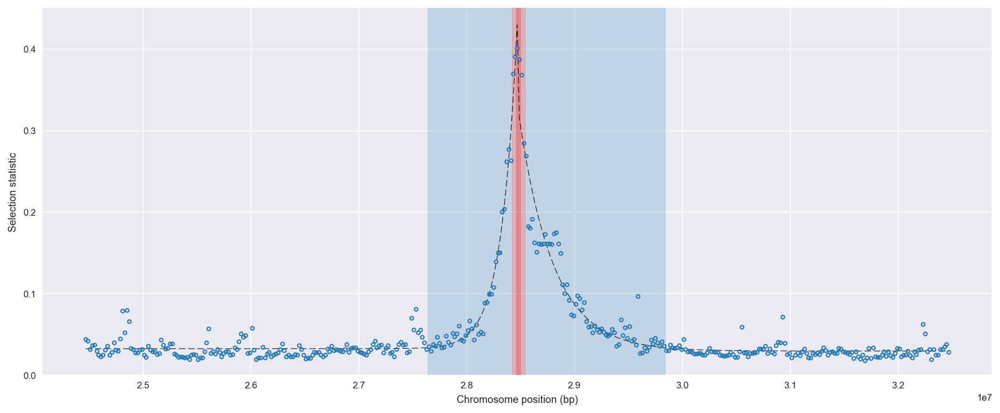
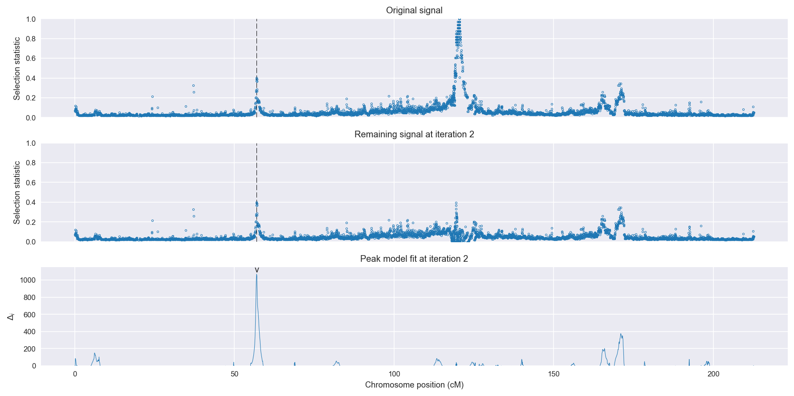
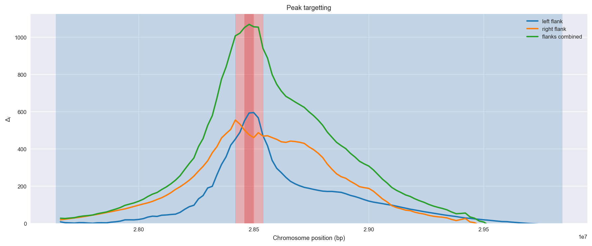
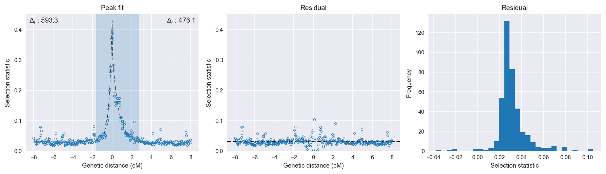

:orphan:

Guinea *An. gambiae* | H12 | Chromosome 2 | Signal #2
================================================================================

This page describes a signal of selection found in the
:doc:`/population/GNS` population using the
:doc:`/method/H12` statistic.The inferred focus of this signal is on chromosome arm
**2R** between positions **28,420,001** and
**28,540,000**.

The following 15 genes overlap the focal region: :doc:`/gene/AGAP002859` (solute carrier family 8 (sodium/calcium exchanger)),  :doc:`/gene/AGAP002862` (CYP6AA1 - cytochrome P450),  :doc:`/gene/AGAP013128` (CYP6AA2 - cytochrome P450),  :doc:`/gene/AGAP002863` (COEAE6O - carboxylesterase alpha esterase),  :doc:`/gene/AGAP002864` (CYP6P15P - cytochrome P450),  :doc:`/gene/AGAP002865` (CYP6P3 - cytochrome P450),  :doc:`/gene/AGAP002866` (CYP6P5 - cytochrome P450),  :doc:`/gene/AGAP002867` (CYP6P4 - cytochrome P450),  :doc:`/gene/AGAP002868` (CYP6P1 - cytochrome P450),  :doc:`/gene/AGAP002869` (CYP6P2 - cytochrome P450),  :doc:`/gene/AGAP002870` (CYP6AD1 - cytochrome P450),  :doc:`/gene/AGAP013202`,  :doc:`/gene/AGAP000586`,  :doc:`/gene/AGAP002872` (lipase),  :doc:`/gene/AGAP002873`.

The following 10 genes are within 50 kbp of the focal
region: :doc:`/gene/AGAP002858` (Sodium/potassium-transporting ATPase subunit alpha),  :doc:`/gene/AGAP013069`,  :doc:`/gene/AGAP002874`,  :doc:`/gene/AGAP002875` (protein HEXIM1/2),  :doc:`/gene/AGAP013244` (adenosine deaminase, tRNA-specific 2, TAD2 homolog),  :doc:`/gene/AGAP002876` (single-strand selective monofunctional uracil DNA glycosylase),  :doc:`/gene/AGAP002877` (Tetratricopeptide repeat protein 30 homolog),  :doc:`/gene/AGAP002878` (Cystatin-like protein),  :doc:`/gene/AGAP002879` (cathepsin F),  :doc:`/gene/AGAP002880` (COP9 signalosome complex subunit 5).

    **Figure 1**. Location of the signal of selection. Blue markers show the
    value of the selection statistic in non-overlapping 20 kbp windows. The
    dashed black line shows the fitted peak model. The vertical red bar shows
    the inferred focus of the selection signal. The shaded blue area shows the
    inferred genomic region affected by the selection event.

Overlapping signals
-------------------

The following selection signals have an inferred focus which overlaps with the
focus of this signal:

.. cssclass:: table-hover
.. csv-table::
    :widths: auto
    :header: Signal, Focus, Score

    :doc:`/signal/H12/UGS/chr2/1/index`,"2R:28,420,001-28,520,000",1602
    :doc:`/signal/H12/CMS/chr2/1/index`,"2R:28,400,001-28,460,000",1231
    :doc:`/signal/H12/BFS/chr2/3/index`,"2R:28,440,001-28,520,000",965
    :doc:`/signal/H12/BFM/chr2/4/index`,"2R:28,380,001-28,500,000",442
    

Diagnostics
-----------

The information below provides some diagnostics from the
:doc:`/method/peak_modelling` algorithm.

    **Figure 2**. Chromosome-wide selection statistic and results from peak
    modelling. **a**, TODO. **b**, TODO.

    **Figure 3**. Diagnostics from targetting the selection signal to a focal
    region. TODO.

    **Figure 4**. Diagnostics from fitting a peak model to the selection signal.
    **a**, TODO. **b**, TODO. **c**, TODO.

Model fit reports
~~~~~~~~~~~~~~~~~

Left flank, peak model::

    [[Model]]
        Model(exponential)
    [[Fit Statistics]]
        # function evals   = 19
        # data points      = 201
        # variables        = 3
        chi-square         = 0.027
        reduced chi-square = 0.000
        Akaike info crit   = -1783.423
        Bayesian info crit = -1773.513
    [[Variables]]
        amplitude:   0.39748115 +/- 0.007621 (1.92%) (init= 0.5)
        decay:       0.29352011 +/- 0.008860 (3.02%) (init= 0.5)
        c:           0.03228243 +/- 0.000897 (2.78%) (init= 0.03)
        cap:         1 (fixed)
    [[Correlations]] (unreported correlations are <  0.100)
        C(amplitude, decay)          = -0.623 
        C(decay, c)                  = -0.281 

Right flank, peak model::

    [[Model]]
        Model(exponential)
    [[Fit Statistics]]
        # function evals   = 27
        # data points      = 199
        # variables        = 3
        chi-square         = 0.048
        reduced chi-square = 0.000
        Akaike info crit   = -1652.107
        Bayesian info crit = -1642.228
    [[Variables]]
        amplitude:   0.30391414 +/- 0.008343 (2.75%) (init= 0.5)
        decay:       0.63852819 +/- 0.026695 (4.18%) (init= 0.5)
        c:           0.02940499 +/- 0.001344 (4.57%) (init= 0.03)
        cap:         1 (fixed)
    [[Correlations]] (unreported correlations are <  0.100)
        C(amplitude, decay)          = -0.665 
        C(decay, c)                  = -0.437 

Left flank, null model::

    [[Model]]
        Model(constant)
    [[Fit Statistics]]
        # function evals   = 6
        # data points      = 200
        # variables        = 1
        chi-square         = 0.516
        reduced chi-square = 0.003
        Akaike info crit   = -1190.113
        Bayesian info crit = -1186.815
    [[Variables]]
        c:   0.04603798 +/- 0.003599 (7.82%) (init= 0.03)

Right flank, null model::

    [[Model]]
        Model(constant)
    [[Fit Statistics]]
        # function evals   = 6
        # data points      = 198
        # variables        = 1
        chi-square         = 0.516
        reduced chi-square = 0.003
        Akaike info crit   = -1175.962
        Bayesian info crit = -1172.674
    [[Variables]]
        c:   0.05133804 +/- 0.003638 (7.09%) (init= 0.03)

Comments
--------

.. raw:: html

    

    
    <noscript>Please enable JavaScript to view the <a href="https://disqus.com/?ref_noscript">comments powered by Disqus.</a></noscript>
