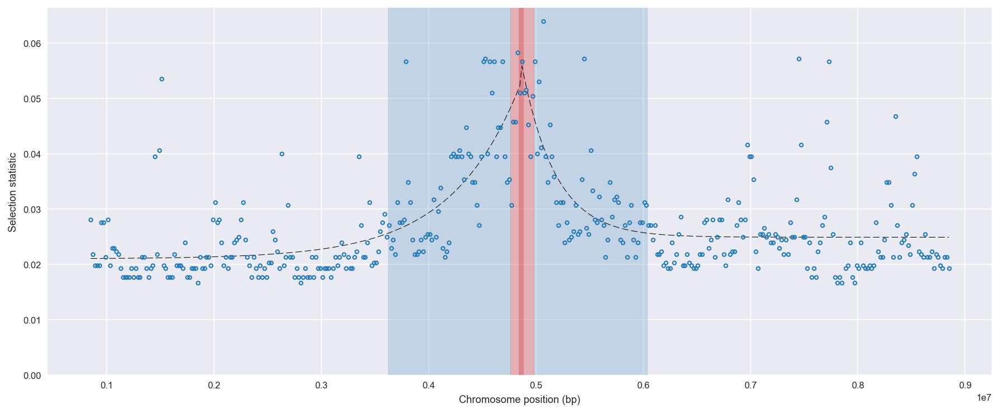
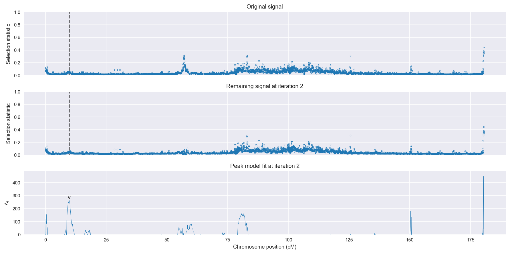
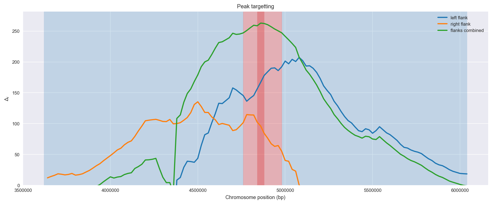

:orphan:

Guinea *An. gambiae* | H12 | Chromosome 3 | Signal #2
================================================================================

This page describes a signal of selection found in the
:doc:`/population/GNS` population using the
:doc:`/method/H12` statistic.The inferred focus of this signal is on chromosome arm
**3R** between positions **4,760,001** and
**4,980,000**.

The following 34 genes overlap the focal region: :doc:`/gene/AGAP008033`,  :doc:`/gene/AGAP013760`,  :doc:`/gene/AGAP008034` (solute carrier family 39 (zinc transporter), member 7),  :doc:`/gene/AGAP008035`,  :doc:`/gene/AGAP008036`,  :doc:`/gene/AGAP008037` (KDEL (Lys-Asp-Glu-Leu) containing 1, isoform CRA_a),  :doc:`/gene/AGAP008039` (protein kinase A),  :doc:`/gene/AGAP008040`,  :doc:`/gene/AGAP008041` (RING finger protein 121),  :doc:`/gene/AGAP008042` (pyridine nucleotide-disulfide oxidoreductase domain 1),  :doc:`/gene/AGAP008043` (mRpS18B - 28S ribosomal protein S18B, mitochondrial),  :doc:`/gene/AGAP008044` (programmed cell death 8 (apoptosis-inducing factor)),  :doc:`/gene/AGAP008045` (transcription initiation factor TFIID subunit 13),  :doc:`/gene/AGAP013736`,  :doc:`/gene/AGAP008046` (protein kinase C and casein kinase substrate in neurons 2 protein),  :doc:`/gene/AGAP013713`,  :doc:`/gene/AGAP008047` (integrator complex subunit 1),  :doc:`/gene/AGAP008048`,  :doc:`/gene/AGAP008049` (cell division cycle 123 homolog),  :doc:`/gene/AGAP008050` (phosphorylated adapter RNA export protein),  :doc:`/gene/AGAP008051` (SAP1 - sensory appendage protein 1),  :doc:`/gene/AGAP008052` (SAP2 - sensory appendage protein 2),  :doc:`/gene/AGAP008053` (sphingomyelin phosphodiesterase 2),  :doc:`/gene/AGAP008054` (SAP3 - sensory appendage protein 3),  :doc:`/gene/AGAP008055` (CSP3 - chemosensory protein 3),  :doc:`/gene/AGAP008056`,  :doc:`/gene/AGAP029127` (CSP5 - chemosensory protein 5),  :doc:`/gene/AGAP008059` (CSP1 - chemosensory protein 1),  :doc:`/gene/AGAP008060` (IDGF2 - imaginal disc growth factor 2),  :doc:`/gene/AGAP008061` (IDGF4 - imaginal disc growth factor 4),  :doc:`/gene/AGAP008062` (CSP4 - chemosensory protein 4),  :doc:`/gene/AGAP008063` (exosome complex component CSL4),  :doc:`/gene/AGAP008064` (uroporphyrinogen-III synthase),  :doc:`/gene/AGAP008065`.

The following 3 genes are within 50 kbp of the focal
region: :doc:`/gene/AGAP028427`,  :doc:`/gene/AGAP013757`,  :doc:`/gene/AGAP008067`.

    **Figure 1**. Location of the signal of selection. Blue markers show the
    value of the selection statistic in non-overlapping 20 kbp windows. The
    dashed black line shows the fitted peak model. The vertical red bar shows
    the inferred focus of the selection signal. The shaded blue area shows the
    inferred genomic region affected by the selection event.

Overlapping signals
-------------------

No overlapping signals.

Diagnostics
-----------

The information below provides some diagnostics from the
:doc:`/method/peak_modelling` algorithm.

    **Figure 2**. Chromosome-wide selection statistic and results from peak
    modelling. **a**, TODO. **b**, TODO.

    **Figure 3**. Diagnostics from targetting the selection signal to a focal
    region. TODO.

.. figure:: peak_fit.png

    **Figure 4**. Diagnostics from fitting a peak model to the selection signal.
    **a**, TODO. **b**, TODO. **c**, TODO.

Model fit reports
~~~~~~~~~~~~~~~~~

Left flank, peak model::

    [[Model]]
        Model(exponential)
    [[Fit Statistics]]
        # function evals   = 35
        # data points      = 201
        # variables        = 3
        chi-square         = 0.008
        reduced chi-square = 0.000
        Akaike info crit   = -2026.602
        Bayesian info crit = -2016.692
    [[Variables]]
        amplitude:   0.03125528 +/- 0.002197 (7.03%) (init= 0.5)
        decay:       1.28432382 +/- 0.174111 (13.56%) (init= 0.5)
        c:           0.02100510 +/- 0.000736 (3.50%) (init= 0.03)
        cap:         1 (fixed)
    [[Correlations]] (unreported correlations are <  0.100)
        C(decay, c)                  = -0.667 
        C(amplitude, decay)          = -0.495 

Right flank, peak model::

    [[Model]]
        Model(exponential)
    [[Fit Statistics]]
        # function evals   = 27
        # data points      = 199
        # variables        = 3
        chi-square         = 0.010
        reduced chi-square = 0.000
        Akaike info crit   = -1973.945
        Bayesian info crit = -1964.065
    [[Variables]]
        amplitude:   0.03301662 +/- 0.003760 (11.39%) (init= 0.5)
        decay:       0.62556078 +/- 0.108119 (17.28%) (init= 0.5)
        c:           0.02491117 +/- 0.000596 (2.39%) (init= 0.03)
        cap:         1 (fixed)
    [[Correlations]] (unreported correlations are <  0.100)
        C(amplitude, decay)          = -0.667 
        C(decay, c)                  = -0.432 

Left flank, null model::

    [[Model]]
        Model(constant)
    [[Fit Statistics]]
        # function evals   = 6
        # data points      = 200
        # variables        = 1
        chi-square         = 0.018
        reduced chi-square = 0.000
        Akaike info crit   = -1859.589
        Bayesian info crit = -1856.291
    [[Variables]]
        c:   0.02590530 +/- 0.000675 (2.61%) (init= 0.03)

Right flank, null model::

    [[Model]]
        Model(constant)
    [[Fit Statistics]]
        # function evals   = 6
        # data points      = 198
        # variables        = 1
        chi-square         = 0.015
        reduced chi-square = 0.000
        Akaike info crit   = -1878.039
        Bayesian info crit = -1874.750
    [[Variables]]
        c:   0.02723909 +/- 0.000618 (2.27%) (init= 0.03)

Comments
--------

.. raw:: html

    

    
    <noscript>Please enable JavaScript to view the <a href="https://disqus.com/?ref_noscript">comments powered by Disqus.</a></noscript>
