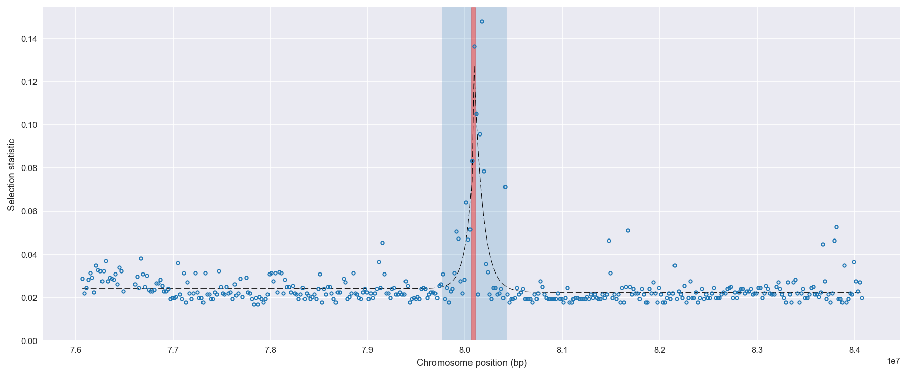
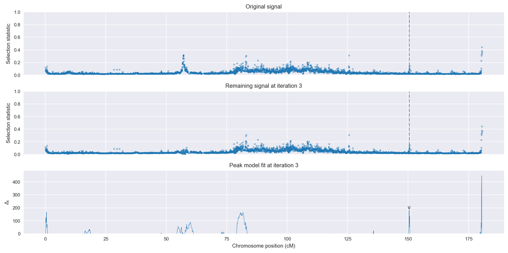
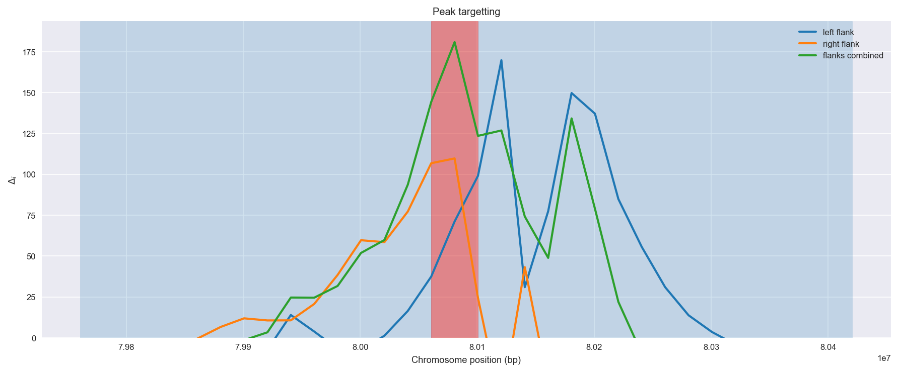
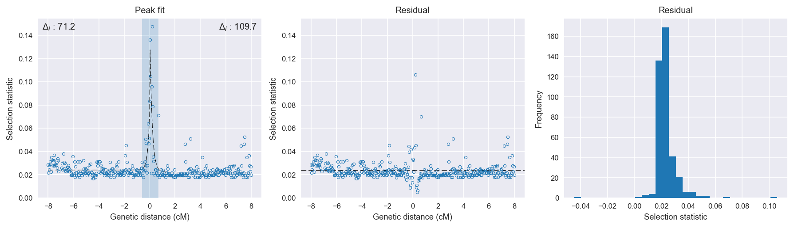

:orphan:

Guinea *An. gambiae* | H12 | Chromosome 3 | Signal #3
================================================================================

This page describes a signal of selection found in the
:doc:`/population/GNS` population using the
:doc:`/method/H12` statistic.The inferred focus of this signal is on chromosome arm
**3L** between positions **26,860,001** and
**26,900,000**.

The following 5 genes overlap the focal region: :doc:`/gene/AGAP011530`,  :doc:`/gene/AGAP011531` (Selenium-binding protein 2),  :doc:`/gene/AGAP011532` (septin),  :doc:`/gene/AGAP011533` (tetratricopeptide repeat protein 15),  :doc:`/gene/AGAP011534`.

The following 7 genes are within 50 kbp of the focal
region: :doc:`/gene/AGAP011535` (transcription elongation factor B, polypeptide 1),  :doc:`/gene/AGAP011536` (Mini-chromosome maintenance complex-binding protein),  :doc:`/gene/AGAP011537` (Argonaute 3),  :doc:`/gene/AGAP028430`,  :doc:`/gene/AGAP011538`,  :doc:`/gene/AGAP011539` (dynein intermediate chain 2, axonemal),  :doc:`/gene/AGAP011540` (dynein intermediate chain 2, axonemal).

    **Figure 1**. Location of the signal of selection. Blue markers show the
    value of the selection statistic in non-overlapping 20 kbp windows. The
    dashed black line shows the fitted peak model. The vertical red bar shows
    the inferred focus of the selection signal. The shaded blue area shows the
    inferred genomic region affected by the selection event.

Overlapping signals
-------------------

The following selection signals have an inferred focus which overlaps with the
focus of this signal:

.. cssclass:: table-hover
.. csv-table::
    :widths: auto
    :header: Signal, Focus, Score

    :doc:`/signal/H12/CMS/chr3/2/index`,"3L:26,880,001-26,940,000",308
    :doc:`/signal/H12/BFS/chr3/2/index`,"3L:26,880,001-26,920,000",257
    

Diagnostics
-----------

The information below provides some diagnostics from the
:doc:`/method/peak_modelling` algorithm.

    **Figure 2**. Chromosome-wide selection statistic and results from peak
    modelling. **a**, TODO. **b**, TODO.

    **Figure 3**. Diagnostics from targetting the selection signal to a focal
    region. TODO.

    **Figure 4**. Diagnostics from fitting a peak model to the selection signal.
    **a**, TODO. **b**, TODO. **c**, TODO.

Model fit reports
~~~~~~~~~~~~~~~~~

Left flank, peak model::

    [[Model]]
        Model(exponential)
    [[Fit Statistics]]
        # function evals   = 39
        # data points      = 194
        # variables        = 3
        chi-square         = 0.006
        reduced chi-square = 0.000
        Akaike info crit   = -2009.188
        Bayesian info crit = -1999.385
    [[Variables]]
        amplitude:   0.04967319 +/- 0.004533 (9.13%) (init= 0.5)
        decay:       0.15000002 +/- 0.022456 (14.97%) (init= 0.5)
        c:           0.02403028 +/- 0.000418 (1.74%) (init= 0.03)
        cap:         1 (fixed)
    [[Correlations]] (unreported correlations are <  0.100)
        C(amplitude, decay)          = -0.588 
        C(decay, c)                  = -0.201 

Right flank, peak model::

    [[Model]]
        Model(exponential)
    [[Fit Statistics]]
        # function evals   = 27
        # data points      = 200
        # variables        = 3
        chi-square         = 0.021
        reduced chi-square = 0.000
        Akaike info crit   = -1824.702
        Bayesian info crit = -1814.807
    [[Variables]]
        amplitude:   0.13118558 +/- 0.012342 (9.41%) (init= 0.5)
        decay:       0.18137062 +/- 0.022040 (12.15%) (init= 0.5)
        c:           0.02224291 +/- 0.000769 (3.46%) (init= 0.03)
        cap:         1 (fixed)
    [[Correlations]] (unreported correlations are <  0.100)
        C(amplitude, decay)          = -0.768 
        C(decay, c)                  = -0.218 

Left flank, null model::

    [[Model]]
        Model(constant)
    [[Fit Statistics]]
        # function evals   = 6
        # data points      = 193
        # variables        = 1
        chi-square         = 0.008
        reduced chi-square = 0.000
        Akaike info crit   = -1938.013
        Bayesian info crit = -1934.750
    [[Variables]]
        c:   0.02482302 +/- 0.000474 (1.91%) (init= 0.03)

Right flank, null model::

    [[Model]]
        Model(constant)
    [[Fit Statistics]]
        # function evals   = 6
        # data points      = 199
        # variables        = 1
        chi-square         = 0.036
        reduced chi-square = 0.000
        Akaike info crit   = -1714.959
        Bayesian info crit = -1711.666
    [[Variables]]
        c:   0.02428375 +/- 0.000951 (3.92%) (init= 0.03)

Comments
--------

.. raw:: html

    

    
    <noscript>Please enable JavaScript to view the <a href="https://disqus.com/?ref_noscript">comments powered by Disqus.</a></noscript>
