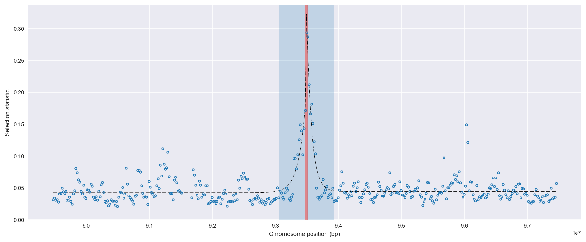
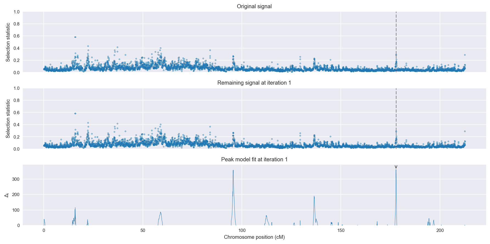
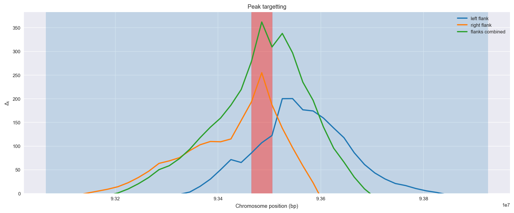
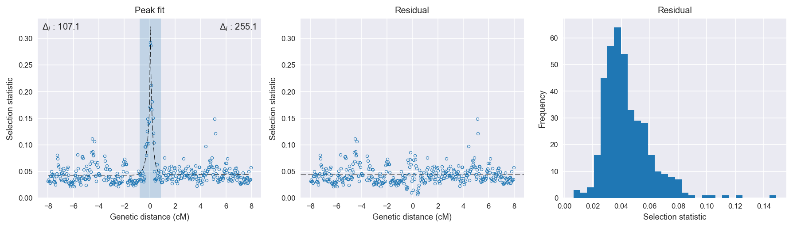

:orphan:

Guinea-Bissau | H12 | Chromosome 2 | Signal #1
================================================================================

This page describes a signal of selection found in the
:doc:`/population/GWA` population using the
:doc:`/method/H12` statistic.The inferred focus of this signal is on chromosome arm
**2L between position 31,920,001 and
31,960,000**.

The following 2 genes overlap the focal region: :doc:`/gene/AGAP006439` (fringe),  :doc:`/gene/AGAP006440` (IR136 - ionotropic receptor IR136).

The following 4 genes are within 40 kbp of the focal
region: :doc:`/gene/AGAP006436` (Med13 - mediator of RNA polymerase II transcription subunit 13),  :doc:`/gene/AGAP028457`,  :doc:`/gene/AGAP006437`,  :doc:`/gene/AGAP006438` (ribosomal biogenesis protein LAS1).

    **Figure 1**. Location of the signal of selection. Blue markers show the
    value of the selection statistic in non-overlapping 20 kbp windows. The
    dashed black line shows the fitted peak model. The vertical red bar shows
    the inferred focus of the selection signal. The shaded blue area shows the
    inferred genomic region affected by the selection event.

Overlapping signals
-------------------

No overlapping signals.

Diagnostics
-----------

The information below provides some diagnostics from the
:doc:`/method/peak_modelling` algorithm.

    **Figure 2**. Chromosome-wide selection statistic and results from peak
    modelling. **a**, TODO. **b**, TODO.

    **Figure 3**. Diagnostics from targetting the selection signal to a focal
    region. TODO.

    **Figure 4**. Diagnostics from fitting a peak model to the selection signal.
    **a**, TODO. **b**, TODO. **c**, TODO.

Model fit reports
~~~~~~~~~~~~~~~~~

Left flank, peak model::

    [[Model]]
        Model(exponential)
    [[Fit Statistics]]
        # function evals   = 47
        # data points      = 194
        # variables        = 3
        chi-square         = 0.059
        reduced chi-square = 0.000
        Akaike info crit   = -1565.619
        Bayesian info crit = -1555.815
    [[Variables]]
        amplitude:   0.13468422 +/- 0.012571 (9.33%) (init= 0.5)
        decay:       0.22250944 +/- 0.033051 (14.85%) (init= 0.5)
        c:           0.04259374 +/- 0.001339 (3.14%) (init= 0.03)
        cap:         1 (fixed)
    [[Correlations]] (unreported correlations are <  0.100)
        C(amplitude, decay)          = -0.613 
        C(decay, c)                  = -0.247 

Right flank, peak model::

    [[Model]]
        Model(exponential)
    [[Fit Statistics]]
        # function evals   = 35
        # data points      = 199
        # variables        = 3
        chi-square         = 0.051
        reduced chi-square = 0.000
        Akaike info crit   = -1641.010
        Bayesian info crit = -1631.130
    [[Variables]]
        amplitude:   0.35750513 +/- 0.021218 (5.94%) (init= 0.5)
        decay:       0.15872348 +/- 0.011939 (7.52%) (init= 0.5)
        c:           0.04434884 +/- 0.001188 (2.68%) (init= 0.03)
        cap:         1 (fixed)
    [[Correlations]] (unreported correlations are <  0.100)
        C(amplitude, decay)          = -0.780 
        C(decay, c)                  = -0.204 

Left flank, null model::

    [[Model]]
        Model(constant)
    [[Fit Statistics]]
        # function evals   = 6
        # data points      = 193
        # variables        = 1
        chi-square         = 0.100
        reduced chi-square = 0.001
        Akaike info crit   = -1458.500
        Bayesian info crit = -1455.237
    [[Variables]]
        c:   0.04616688 +/- 0.001641 (3.55%) (init= 0.03)

Right flank, null model::

    [[Model]]
        Model(constant)
    [[Fit Statistics]]
        # function evals   = 6
        # data points      = 198
        # variables        = 1
        chi-square         = 0.179
        reduced chi-square = 0.001
        Akaike info crit   = -1385.945
        Bayesian info crit = -1382.657
    [[Variables]]
        c:   0.04939279 +/- 0.002140 (4.33%) (init= 0.03)

Comments
--------

.. raw:: html

    

    
    <noscript>Please enable JavaScript to view the <a href="https://disqus.com/?ref_noscript">comments powered by Disqus.</a></noscript>
