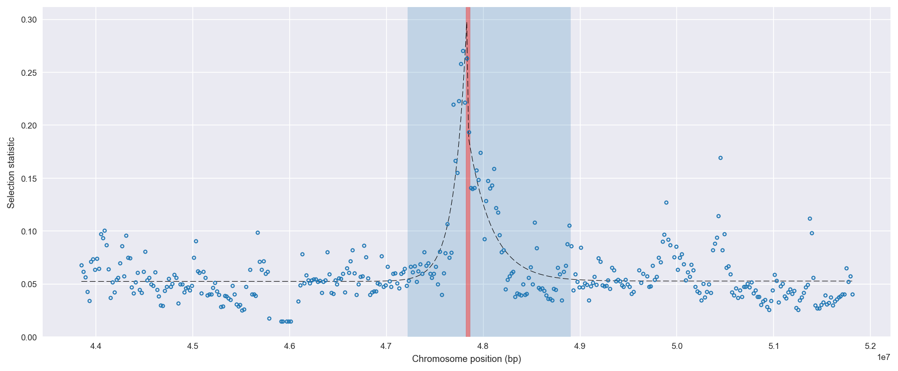
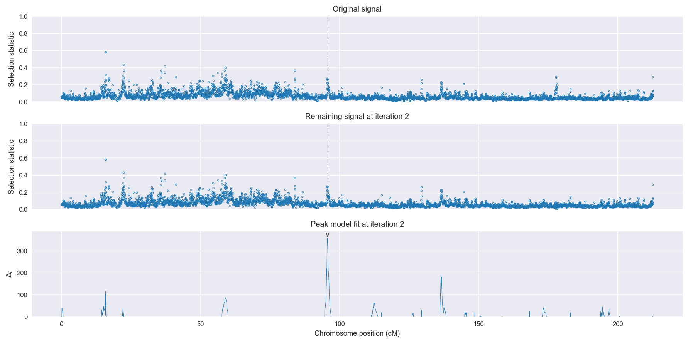
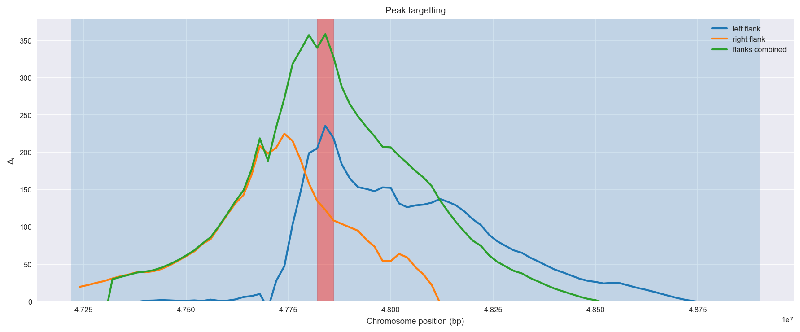
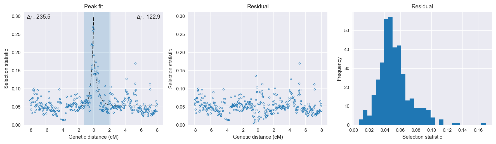

:orphan:

Guinea-Bissau | H12 | Chromosome 2 | Signal #2
================================================================================

This page describes a signal of selection found in the
:doc:`/population/GWA` population using the
:doc:`/method/H12` statistic.The inferred focus of this signal is on chromosome arm
2R between position 47,820,001 and
47,860,000.

The following 5 genes overlap the focal region: :doc:`/gene/AGAP004005`,  :doc:`/gene/AGAP013019`,  :doc:`/gene/AGAP004006`,  :doc:`/gene/AGAP004007`,  :doc:`/gene/AGAP004008`.

The following 14 genes are within 50 kbp of the focal
region: :doc:`/gene/AGAP004000` (myosin IX),  :doc:`/gene/AGAP004002` (60 kDa heat shock protein, mitochondrial precursor),  :doc:`/gene/AGAP013015` (p53 and DNA damage-regulated protein),  :doc:`/gene/AGAP004003`,  :doc:`/gene/AGAP004004`,  :doc:`/gene/AGAP004011` (survival motor neuron protein),  :doc:`/gene/AGAP004012` (katanin p60 ATPase-containing subunit),  :doc:`/gene/AGAP004013` (SP11838),  :doc:`/gene/AGAP004014` (SP11706),  :doc:`/gene/AGAP004015` (SP21408),  :doc:`/gene/AGAP013186`,  :doc:`/gene/AGAP004017`,  :doc:`/gene/AGAP004016`,  :doc:`/gene/AGAP004018`.

    **Figure 1**. Location of the signal of selection. Blue markers show the
    value of the selection statistic in non-overlapping 20 kbp windows. The
    dashed black line shows the fitted peak model. The vertical red bar shows
    the inferred focus of the selection signal. The shaded blue area shows the
    inferred genomic region affected by the selection event.

Overlapping signals
-------------------

No overlapping signals.

Diagnostics
-----------

The information below provides some diagnostics from the
:doc:`/method/peak_modelling` algorithm.

    **Figure 2**. Chromosome-wide selection statistic and results from peak
    modelling. **a**, TODO. **b**, TODO.

    **Figure 3**. Diagnostics from targetting the selection signal to a focal
    region. TODO.

    **Figure 4**. Diagnostics from fitting a peak model to the selection signal.
    **a**, TODO. **b**, TODO. **c**, TODO.

Model fit reports
~~~~~~~~~~~~~~~~~

Left flank, peak model::

    [[Model]]
        Model(exponential)
    [[Fit Statistics]]
        # function evals   = 27
        # data points      = 190
        # variables        = 3
        chi-square         = 0.070
        reduced chi-square = 0.000
        Akaike info crit   = -1495.224
        Bayesian info crit = -1485.483
    [[Variables]]
        amplitude:   0.24498729 +/- 0.013130 (5.36%) (init= 0.5)
        decay:       0.26141296 +/- 0.022174 (8.48%) (init= 0.5)
        c:           0.05240605 +/- 0.001515 (2.89%) (init= 0.03)
        cap:         1 (fixed)
    [[Correlations]] (unreported correlations are <  0.100)
        C(amplitude, decay)          = -0.618 
        C(decay, c)                  = -0.272 

Right flank, peak model::

    [[Model]]
        Model(exponential)
    [[Fit Statistics]]
        # function evals   = 19
        # data points      = 194
        # variables        = 3
        chi-square         = 0.098
        reduced chi-square = 0.001
        Akaike info crit   = -1467.408
        Bayesian info crit = -1457.605
    [[Variables]]
        amplitude:   0.14622282 +/- 0.014190 (9.70%) (init= 0.5)
        decay:       0.48691186 +/- 0.068877 (14.15%) (init= 0.5)
        c:           0.05272001 +/- 0.001868 (3.54%) (init= 0.03)
        cap:         1 (fixed)
    [[Correlations]] (unreported correlations are <  0.100)
        C(amplitude, decay)          = -0.678 
        C(decay, c)                  = -0.378 

Left flank, null model::

    [[Model]]
        Model(constant)
    [[Fit Statistics]]
        # function evals   = 6
        # data points      = 189
        # variables        = 1
        chi-square         = 0.238
        reduced chi-square = 0.001
        Akaike info crit   = -1259.690
        Bayesian info crit = -1256.449
    [[Variables]]
        c:   0.06038772 +/- 0.002590 (4.29%) (init= 0.03)

Right flank, null model::

    [[Model]]
        Model(constant)
    [[Fit Statistics]]
        # function evals   = 6
        # data points      = 193
        # variables        = 1
        chi-square         = 0.180
        reduced chi-square = 0.001
        Akaike info crit   = -1344.472
        Bayesian info crit = -1341.209
    [[Variables]]
        c:   0.06044374 +/- 0.002205 (3.65%) (init= 0.03)

Comments
--------

.. raw:: html

    

    
    <noscript>Please enable JavaScript to view the <a href="https://disqus.com/?ref_noscript">comments powered by Disqus.</a></noscript>
