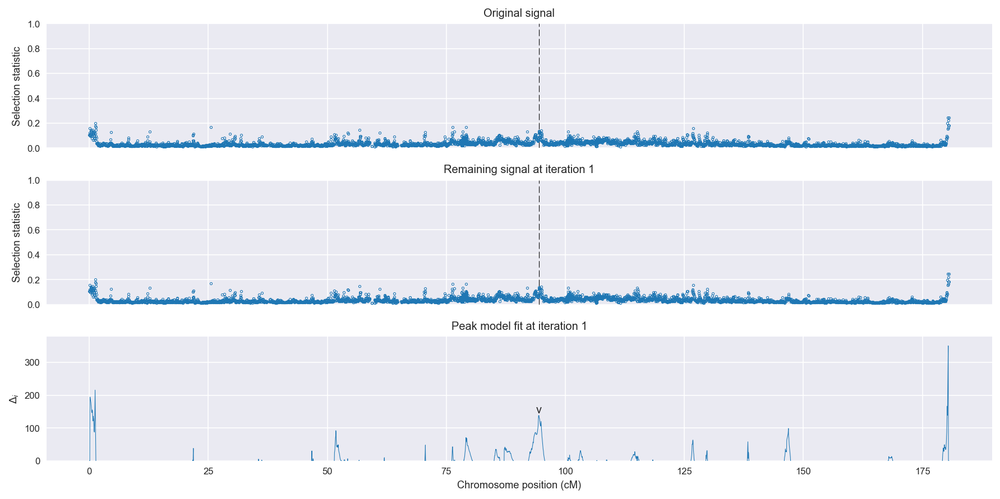
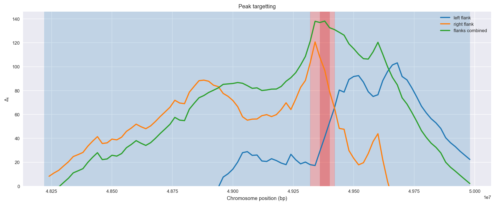
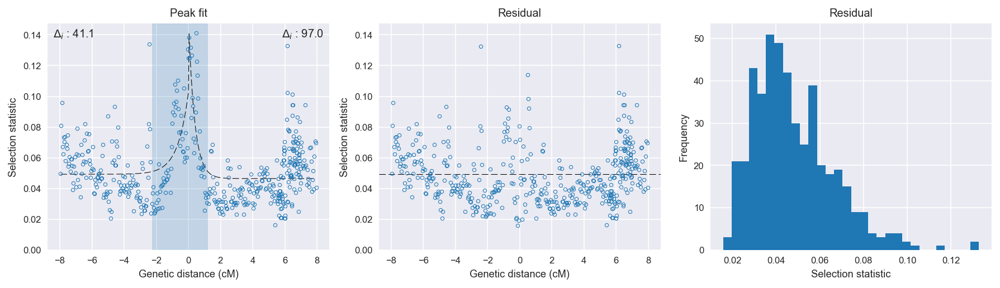

:orphan:

Guinea-Bissau | H12 | Chromosome 3 | Signal #1
================================================================================

This page describes a signal of selection found in the
:doc:`/population/GWA` population using the
:doc:`/method/H12` statistic.The inferred focus of this signal is on chromosome arm
**3R between position 49,320,001 and
49,420,000**.

The following 7 genes overlap the focal region: :doc:`/gene/AGAP010137` (adenosine kinase),  :doc:`/gene/AGAP010138` (uncharacterized protein yjbQ),  :doc:`/gene/AGAP010139` (GMP synthase (glutamine-hydrolysing)),  :doc:`/gene/AGAP010140` (hydrolases of HD superfamily),  :doc:`/gene/AGAP010141` (DnaJ homolog subfamily C member 4),  :doc:`/gene/AGAP010142` (Dat - dopamine N-acetyltransferase),  :doc:`/gene/AGAP010143`.

The following 10 genes are within 40 kbp of the focal
region: :doc:`/gene/AGAP010131` (ornithine decarboxylase antizyme 1),  :doc:`/gene/AGAP010132` (SCRBQ1 - Class B Scavenger Receptor (CD36 domain).),  :doc:`/gene/AGAP010133` (SCRPQ2 - Class B Scavenger Receptor (CD36 domain).),  :doc:`/gene/AGAP010134` (arrestin-1),  :doc:`/gene/AGAP010135` (NCK adaptor protein),  :doc:`/gene/AGAP010136`,  :doc:`/gene/AGAP010144`,  :doc:`/gene/AGAP010145` (yellow),  :doc:`/gene/AGAP010146`,  :doc:`/gene/AGAP010147` (myosin heavy chain).

.. figure:: peak_location.png
    :alt: signal location

    **Figure 1**. Location of the signal of selection. Blue markers show the
    value of the selection statistic in non-overlapping 20 kbp windows. The
    dashed black line shows the fitted peak model. The vertical red bar shows
    the inferred focus of the selection signal. The shaded blue area shows the
    inferred genomic region affected by the selection event.

Overlapping signals
-------------------

The following selection signals have an inferred focus which overlaps with the
focus of this signal:

.. cssclass:: table-hover
.. csv-table::
    :widths: auto
    :header: Signal, Focus, Score

    :doc:`/signal/H12/UGS/chr3/2/index`,":49380001-49720000",376
    

Diagnostics
-----------

The information below provides some diagnostics from the
:doc:`/method/peak_modelling` algorithm.

    **Figure 2**. Chromosome-wide selection statistic and results from peak
    modelling. **a**, TODO. **b**, TODO.

    **Figure 3**. Diagnostics from targetting the selection signal to a focal
    region. TODO.

    **Figure 4**. Diagnostics from fitting a peak model to the selection signal.
    **a**, TODO. **b**, TODO. **c**, TODO.

Model fit reports
~~~~~~~~~~~~~~~~~

Left flank, peak model::

    [[Model]]
        Model(exponential)
    [[Fit Statistics]]
        # function evals   = 36
        # data points      = 194
        # variables        = 3
        chi-square         = 0.067
        reduced chi-square = 0.000
        Akaike info crit   = -1539.912
        Bayesian info crit = -1530.108
    [[Variables]]
        amplitude:   0.05322595 +/- 0.008739 (16.42%) (init= 0.5)
        decay:       0.66030088 +/- 0.180673 (27.36%) (init= 0.5)
        c:           0.04931546 +/- 0.001637 (3.32%) (init= 0.03)
        cap:         1 (fixed)
    [[Correlations]] (unreported correlations are <  0.100)
        C(amplitude, decay)          = -0.598 
        C(decay, c)                  = -0.443 

Right flank, peak model::

    [[Model]]
        Model(exponential)
    [[Fit Statistics]]
        # function evals   = 47
        # data points      = 278
        # variables        = 3
        chi-square         = 0.090
        reduced chi-square = 0.000
        Akaike info crit   = -2227.134
        Bayesian info crit = -2216.252
    [[Variables]]
        amplitude:   0.10455633 +/- 0.013038 (12.47%) (init= 0.5)
        decay:       0.38361732 +/- 0.066635 (17.37%) (init= 0.5)
        c:           0.04651422 +/- 0.001170 (2.52%) (init= 0.03)
        cap:         1 (fixed)
    [[Correlations]] (unreported correlations are <  0.100)
        C(amplitude, decay)          = -0.720 
        C(decay, c)                  = -0.272 

Left flank, null model::

    [[Model]]
        Model(constant)
    [[Fit Statistics]]
        # function evals   = 6
        # data points      = 193
        # variables        = 1
        chi-square         = 0.081
        reduced chi-square = 0.000
        Akaike info crit   = -1498.800
        Bayesian info crit = -1495.537
    [[Variables]]
        c:   0.05335489 +/- 0.001478 (2.77%) (init= 0.03)

Right flank, null model::

    [[Model]]
        Model(constant)
    [[Fit Statistics]]
        # function evals   = 6
        # data points      = 277
        # variables        = 1
        chi-square         = 0.126
        reduced chi-square = 0.000
        Akaike info crit   = -2130.094
        Bayesian info crit = -2126.470
    [[Variables]]
        c:   0.04960742 +/- 0.001282 (2.59%) (init= 0.03)

Comments
--------

.. raw:: html

    

    
    <noscript>Please enable JavaScript to view the <a href="https://disqus.com/?ref_noscript">comments powered by Disqus.</a></noscript>
