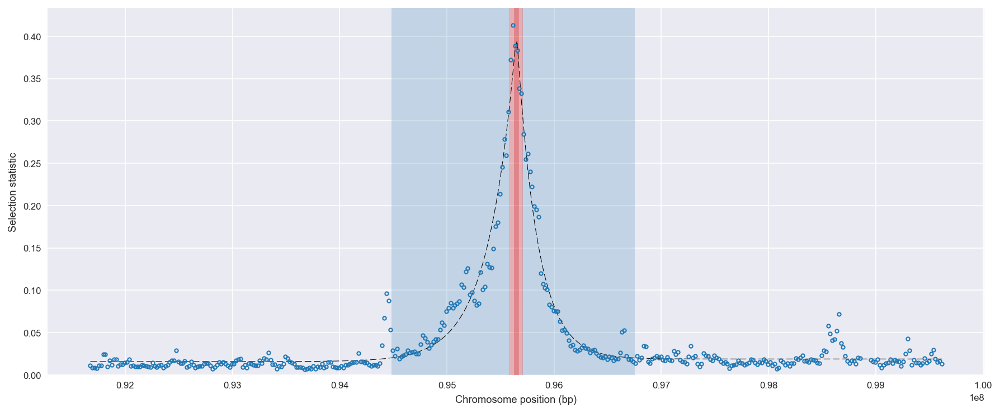
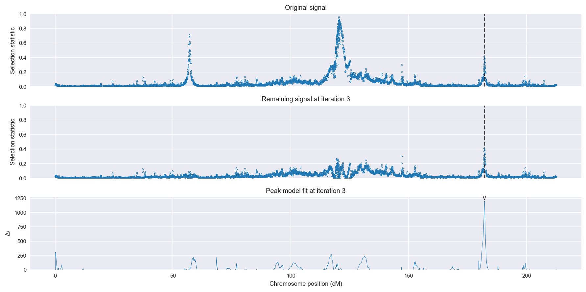
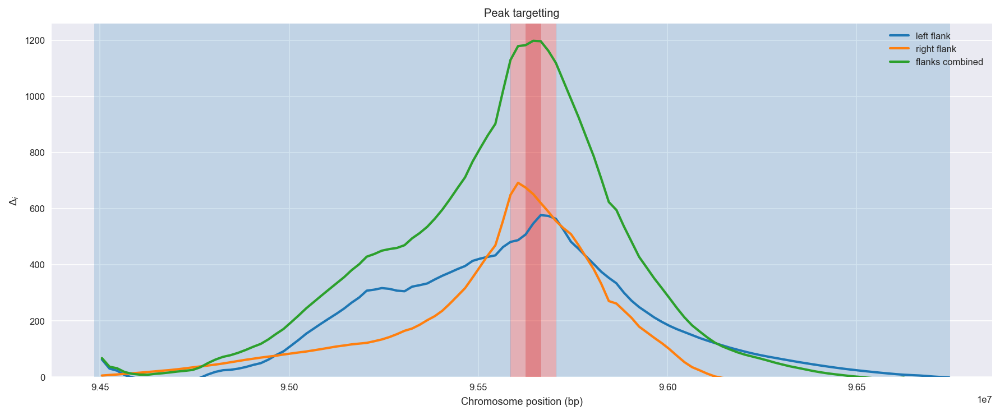
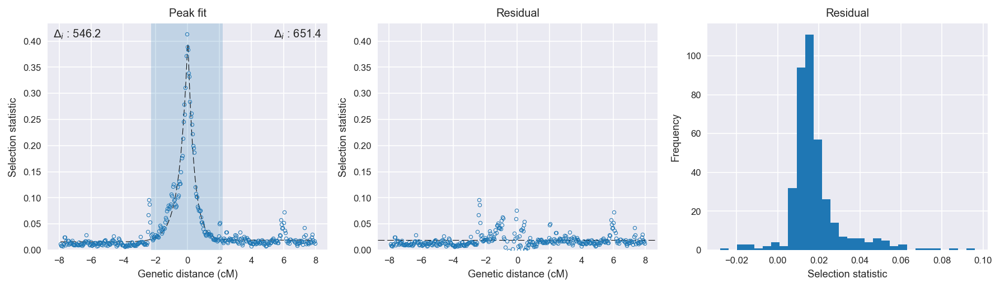

:orphan:

Uganda *An. gambiae* | H12 | Chromosome 2 | Signal #3
================================================================================

This page describes a signal of selection found in the
:doc:`/population/UGS` population using the
:doc:`/method/H12` statistic.The inferred focus of this signal is on chromosome arm
2L between position 34,040,001 and
34,160,000.

The following 31 genes overlap the focal region: :doc:`/gene/AGAP006539` (eupolytin),  :doc:`/gene/AGAP006540` (LIM homeobox protein),  :doc:`/gene/AGAP006541` (Transcriptional regulators containing a dna-binding hth domain and an aminotransferase domain transcription regulator protein),  :doc:`/gene/AGAP006542` (cactin),  :doc:`/gene/AGAP006543`,  :doc:`/gene/AGAP028608`,  :doc:`/gene/AGAP006546`,  :doc:`/gene/AGAP006547`,  :doc:`/gene/AGAP006548` (glycine cleavage system H protein),  :doc:`/gene/AGAP006549`,  :doc:`/gene/AGAP006550`,  :doc:`/gene/AGAP006551`,  :doc:`/gene/AGAP006552`,  :doc:`/gene/AGAP006553`,  :doc:`/gene/AGAP006554`,  :doc:`/gene/AGAP006555`,  :doc:`/gene/AGAP006556`,  :doc:`/gene/AGAP006557`,  :doc:`/gene/AGAP006558`,  :doc:`/gene/AGAP006559`,  :doc:`/gene/AGAP006560`,  :doc:`/gene/AGAP006561`,  :doc:`/gene/AGAP006562`,  :doc:`/gene/AGAP006563`,  :doc:`/gene/AGAP006564`,  :doc:`/gene/AGAP028429`,  :doc:`/gene/AGAP006566`,  :doc:`/gene/AGAP028428`,  :doc:`/gene/AGAP006567`,  :doc:`/gene/AGAP006568`,  :doc:`/gene/AGAP006569` (acetyl-CoA synthetase).

The following 7 genes are within 50 kbp of the focal
region: :doc:`/gene/AGAP006536` (Arrowhead),  :doc:`/gene/AGAP006537` (Arrowhead),  :doc:`/gene/AGAP006570` (myo-inositol-1(or 4)-monophosphatase),  :doc:`/gene/AGAP006571` (nuclear receptor subfamily 1 group D member 3),  :doc:`/gene/AGAP006572` (ubiquinone biosynthesis protein COQ7 homolog),  :doc:`/gene/AGAP006573` (integrin-linked kinase),  :doc:`/gene/AGAP006574`.

    **Figure 1**. Location of the signal of selection. Blue markers show the
    value of the selection statistic in non-overlapping 20 kbp windows. The
    dashed black line shows the fitted peak model. The vertical red bar shows
    the inferred focus of the selection signal. The shaded blue area shows the
    inferred genomic region affected by the selection event.

Overlapping signals
-------------------

No overlapping signals.

Diagnostics
-----------

The information below provides some diagnostics from the
:doc:`/method/peak_modelling` algorithm.

    **Figure 2**. Chromosome-wide selection statistic and results from peak
    modelling. **a**, TODO. **b**, TODO.

    **Figure 3**. Diagnostics from targetting the selection signal to a focal
    region. TODO.

    **Figure 4**. Diagnostics from fitting a peak model to the selection signal.
    **a**, TODO. **b**, TODO. **c**, TODO.

Model fit reports
~~~~~~~~~~~~~~~~~

Left flank, peak model::

    [[Model]]
        Model(exponential)
    [[Fit Statistics]]
        # function evals   = 27
        # data points      = 199
        # variables        = 3
        chi-square         = 0.048
        reduced chi-square = 0.000
        Akaike info crit   = -1653.191
        Bayesian info crit = -1643.312
    [[Variables]]
        amplitude:   0.36722214 +/- 0.008019 (2.18%) (init= 0.5)
        decay:       0.52083991 +/- 0.018121 (3.48%) (init= 0.5)
        c:           0.01586837 +/- 0.001286 (8.11%) (init= 0.03)
        cap:         1 (fixed)
    [[Correlations]] (unreported correlations are <  0.100)
        C(amplitude, decay)          = -0.617 
        C(decay, c)                  = -0.388 

Right flank, peak model::

    [[Model]]
        Model(exponential)
    [[Fit Statistics]]
        # function evals   = 23
        # data points      = 195
        # variables        = 3
        chi-square         = 0.021
        reduced chi-square = 0.000
        Akaike info crit   = -1777.534
        Bayesian info crit = -1767.715
    [[Variables]]
        amplitude:   0.41710037 +/- 0.007479 (1.79%) (init= 0.5)
        decay:       0.38432958 +/- 0.009792 (2.55%) (init= 0.5)
        c:           0.01892201 +/- 0.000832 (4.40%) (init= 0.03)
        cap:         1 (fixed)
    [[Correlations]] (unreported correlations are <  0.100)
        C(amplitude, decay)          = -0.709 
        C(decay, c)                  = -0.331 

Left flank, null model::

    [[Model]]
        Model(constant)
    [[Fit Statistics]]
        # function evals   = 6
        # data points      = 198
        # variables        = 1
        chi-square         = 0.731
        reduced chi-square = 0.004
        Akaike info crit   = -1107.006
        Bayesian info crit = -1103.717
    [[Variables]]
        c:   0.03895063 +/- 0.004330 (11.12%) (init= 0.03)

Right flank, null model::

    [[Model]]
        Model(constant)
    [[Fit Statistics]]
        # function evals   = 6
        # data points      = 194
        # variables        = 1
        chi-square         = 0.579
        reduced chi-square = 0.003
        Akaike info crit   = -1126.122
        Bayesian info crit = -1122.855
    [[Variables]]
        c:   0.03664268 +/- 0.003930 (10.73%) (init= 0.03)

Comments
--------

.. raw:: html

    

    
    <noscript>Please enable JavaScript to view the <a href="https://disqus.com/?ref_noscript">comments powered by Disqus.</a></noscript>
