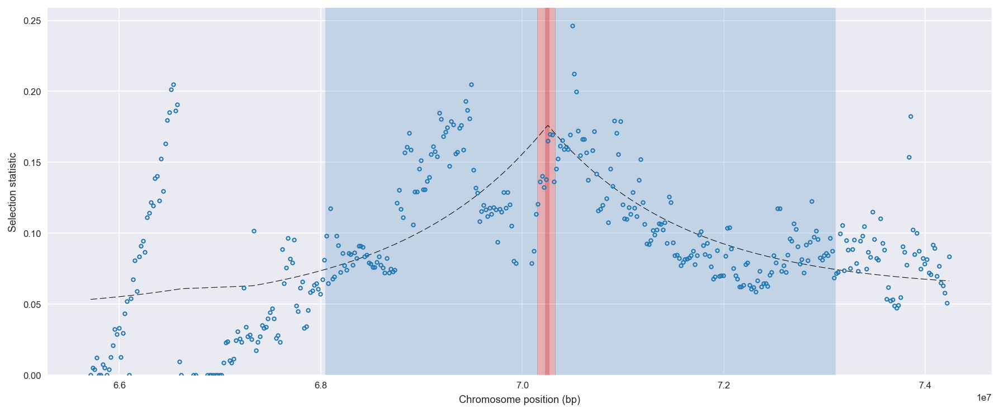
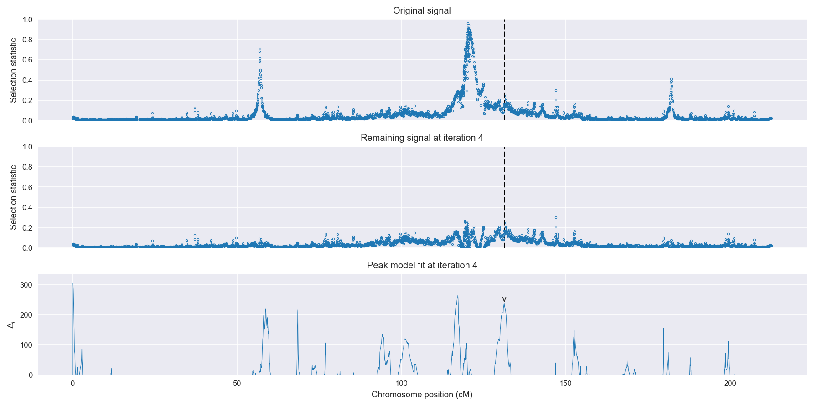
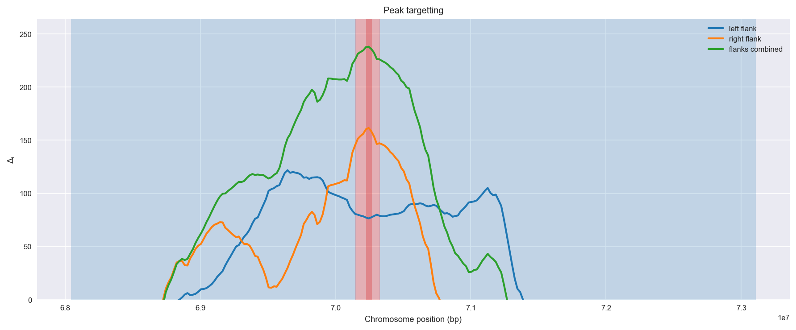
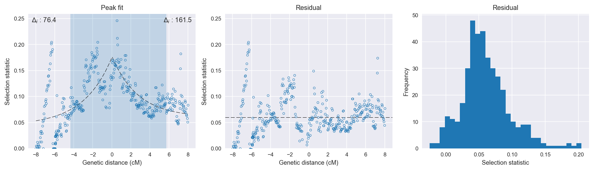

:orphan:

Uganda *An. gambiae* | H12 | Chromosome 2 | Signal #4
================================================================================

This page describes a signal of selection found in the
:doc:`/population/UGS` population using the
:doc:`/method/H12` statistic.The inferred focus of this signal is on chromosome arm
2L between position 8,600,001 and
8,780,000.

The following 13 genes overlap the focal region: :doc:`/gene/AGAP005031` (E3 SUMO-protein ligase PIAS2),  :doc:`/gene/AGAP005032` (calnexin),  :doc:`/gene/AGAP005033` (U3 small nucleolar RNA-associated protein 20),  :doc:`/gene/AGAP005034` (GPRMGL5 - putative metabotropic glutamate receptor 5),  :doc:`/gene/AGAP005035` (DNA helicase INO80),  :doc:`/gene/AGAP005036`,  :doc:`/gene/AGAP005037` (Coiled-coil domain-containing protein AGAP005037),  :doc:`/gene/AGAP005038`,  :doc:`/gene/AGAP005039`,  :doc:`/gene/AGAP005040` (RILP-like protein-like protein),  :doc:`/gene/AGAP005041`,  :doc:`/gene/AGAP005042`,  :doc:`/gene/AGAP005043` (Inactive dipeptidyl peptidase 10).

The following 13 genes are within 50 kbp of the focal
region: :doc:`/gene/AGAP005029` (serine-threonine kinase receptor-associated protein),  :doc:`/gene/AGAP005030`,  :doc:`/gene/AGAP005044`,  :doc:`/gene/AGAP005045`,  :doc:`/gene/AGAP005046` (RpL22 - 60S ribosomal protein L22),  :doc:`/gene/AGAP005047` (Gr43 - gustatory receptor 43),  :doc:`/gene/AGAP028210` (SRPN13 - serine protease inhibitor (serpin) 13),  :doc:`/gene/AGAP005048` (anaphase-promoting complex subunit 2),  :doc:`/gene/AGAP005049` (coiled-coil domain-containing protein 53),  :doc:`/gene/AGAP005050` (interferon-stimulated gene 20 kDa protein),  :doc:`/gene/AGAP005051` (DNA polymerase epsilon subunit 3),  :doc:`/gene/AGAP005052` (deoxyribodipyrimidine photo-lyase),  :doc:`/gene/AGAP005053` (E3 ubiquitin-protein ligase LRSAM1).

    **Figure 1**. Location of the signal of selection. Blue markers show the
    value of the selection statistic in non-overlapping 20 kbp windows. The
    dashed black line shows the fitted peak model. The vertical red bar shows
    the inferred focus of the selection signal. The shaded blue area shows the
    inferred genomic region affected by the selection event.

Overlapping signals
-------------------

No overlapping signals.

Diagnostics
-----------

The information below provides some diagnostics from the
:doc:`/method/peak_modelling` algorithm.

    **Figure 2**. Chromosome-wide selection statistic and results from peak
    modelling. **a**, TODO. **b**, TODO.

    **Figure 3**. Diagnostics from targetting the selection signal to a focal
    region. TODO.

    **Figure 4**. Diagnostics from fitting a peak model to the selection signal.
    **a**, TODO. **b**, TODO. **c**, TODO.

Model fit reports
~~~~~~~~~~~~~~~~~

Left flank, peak model::

    [[Model]]
        Model(exponential)
    [[Fit Statistics]]
        # function evals   = 54
        # data points      = 210
        # variables        = 3
        chi-square         = 0.445
        reduced chi-square = 0.002
        Akaike info crit   = -1286.929
        Bayesian info crit = -1276.888
    [[Variables]]
        amplitude:   0.13042319 +/- 0.013813 (10.59%) (init= 0.5)
        decay:       2.99999990 +/- 1.028503 (34.28%) (init= 0.5)
        c:           0.04417277 +/- 0.014565 (32.97%) (init= 0.03)
        cap:         1 (fixed)
    [[Correlations]] (unreported correlations are <  0.100)
        C(decay, c)                  = -0.930 
        C(amplitude, c)              = -0.489 
        C(amplitude, decay)          =  0.219 

Right flank, peak model::

    [[Model]]
        Model(exponential)
    [[Fit Statistics]]
        # function evals   = 284
        # data points      = 198
        # variables        = 3
        chi-square         = 0.100
        reduced chi-square = 0.001
        Akaike info crit   = -1497.718
        Bayesian info crit = -1487.853
    [[Variables]]
        amplitude:   0.11771677 +/- 0.006415 (5.45%) (init= 0.5)
        decay:       2.73868466 +/- 0.463188 (16.91%) (init= 0.5)
        c:           0.05999999 +/- 0.005778 (9.63%) (init= 0.03)
        cap:         1 (fixed)
    [[Correlations]] (unreported correlations are <  0.100)
        C(decay, c)                  =  0.911 
        C(amplitude, c)              =  0.452 
        C(amplitude, decay)          =  0.146 

Left flank, null model::

    [[Model]]
        Model(constant)
    [[Fit Statistics]]
        # function evals   = 6
        # data points      = 209
        # variables        = 1
        chi-square         = 0.632
        reduced chi-square = 0.003
        Akaike info crit   = -1210.487
        Bayesian info crit = -1207.144
    [[Variables]]
        c:   0.08492394 +/- 0.003812 (4.49%) (init= 0.03)

Right flank, null model::

    [[Model]]
        Model(constant)
    [[Fit Statistics]]
        # function evals   = 6
        # data points      = 197
        # variables        = 1
        chi-square         = 0.221
        reduced chi-square = 0.001
        Akaike info crit   = -1336.190
        Bayesian info crit = -1332.907
    [[Variables]]
        c:   0.09881395 +/- 0.002392 (2.42%) (init= 0.03)

Comments
--------

.. raw:: html

    

    
    <noscript>Please enable JavaScript to view the <a href="https://disqus.com/?ref_noscript">comments powered by Disqus.</a></noscript>
