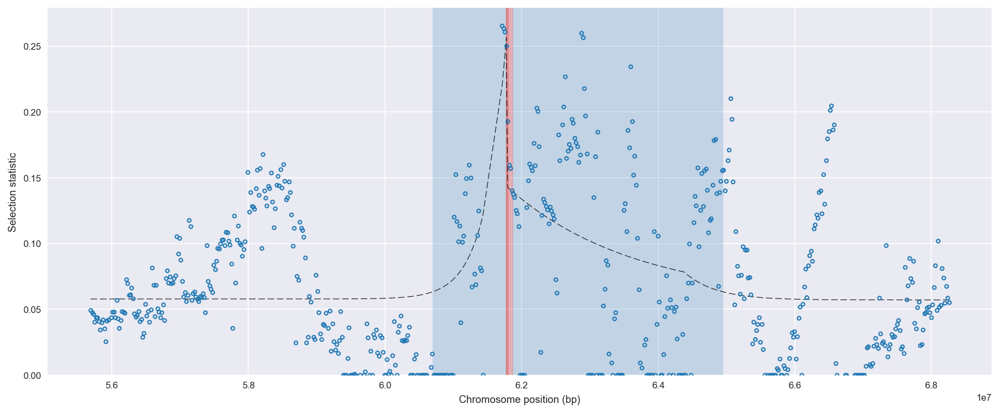
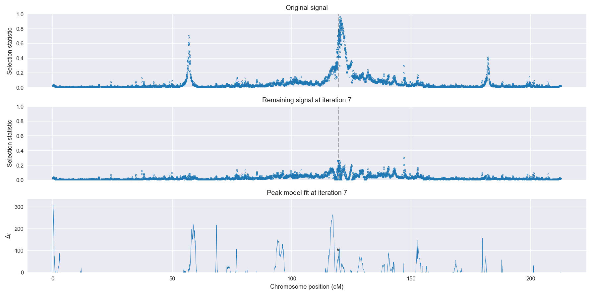
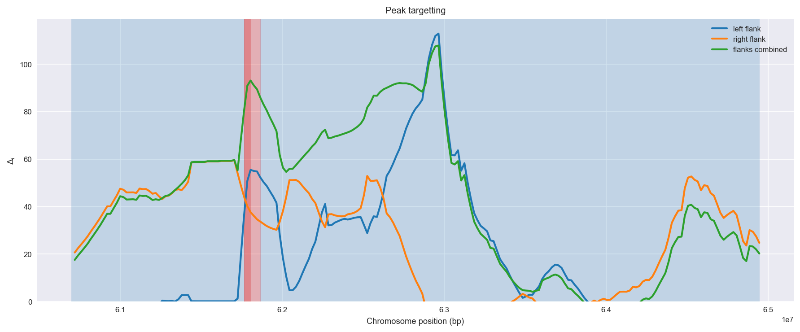
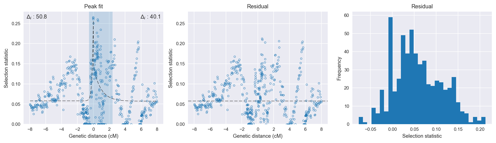

:orphan:

Uganda *An. gambiae* | H12 | Chromosome 2 | Signal #7
================================================================================

This page describes a signal of selection found in the
:doc:`/population/UGS` population using the
:doc:`/method/H12` statistic.The inferred focus of this signal is on chromosome arm
2L between position 220,001 and
320,000.

Gene :doc:`/gene/AGAP004680` overlaps the focal region.

The following 4 genes are within 50 kbp of the focal
region: :doc:`/gene/AGAP004677` (methylenetetrahydrofolate dehydrogenase(NAD ) / 5,10-methenyltetrahydrofolate),  :doc:`/gene/AGAP004678`,  :doc:`/gene/AGAP004679` (Folylpolyglutamate synthase),  :doc:`/gene/AGAP004681`.

    **Figure 1**. Location of the signal of selection. Blue markers show the
    value of the selection statistic in non-overlapping 20 kbp windows. The
    dashed black line shows the fitted peak model. The vertical red bar shows
    the inferred focus of the selection signal. The shaded blue area shows the
    inferred genomic region affected by the selection event.

Overlapping signals
-------------------

No overlapping signals.

Diagnostics
-----------

The information below provides some diagnostics from the
:doc:`/method/peak_modelling` algorithm.

    **Figure 2**. Chromosome-wide selection statistic and results from peak
    modelling. **a**, TODO. **b**, TODO.

    **Figure 3**. Diagnostics from targetting the selection signal to a focal
    region. TODO.

    **Figure 4**. Diagnostics from fitting a peak model to the selection signal.
    **a**, TODO. **b**, TODO. **c**, TODO.

Model fit reports
~~~~~~~~~~~~~~~~~

Left flank, peak model::

    [[Model]]
        Model(exponential)
    [[Fit Statistics]]
        # function evals   = 53
        # data points      = 278
        # variables        = 3
        chi-square         = 0.583
        reduced chi-square = 0.002
        Akaike info crit   = -1708.455
        Bayesian info crit = -1697.572
    [[Variables]]
        amplitude:   0.19864520 +/- 0.026515 (13.35%) (init= 0.5)
        decay:       0.15000000 +/- 0.029322 (19.55%) (init= 0.5)
        c:           0.05779767 +/- 0.003016 (5.22%) (init= 0.03)
        cap:         1 (fixed)
    [[Correlations]] (unreported correlations are <  0.100)
        C(amplitude, decay)          = -0.457 
        C(decay, c)                  = -0.332 

Right flank, peak model::

    [[Model]]
        Model(exponential)
    [[Fit Statistics]]
        # function evals   = 51
        # data points      = 308
        # variables        = 3
        chi-square         = 1.189
        reduced chi-square = 0.004
        Akaike info crit   = -1705.545
        Bayesian info crit = -1694.354
    [[Variables]]
        amplitude:   0.08658312 +/- 0.014655 (16.93%) (init= 0.5)
        decay:       0.92912608 +/- 0.311213 (33.50%) (init= 0.5)
        c:           0.05701811 +/- 0.005479 (9.61%) (init= 0.03)
        cap:         1 (fixed)
    [[Correlations]] (unreported correlations are <  0.100)
        C(decay, c)                  = -0.536 
        C(amplitude, decay)          = -0.526 
        C(amplitude, c)              = -0.176 

Left flank, null model::

    [[Model]]
        Model(constant)
    [[Fit Statistics]]
        # function evals   = 6
        # data points      = 277
        # variables        = 1
        chi-square         = 0.692
        reduced chi-square = 0.003
        Akaike info crit   = -1657.646
        Bayesian info crit = -1654.022
    [[Variables]]
        c:   0.06282869 +/- 0.003009 (4.79%) (init= 0.03)

Right flank, null model::

    [[Model]]
        Model(constant)
    [[Fit Statistics]]
        # function evals   = 6
        # data points      = 307
        # variables        = 1
        chi-square         = 1.344
        reduced chi-square = 0.004
        Akaike info crit   = -1665.410
        Bayesian info crit = -1661.683
    [[Variables]]
        c:   0.07691986 +/- 0.003782 (4.92%) (init= 0.03)

Comments
--------

.. raw:: html

    

    
    <noscript>Please enable JavaScript to view the <a href="https://disqus.com/?ref_noscript">comments powered by Disqus.</a></noscript>
