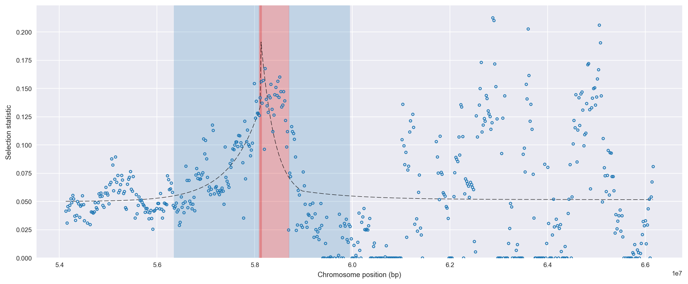
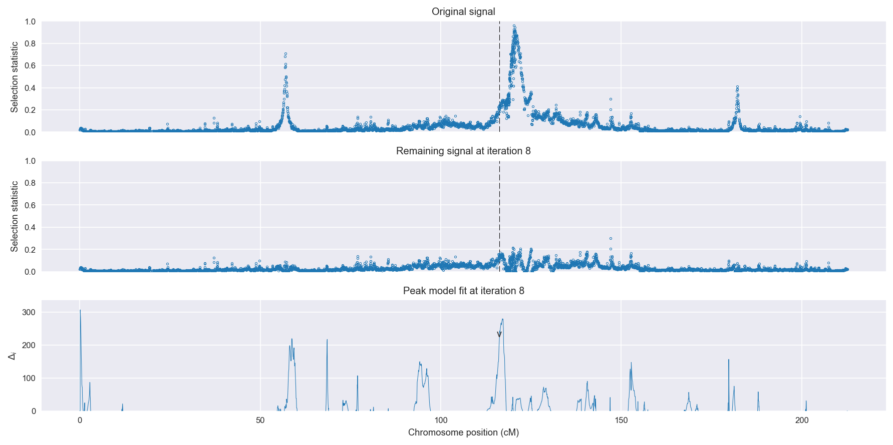
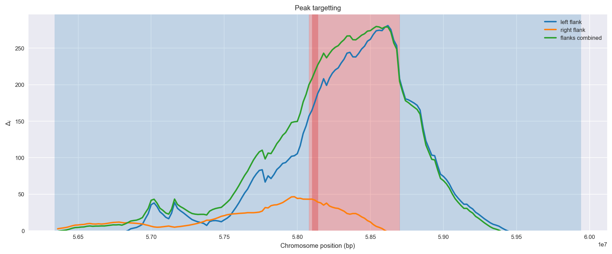
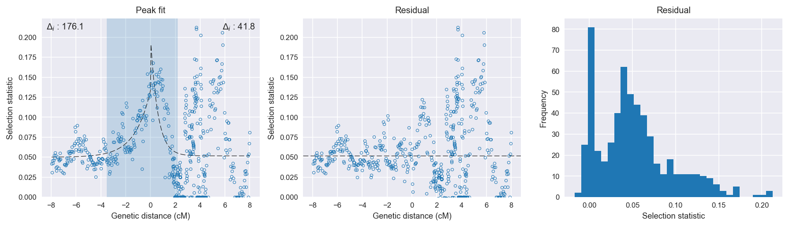

:orphan:

Uganda *An. gambiae* | H12 | Chromosome 2 | Signal #8
================================================================================

This page describes a signal of selection found in the
:doc:`/population/UGS` population using the
:doc:`/method/H12` statistic.The inferred focus of this signal is on chromosome arm
**2R between position 58,080,001 and
58,700,000**.

The following 53 genes overlap the focal region: :doc:`/gene/AGAP004586` (ADP-ribosylation factor related protein 1),  :doc:`/gene/AGAP004587`,  :doc:`/gene/AGAP004588`,  :doc:`/gene/AGAP004589`,  :doc:`/gene/AGAP004590`,  :doc:`/gene/AGAP013326`,  :doc:`/gene/AGAP004591` (acid phosphatase),  :doc:`/gene/AGAP004592` (splicing factor, arginine/serine-rich 4/5/6),  :doc:`/gene/AGAP004593` (EH domain-containing protein 1),  :doc:`/gene/AGAP004594` (cell division protein kinase 2),  :doc:`/gene/AGAP004595` (GPRGBB2 - putative GABA-B receptor 2),  :doc:`/gene/AGAP004596` (PyK - pyruvate kinase),  :doc:`/gene/AGAP004597` (guanosine-3',5'-bis(diphosphate) 3'-pyrophosphohydrolase),  :doc:`/gene/AGAP004598` (Phosphoserine aminotransferase),  :doc:`/gene/AGAP004599` (defense protein 3),  :doc:`/gene/AGAP004604`,  :doc:`/gene/AGAP004600` (ABCC6 - ATP-binding cassette transporter (ABC transporter) family C member 6),  :doc:`/gene/AGAP004602` (ABCC4 - ATP-binding cassette transporter (ABC transporter) family C member 4),  :doc:`/gene/AGAP004603` (ABCG4 - ATP-binding cassette transporter (ABC transporter) family G member 4),  :doc:`/gene/AGAP004605` (zinc finger protein 830),  :doc:`/gene/AGAP004606` (HYPK),  :doc:`/gene/AGAP004607`,  :doc:`/gene/AGAP004608`,  :doc:`/gene/AGAP004609` (protein kinase C substrate 80K-H),  :doc:`/gene/AGAP004610` (signal recognition particle subunit SRP54),  :doc:`/gene/AGAP013073`,  :doc:`/gene/AGAP004611` (prolyl 4-hydroxylase),  :doc:`/gene/AGAP013331`,  :doc:`/gene/AGAP004612` (phosphotransferase LOC123688),  :doc:`/gene/AGAP004613` (GPRDOP1 - GPCR Dopamine Family 1),  :doc:`/gene/AGAP004614` (DNA polymerase epsilon subunit 2),  :doc:`/gene/AGAP004615` (DNA polymerase epsilon subunit 1),  :doc:`/gene/AGAP004616` (F-type H -transporting ATPase subunit 6),  :doc:`/gene/AGAP013140`,  :doc:`/gene/AGAP004618`,  :doc:`/gene/AGAP004619`,  :doc:`/gene/AGAP004620` (Envelysin),  :doc:`/gene/AGAP004621`,  :doc:`/gene/AGAP004622` (glutamate dehydrogenase (NAD(P) )),  :doc:`/gene/AGAP004623` (anaphase-promoting complex subunit 6),  :doc:`/gene/AGAP004624`,  :doc:`/gene/AGAP004625` (cortactin),  :doc:`/gene/AGAP004626`,  :doc:`/gene/AGAP004627`,  :doc:`/gene/AGAP004628` (scaffold protein salvador),  :doc:`/gene/AGAP004629`,  :doc:`/gene/AGAP004630` (Erg28-domain containing protein),  :doc:`/gene/AGAP004631`,  :doc:`/gene/AGAP004632` (DEF2 - defensin anti-microbial peptide),  :doc:`/gene/AGAP004633` (sodium-independent sulfate anion transporter),  :doc:`/gene/AGAP004634`,  :doc:`/gene/AGAP004635` (sodium-independent sulfate anion transporter),  :doc:`/gene/AGAP013218` (sodium-independent sulfate anion transporter).

Gene :doc:`/gene/AGAP004636` (sodium-independent sulfate anion transporter) is within 40 kbp of the focal region.

    **Figure 1**. Location of the signal of selection. Blue markers show the
    value of the selection statistic in non-overlapping 20 kbp windows. The
    dashed black line shows the fitted peak model. The vertical red bar shows
    the inferred focus of the selection signal. The shaded blue area shows the
    inferred genomic region affected by the selection event.

Overlapping signals
-------------------

No overlapping signals.

Diagnostics
-----------

The information below provides some diagnostics from the
:doc:`/method/peak_modelling` algorithm.

    **Figure 2**. Chromosome-wide selection statistic and results from peak
    modelling. **a**, TODO. **b**, TODO.

    **Figure 3**. Diagnostics from targetting the selection signal to a focal
    region. TODO.

    **Figure 4**. Diagnostics from fitting a peak model to the selection signal.
    **a**, TODO. **b**, TODO. **c**, TODO.

Model fit reports
~~~~~~~~~~~~~~~~~

Left flank, peak model::

    [[Model]]
        Model(exponential)
    [[Fit Statistics]]
        # function evals   = 23
        # data points      = 193
        # variables        = 3
        chi-square         = 0.046
        reduced chi-square = 0.000
        Akaike info crit   = -1605.875
        Bayesian info crit = -1596.087
    [[Variables]]
        amplitude:   0.08338211 +/- 0.005492 (6.59%) (init= 0.5)
        decay:       1.25548089 +/- 0.156320 (12.45%) (init= 0.5)
        c:           0.04992233 +/- 0.001809 (3.62%) (init= 0.03)
        cap:         1 (fixed)
    [[Correlations]] (unreported correlations are <  0.100)
        C(decay, c)                  = -0.665 
        C(amplitude, decay)          = -0.499 

Right flank, peak model::

    [[Model]]
        Model(exponential)
    [[Fit Statistics]]
        # function evals   = 31
        # data points      = 371
        # variables        = 3
        chi-square         = 1.019
        reduced chi-square = 0.003
        Akaike info crit   = -2181.772
        Bayesian info crit = -2170.023
    [[Variables]]
        amplitude:   0.14943670 +/- 0.028711 (19.21%) (init= 0.5)
        decay:       0.58098579 +/- 0.161263 (27.76%) (init= 0.5)
        c:           0.05155210 +/- 0.003296 (6.39%) (init= 0.03)
        cap:         1 (fixed)
    [[Correlations]] (unreported correlations are <  0.100)
        C(amplitude, decay)          = -0.673 
        C(decay, c)                  = -0.487 
        C(amplitude, c)              =  0.124 

Left flank, null model::

    [[Model]]
        Model(constant)
    [[Fit Statistics]]
        # function evals   = 6
        # data points      = 192
        # variables        = 1
        chi-square         = 0.111
        reduced chi-square = 0.001
        Akaike info crit   = -1429.815
        Bayesian info crit = -1426.557
    [[Variables]]
        c:   0.06282859 +/- 0.001738 (2.77%) (init= 0.03)

Right flank, null model::

    [[Model]]
        Model(constant)
    [[Fit Statistics]]
        # function evals   = 6
        # data points      = 370
        # variables        = 1
        chi-square         = 1.133
        reduced chi-square = 0.003
        Akaike info crit   = -2139.940
        Bayesian info crit = -2136.027
    [[Variables]]
        c:   0.05752517 +/- 0.002880 (5.01%) (init= 0.03)

Comments
--------

.. raw:: html

    

    
    <noscript>Please enable JavaScript to view the <a href="https://disqus.com/?ref_noscript">comments powered by Disqus.</a></noscript>
