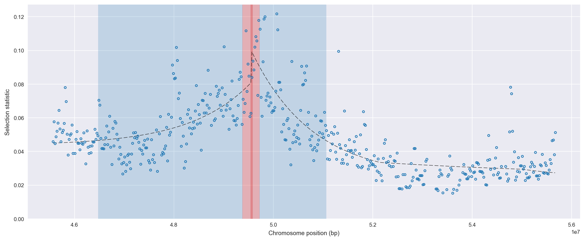
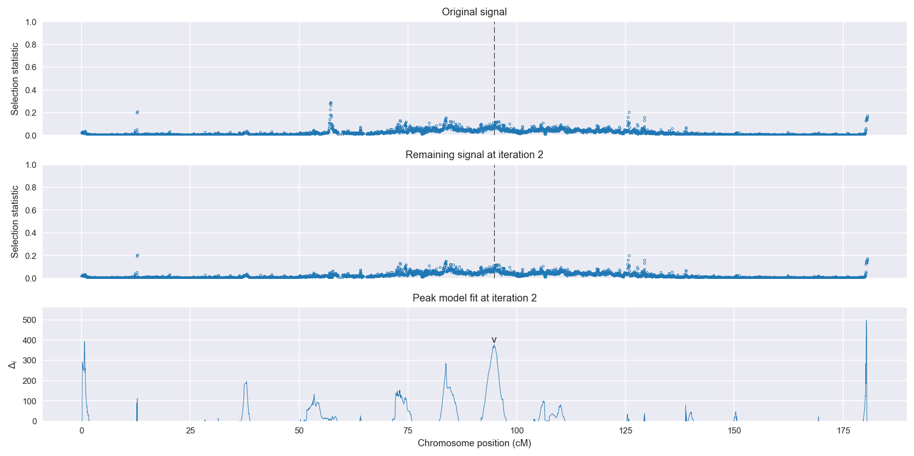
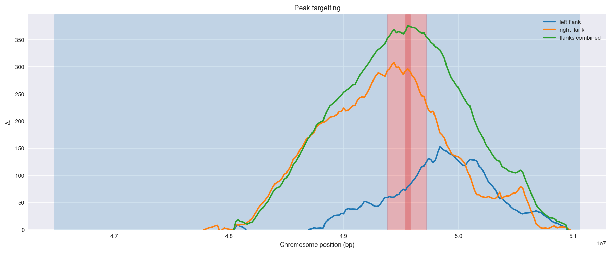
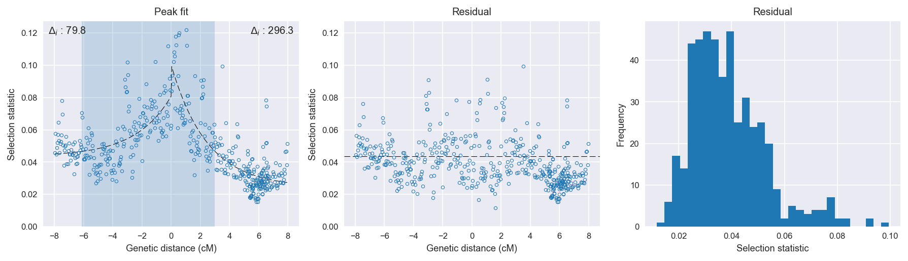

:orphan:

Uganda *An. gambiae* | H12 | Chromosome 3 | Signal #2
================================================================================

This page describes a signal of selection found in the
:doc:`/population/UGS` population using the
:doc:`/method/H12` statistic.The inferred focus of this signal is on chromosome arm
3R between position 49,380,001 and
49,720,000.

The following 20 genes overlap the focal region: :doc:`/gene/AGAP010142` (Dat - dopamine N-acetyltransferase),  :doc:`/gene/AGAP010143`,  :doc:`/gene/AGAP010144`,  :doc:`/gene/AGAP010145` (yellow),  :doc:`/gene/AGAP010146`,  :doc:`/gene/AGAP010147` (myosin heavy chain),  :doc:`/gene/AGAP010148`,  :doc:`/gene/AGAP010149` (cytochrome b5-related),  :doc:`/gene/AGAP010150` (cytochrome b5-related),  :doc:`/gene/AGAP010151`,  :doc:`/gene/AGAP010152` (gem associated protein 5),  :doc:`/gene/AGAP010155`,  :doc:`/gene/AGAP013739`,  :doc:`/gene/AGAP010156` (ATP citrate lyase),  :doc:`/gene/AGAP013762`,  :doc:`/gene/AGAP010157` (Ast2 - allatostatin 2),  :doc:`/gene/AGAP010158`,  :doc:`/gene/AGAP010159` (dUTP pyrophosphatase),  :doc:`/gene/AGAP010160` (myosin I),  :doc:`/gene/AGAP010161`.

The following 5 genes are within 50 kbp of the focal
region: :doc:`/gene/AGAP010138` (uncharacterized protein yjbQ),  :doc:`/gene/AGAP010139` (GMP synthase (glutamine-hydrolysing)),  :doc:`/gene/AGAP010140` (hydrolases of HD superfamily),  :doc:`/gene/AGAP010141` (DnaJ homolog subfamily C member 4),  :doc:`/gene/AGAP010162`.

    **Figure 1**. Location of the signal of selection. Blue markers show the
    value of the selection statistic in non-overlapping 20 kbp windows. The
    dashed black line shows the fitted peak model. The vertical red bar shows
    the inferred focus of the selection signal. The shaded blue area shows the
    inferred genomic region affected by the selection event.

Overlapping signals
-------------------

The following selection signals have an inferred focus which overlaps with the
focus of this signal:

.. cssclass:: table-hover
.. csv-table::
    :widths: auto
    :header: Signal, Focus, Score

    :doc:`/signal/H12/GWA/chr3/1/index`,"3R:49,320,001-49,420,000",138
    

Diagnostics
-----------

The information below provides some diagnostics from the
:doc:`/method/peak_modelling` algorithm.

    **Figure 2**. Chromosome-wide selection statistic and results from peak
    modelling. **a**, TODO. **b**, TODO.

    **Figure 3**. Diagnostics from targetting the selection signal to a focal
    region. TODO.

    **Figure 4**. Diagnostics from fitting a peak model to the selection signal.
    **a**, TODO. **b**, TODO. **c**, TODO.

Model fit reports
~~~~~~~~~~~~~~~~~

Left flank, peak model::

    [[Model]]
        Model(exponential)
    [[Fit Statistics]]
        # function evals   = 60
        # data points      = 194
        # variables        = 3
        chi-square         = 0.032
        reduced chi-square = 0.000
        Akaike info crit   = -1685.748
        Bayesian info crit = -1675.944
    [[Variables]]
        amplitude:   0.03719746 +/- 0.003557 (9.56%) (init= 0.5)
        decay:       2.44928606 +/- 0.686594 (28.03%) (init= 0.5)
        c:           0.04352814 +/- 0.003031 (6.96%) (init= 0.03)
        cap:         1 (fixed)
    [[Correlations]] (unreported correlations are <  0.100)
        C(decay, c)                  = -0.888 
        C(amplitude, c)              = -0.367 

Right flank, peak model::

    [[Model]]
        Model(exponential)
    [[Fit Statistics]]
        # function evals   = 27
        # data points      = 278
        # variables        = 3
        chi-square         = 0.044
        reduced chi-square = 0.000
        Akaike info crit   = -2425.017
        Bayesian info crit = -2414.134
    [[Variables]]
        amplitude:   0.07602124 +/- 0.003269 (4.30%) (init= 0.5)
        decay:       2.44893614 +/- 0.322862 (13.18%) (init= 0.5)
        c:           0.02439680 +/- 0.002596 (10.64%) (init= 0.03)
        cap:         1 (fixed)
    [[Correlations]] (unreported correlations are <  0.100)
        C(decay, c)                  = -0.910 
        C(amplitude, c)              = -0.175 
        C(amplitude, decay)          = -0.128 

Left flank, null model::

    [[Model]]
        Model(constant)
    [[Fit Statistics]]
        # function evals   = 6
        # data points      = 193
        # variables        = 1
        chi-square         = 0.046
        reduced chi-square = 0.000
        Akaike info crit   = -1605.900
        Bayesian info crit = -1602.637
    [[Variables]]
        c:   0.05418754 +/- 0.001120 (2.07%) (init= 0.03)

Right flank, null model::

    [[Model]]
        Model(constant)
    [[Fit Statistics]]
        # function evals   = 6
        # data points      = 277
        # variables        = 1
        chi-square         = 0.126
        reduced chi-square = 0.000
        Akaike info crit   = -2128.711
        Bayesian info crit = -2125.087
    [[Variables]]
        c:   0.04200847 +/- 0.001285 (3.06%) (init= 0.03)

Comments
--------

.. raw:: html

    

    
    <noscript>Please enable JavaScript to view the <a href="https://disqus.com/?ref_noscript">comments powered by Disqus.</a></noscript>
