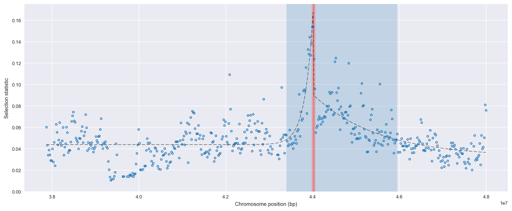
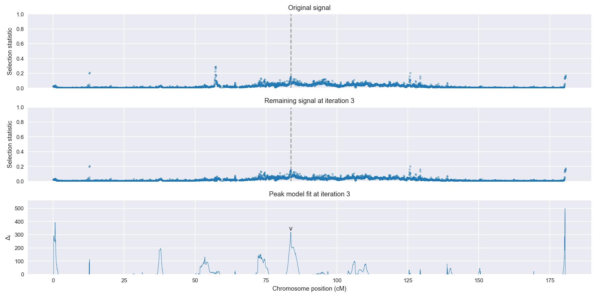
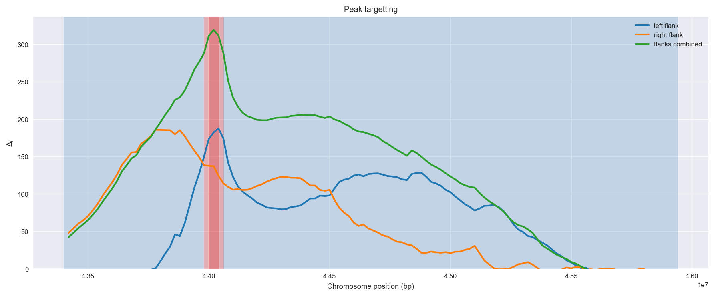
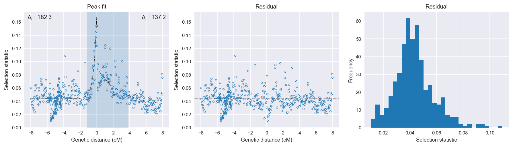

:orphan:

Uganda *An. gambiae* | H12 | Chromosome 3 | Signal #3
================================================================================

This page describes a signal of selection found in the
:doc:`/population/UGS` population using the
:doc:`/method/H12` statistic.The inferred focus of this signal is on chromosome arm
**3R between position 43,980,001 and
44,060,000**.

The following 8 genes overlap the focal region: :doc:`/gene/AGAP009829` (beat protein),  :doc:`/gene/AGAP009830`,  :doc:`/gene/AGAP009831`,  :doc:`/gene/AGAP009832` (CASPS8 - short caspase 8),  :doc:`/gene/AGAP028572` (Gustatory receptor),  :doc:`/gene/AGAP009833` (voltage-dependent anion-selective channel protein 2),  :doc:`/gene/AGAP009834` (COP9 signalosome subunit 4),  :doc:`/gene/AGAP009835` (ABCC14 - ATP-binding cassette transporter (ABC transporter) family C member 14).

The following 12 genes are within 40 kbp of the focal
region: :doc:`/gene/AGAP009828`,  :doc:`/gene/AGAP009836`,  :doc:`/gene/AGAP009837`,  :doc:`/gene/AGAP009838` (Non-imprinted in Prader-Willi/Angelman syndrome region protein 2-like protein),  :doc:`/gene/AGAP009839` (Phosphatase 1 regulatory subunit 7),  :doc:`/gene/AGAP009840` (USO1 vesicle docking protein homolog),  :doc:`/gene/AGAP009841`,  :doc:`/gene/AGAP009842` (ribonuclease T2),  :doc:`/gene/AGAP009843`,  :doc:`/gene/AGAP009844` (CLIPB15 - CLIP-domain serine protease),  :doc:`/gene/AGAP009845`,  :doc:`/gene/AGAP009846` (Ras-related protein Rab-9A).

    **Figure 1**. Location of the signal of selection. Blue markers show the
    value of the selection statistic in non-overlapping 20 kbp windows. The
    dashed black line shows the fitted peak model. The vertical red bar shows
    the inferred focus of the selection signal. The shaded blue area shows the
    inferred genomic region affected by the selection event.

Overlapping signals
-------------------

No overlapping signals.

Diagnostics
-----------

The information below provides some diagnostics from the
:doc:`/method/peak_modelling` algorithm.

    **Figure 2**. Chromosome-wide selection statistic and results from peak
    modelling. **a**, TODO. **b**, TODO.

    **Figure 3**. Diagnostics from targetting the selection signal to a focal
    region. TODO.

    **Figure 4**. Diagnostics from fitting a peak model to the selection signal.
    **a**, TODO. **b**, TODO. **c**, TODO.

Model fit reports
~~~~~~~~~~~~~~~~~

Left flank, peak model::

    [[Model]]
        Model(exponential)
    [[Fit Statistics]]
        # function evals   = 23
        # data points      = 289
        # variables        = 3
        chi-square         = 0.065
        reduced chi-square = 0.000
        Akaike info crit   = -2420.053
        Bayesian info crit = -2409.054
    [[Variables]]
        amplitude:   0.12339986 +/- 0.008906 (7.22%) (init= 0.5)
        decay:       0.37630339 +/- 0.041923 (11.14%) (init= 0.5)
        c:           0.04385342 +/- 0.000951 (2.17%) (init= 0.03)
        cap:         1 (fixed)
    [[Correlations]] (unreported correlations are <  0.100)
        C(amplitude, decay)          = -0.641 
        C(decay, c)                  = -0.255 

Right flank, peak model::

    [[Model]]
        Model(exponential)
    [[Fit Statistics]]
        # function evals   = 35
        # data points      = 196
        # variables        = 3
        chi-square         = 0.039
        reduced chi-square = 0.000
        Akaike info crit   = -1666.302
        Bayesian info crit = -1656.467
    [[Variables]]
        amplitude:   0.05808812 +/- 0.004222 (7.27%) (init= 0.5)
        decay:       3          +/- 0.002771 (0.09%) (init= 0.5)
        c:           0.03249271 +/- 0.004635 (14.27%) (init= 0.03)
        cap:         1 (fixed)
    [[Correlations]] (unreported correlations are <  0.100)
        C(decay, c)                  =  0.928 
        C(amplitude, c)              = -0.589 
        C(amplitude, decay)          = -0.327 

Left flank, null model::

    [[Model]]
        Model(constant)
    [[Fit Statistics]]
        # function evals   = 6
        # data points      = 287
        # variables        = 1
        chi-square         = 0.117
        reduced chi-square = 0.000
        Akaike info crit   = -2237.714
        Bayesian info crit = -2234.055
    [[Variables]]
        c:   0.04732997 +/- 0.001194 (2.52%) (init= 0.03)

Right flank, null model::

    [[Model]]
        Model(constant)
    [[Fit Statistics]]
        # function evals   = 6
        # data points      = 195
        # variables        = 1
        chi-square         = 0.076
        reduced chi-square = 0.000
        Akaike info crit   = -1529.119
        Bayesian info crit = -1525.846
    [[Variables]]
        c:   0.05251820 +/- 0.001416 (2.70%) (init= 0.03)

Comments
--------

.. raw:: html

    

    
    <noscript>Please enable JavaScript to view the <a href="https://disqus.com/?ref_noscript">comments powered by Disqus.</a></noscript>
