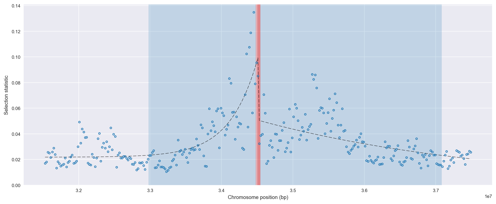
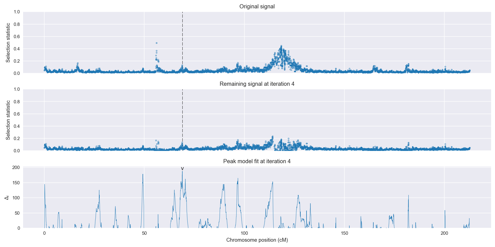
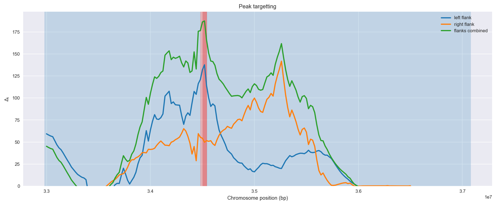
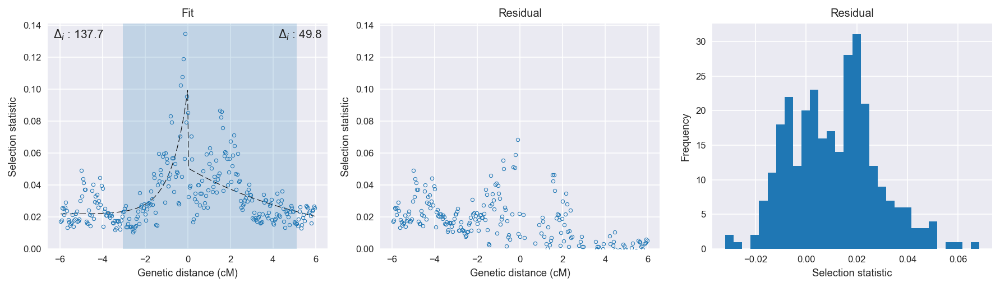

Angola *An. coluzzii* | H12 | Chromosome 2 | Signal #4
================================================================================

This page describes a signal of selection found in the
:doc:`/populations/aom` population using the
:doc:`/methods/h12` statistic.
The inferred focus of this signal is on chromosome arm 2R from
position 34,480,001 to 34,540,000.

The following 10 genes overlap the focal region: :doc:`/genes/AGAP003252` (CLIPB6 - CLIP-domain serine protease),  :doc:`/genes/AGAP013184` (CLIPB36 - CLIP-domain serine protease),  :doc:`/genes/AGAP003253` (Gr15 - gustatory receptor 15),  :doc:`/genes/AGAP003254` (Gr16 - gustatory receptor 16),  :doc:`/genes/AGAP003255` (Gr17 - gustatory receptor 17),  :doc:`/genes/AGAP003256` (Gr18 - gustatory receptor 18),  :doc:`/genes/AGAP003257` (GSTU2 - glutathione S-transferase unclassified 2),  :doc:`/genes/AGAP003258` (Gustatory receptor),  :doc:`/genes/AGAP003259` (Gr20 - gustatory receptor 20),  :doc:`/genes/AGAP003260` (Gr21 - gustatory receptor 21).

The following 11 genes are within 40 kbp of the focal
region: :doc:`/genes/AGAP003245` (CLIPA19 - CLIP-domain serine protease),  :doc:`/genes/AGAP003246` (CLIPB2 - CLIP-domain serine protease),  :doc:`/genes/AGAP003247` (CLIPB19 - CLIP-domain serine protease),  :doc:`/genes/AGAP003248`,  :doc:`/genes/AGAP013487`,  :doc:`/genes/AGAP003249` (CLIPB3 - CLIP-domain serine protease),  :doc:`/genes/AGAP003250` (CLIPB4 - CLIP-domain serine protease),  :doc:`/genes/AGAP003251` (CLIPB1 - CLIP-domain serine protease),  :doc:`/genes/AGAP003261`,  :doc:`/genes/AGAP003262` (integrator complex subunit 10),  :doc:`/genes/AGAP003263` (CDC42 small effector protein-like protein).

    **Figure 1**. Location of the signal of selection. Blue markers show the
    value of the selection statistic in non-overlapping 20 kbp windows. The
    dashed black line shows the fitted peak model. The vertical red bar shows
    the inferred focus of the selection signal. The shaded blue area shows the
    inferred genomic region affected by the selection event.

Related signals
---------------

Overlapping signals
~~~~~~~~~~~~~~~~~~~

The following selection signals have an inferred focus which overlaps with the
focus of this signal:

.. cssclass:: table-hover
.. csv-table::
    :widths: auto
    :header: Signal, Focus, Score

    

Adjacent signals
~~~~~~~~~~~~~~~~

The following selection signals have an inferred focus that is immediately
adjacent to the focus of this signal:

.. cssclass:: table-hover
.. csv-table::
    :header: Signal, Chromosome, Start, Stop, Score, Genes

    :doc:`/signals/h12/bfs/1/index`, 2L, "2,420,000", "2,460,000", 511.2, AGAP001234
    :doc:`/signals/h12/bfs/1/index`, 2L, "2,420,000", "2,460,000", 511.2, AGAP001234
    :doc:`/signals/h12/bfs/1/index`, 2L, "2,420,000", "2,460,000", 511.2, AGAP001234
    :doc:`/signals/h12/bfs/1/index`, 2L, "2,420,000", "2,460,000", 511.2, AGAP001234

Nearby signals
~~~~~~~~~~~~~~

The following signals affect a genome region that overlaps with the genome region
affected by this signal:

.. cssclass:: table-hover
.. csv-table::
    :header: Signal, Chromosome, Start, Stop, Score, Genes

    :doc:`/signals/h12/bfs/1/index`, 2L, "2,420,000", "2,460,000", 511.2, AGAP001234
    :doc:`/signals/h12/bfs/1/index`, 2L, "2,420,000", "2,460,000", 511.2, AGAP001234
    :doc:`/signals/h12/bfs/1/index`, 2L, "2,420,000", "2,460,000", 511.2, AGAP001234
    :doc:`/signals/h12/bfs/1/index`, 2L, "2,420,000", "2,460,000", 511.2, AGAP001234

Diagnostics
-----------

The information below provides some diagnostics from the
:doc:`/methods/peak_modelling` procedure.

    **Figure 2**. Chromosome-wide selection statistic and results from peak
    modelling. **a**, TODO. **b**, TODO.

    **Figure 3**. Diagnostics from targetting the selection signal to a focal
    region. TODO.

    **Figure 4**. Diagnostics from fitting a peak model to the selection signal.
    **a**, TODO. **b**, TODO. **c**, TODO.

Model fit reports
~~~~~~~~~~~~~~~~~

Left flank, peak model::

    [[Model]]
        Model(exponential)
    [[Fit Statistics]]
        # function evals   = 27
        # data points      = 150
        # variables        = 3
        chi-square         = 0.025
        reduced chi-square = 0.000
        Akaike info crit   = -1301.801
        Bayesian info crit = -1292.770
    [[Variables]]
        amplitude:   0.07737398 +/- 0.005556 (7.18%) (init= 0.5)
        decay:       0.78240745 +/- 0.100901 (12.90%) (init= 0.5)
        c:           0.02181802 +/- 0.001518 (6.96%) (init= 0.04)
        cap:         1 (fixed)
    [[Correlations]] (unreported correlations are <  0.100)
        C(decay, c)                  = -0.590 
        C(amplitude, decay)          = -0.538 

Right flank, peak model::

    [[Model]]
        Model(exponential)
    [[Fit Statistics]]
        # function evals   = 89
        # data points      = 148
        # variables        = 3
        chi-square         = 0.026
        reduced chi-square = 0.000
        Akaike info crit   = -1273.029
        Bayesian info crit = -1264.037
    [[Variables]]
        amplitude:   0.05066362 +/- 0        (0.00%) (init= 0.5)
        decay:       6.58878781 +/- 0        (0.00%) (init= 0.5)
        c:           3.2681e-09 +/- 0        (0.00%) (init= 0.04)
        cap:         1 (fixed)

Left flank, null model::

    [[Model]]
        Model(constant)
    [[Fit Statistics]]
        # function evals   = 9
        # data points      = 149
        # variables        = 1
        chi-square         = 0.059
        reduced chi-square = 0.000
        Akaike info crit   = -1164.086
        Bayesian info crit = -1161.082
    [[Variables]]
        c:   0.03147464 +/- 0.001642 (5.22%) (init= 0.04)

Right flank, null model::

    [[Model]]
        Model(constant)
    [[Fit Statistics]]
        # function evals   = 9
        # data points      = 147
        # variables        = 1
        chi-square         = 0.035
        reduced chi-square = 0.000
        Akaike info crit   = -1223.266
        Bayesian info crit = -1220.275
    [[Variables]]
        c:   0.03284580 +/- 0.001281 (3.90%) (init= 0.04)

Comments
--------

.. raw:: html

    

    
    <noscript>Please enable JavaScript to view the <a href="https://disqus.com/?ref_noscript">comments powered by Disqus.</a></noscript>
