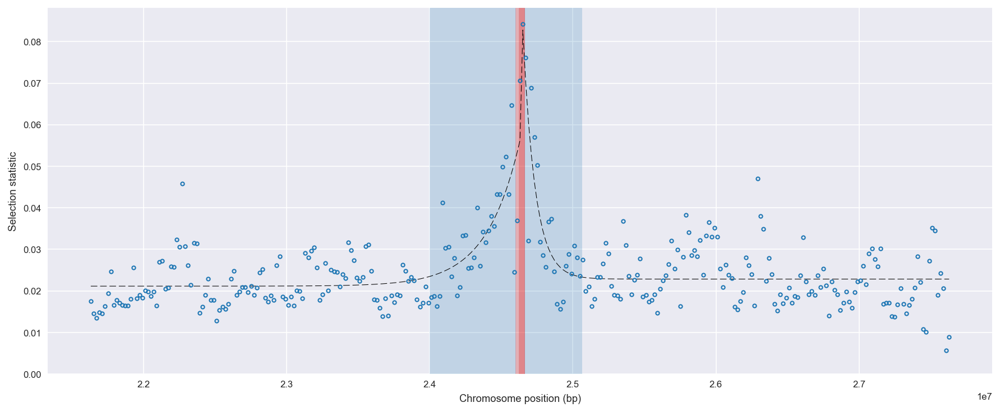
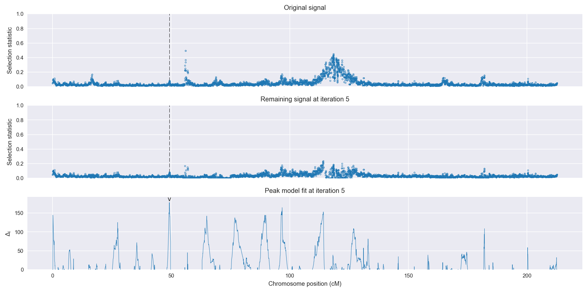
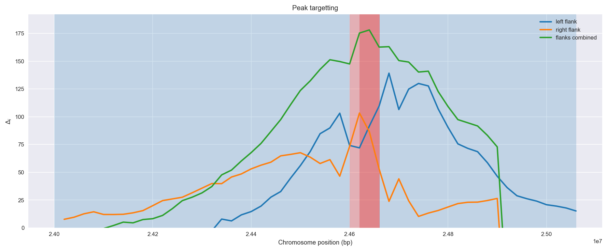
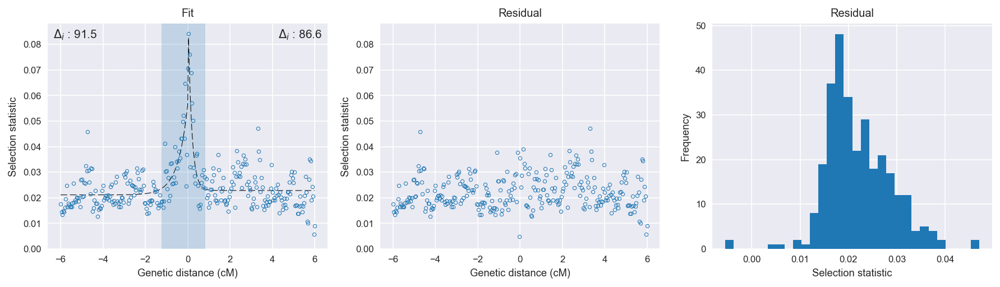

Angola *An. coluzzii* | H12 | Chromosome 2 | Signal #5
================================================================================

This page describes a signal of selection found in the
:doc:`/populations/aom` population using the
:doc:`/methods/h12` statistic.
The inferred focus of this signal is on chromosome arm 2R from
position 24,600,001 to 24,660,000.

The following 3 genes overlap the focal region: :doc:`/genes/AGAP002630` (NADH dehydrogenase (ubiquinone) 1 beta subcomplex 2),  :doc:`/genes/AGAP002631`,  :doc:`/genes/AGAP002632`.

The following 2 genes are within 40 kbp of the focal
region: :doc:`/genes/AGAP002629`,  :doc:`/genes/AGAP002633` (Gr53 - gustatory receptor 53).

    **Figure 1**. Location of the signal of selection. Blue markers show the
    value of the selection statistic in non-overlapping 20 kbp windows. The
    dashed black line shows the fitted peak model. The vertical red bar shows
    the inferred focus of the selection signal. The shaded blue area shows the
    inferred genomic region affected by the selection event.

Related signals
---------------

Overlapping signals
~~~~~~~~~~~~~~~~~~~

The following selection signals have an inferred focus which overlaps with the
focus of this signal:

.. cssclass:: table-hover
.. csv-table::
    :widths: auto
    :header: Signal, Focus, Score

    

Adjacent signals
~~~~~~~~~~~~~~~~

The following selection signals have an inferred focus that is immediately
adjacent to the focus of this signal:

.. cssclass:: table-hover
.. csv-table::
    :header: Signal, Chromosome, Start, Stop, Score, Genes

    :doc:`/signals/h12/bfs/1/index`, 2L, "2,420,000", "2,460,000", 511.2, AGAP001234
    :doc:`/signals/h12/bfs/1/index`, 2L, "2,420,000", "2,460,000", 511.2, AGAP001234
    :doc:`/signals/h12/bfs/1/index`, 2L, "2,420,000", "2,460,000", 511.2, AGAP001234
    :doc:`/signals/h12/bfs/1/index`, 2L, "2,420,000", "2,460,000", 511.2, AGAP001234

Nearby signals
~~~~~~~~~~~~~~

The following signals affect a genome region that overlaps with the genome region
affected by this signal:

.. cssclass:: table-hover
.. csv-table::
    :header: Signal, Chromosome, Start, Stop, Score, Genes

    :doc:`/signals/h12/bfs/1/index`, 2L, "2,420,000", "2,460,000", 511.2, AGAP001234
    :doc:`/signals/h12/bfs/1/index`, 2L, "2,420,000", "2,460,000", 511.2, AGAP001234
    :doc:`/signals/h12/bfs/1/index`, 2L, "2,420,000", "2,460,000", 511.2, AGAP001234
    :doc:`/signals/h12/bfs/1/index`, 2L, "2,420,000", "2,460,000", 511.2, AGAP001234

Diagnostics
-----------

The information below provides some diagnostics from the
:doc:`/methods/peak_modelling` procedure.

    **Figure 2**. Chromosome-wide selection statistic and results from peak
    modelling. **a**, TODO. **b**, TODO.

    **Figure 3**. Diagnostics from targetting the selection signal to a focal
    region. TODO.

    **Figure 4**. Diagnostics from fitting a peak model to the selection signal.
    **a**, TODO. **b**, TODO. **c**, TODO.

Model fit reports
~~~~~~~~~~~~~~~~~

Left flank, peak model::

    [[Model]]
        Model(exponential)
    [[Fit Statistics]]
        # function evals   = 27
        # data points      = 151
        # variables        = 3
        chi-square         = 0.006
        reduced chi-square = 0.000
        Akaike info crit   = -1528.566
        Bayesian info crit = -1519.514
    [[Variables]]
        amplitude:   0.03504579 +/- 0.003383 (9.66%) (init= 0.5)
        decay:       0.46588401 +/- 0.073382 (15.75%) (init= 0.5)
        c:           0.02113238 +/- 0.000614 (2.91%) (init= 0.04)
        cap:         1 (fixed)
    [[Correlations]] (unreported correlations are <  0.100)
        C(amplitude, decay)          = -0.599 
        C(decay, c)                  = -0.427 

Right flank, peak model::

    [[Model]]
        Model(exponential)
    [[Fit Statistics]]
        # function evals   = 27
        # data points      = 150
        # variables        = 3
        chi-square         = 0.008
        reduced chi-square = 0.000
        Akaike info crit   = -1473.481
        Bayesian info crit = -1464.449
    [[Variables]]
        amplitude:   0.07571418 +/- 0.009066 (11.97%) (init= 0.5)
        decay:       0.17129843 +/- 0.026495 (15.47%) (init= 0.5)
        c:           0.02283494 +/- 0.000632 (2.77%) (init= 0.04)
        cap:         1 (fixed)
    [[Correlations]] (unreported correlations are <  0.100)
        C(amplitude, decay)          = -0.769 
        C(decay, c)                  = -0.247 

Left flank, null model::

    [[Model]]
        Model(constant)
    [[Fit Statistics]]
        # function evals   = 11
        # data points      = 150
        # variables        = 1
        chi-square         = 0.010
        reduced chi-square = 0.000
        Akaike info crit   = -1437.071
        Bayesian info crit = -1434.060
    [[Variables]]
        c:   0.02364259 +/- 0.000676 (2.86%) (init= 0.04)

Right flank, null model::

    [[Model]]
        Model(constant)
    [[Fit Statistics]]
        # function evals   = 11
        # data points      = 149
        # variables        = 1
        chi-square         = 0.013
        reduced chi-square = 0.000
        Akaike info crit   = -1386.895
        Bayesian info crit = -1383.891
    [[Variables]]
        c:   0.02435525 +/- 0.000778 (3.19%) (init= 0.04)

Comments
--------

.. raw:: html

    

    
    <noscript>Please enable JavaScript to view the <a href="https://disqus.com/?ref_noscript">comments powered by Disqus.</a></noscript>
