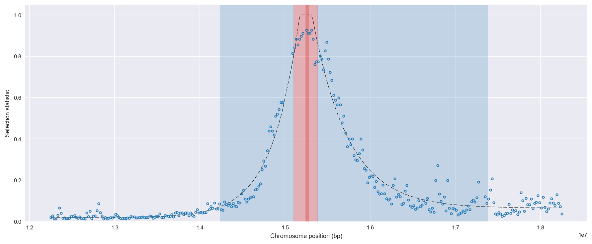
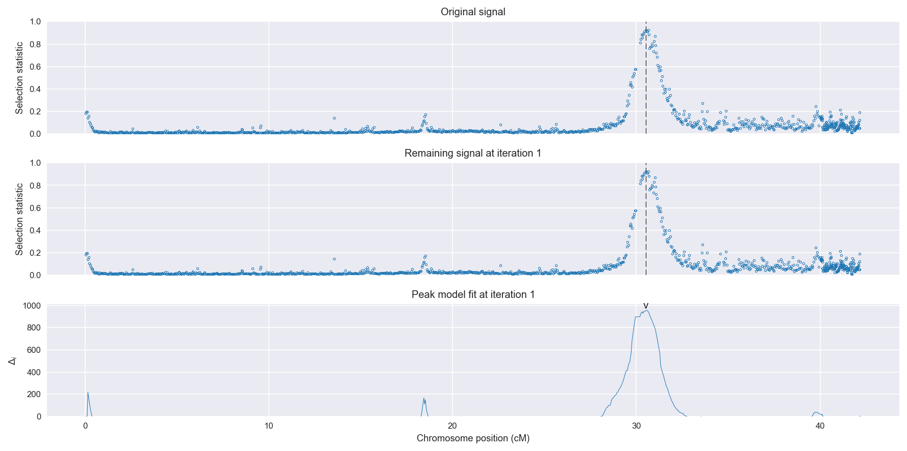
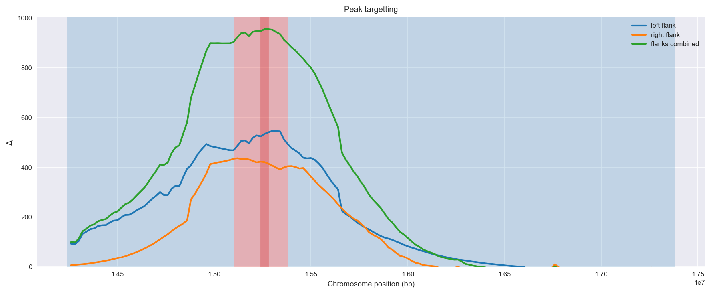
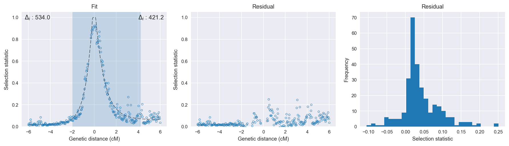

Burkina Faso *An. coluzzii* | H12 | Chromosome X | Signal #1
================================================================================

This page describes a signal of selection found in the
:doc:`/populations/bfm` population using the
:doc:`/methods/h12` statistic.
The inferred focus of this signal is on chromosome arm X from
position 15,100,001 to 15,380,000.

The following 14 genes overlap the focal region: :doc:`/genes/AGAP012997`,  :doc:`/genes/AGAP000818` (CYP9K1 - cytochrome P450),  :doc:`/genes/AGAP000819` (nuclear receptor subfamily 2 group E member (Tailless)),  :doc:`/genes/AGAP000820` (CPR125 - cuticular protein RR-2 family 125),  :doc:`/genes/AGAP000821`,  :doc:`/genes/AGAP000822`,  :doc:`/genes/AGAP000823` (CD81 antigen),  :doc:`/genes/AGAP000824` (bone morphogenetic protein 5),  :doc:`/genes/AGAP000825`,  :doc:`/genes/AGAP000826` (cap-specific mRNA (nucleoside-2'-O-)-methyltransferase 1),  :doc:`/genes/AGAP000829` (calpain-15),  :doc:`/genes/AGAP000830` (CASPS7 - short caspase 7),  :doc:`/genes/AGAP000831` (DnaJ homolog subfamily C member 25),  :doc:`/genes/AGAP000832` (Derlin-2/3).

The following 3 genes are within 40 kbp of the focal
region: :doc:`/genes/AGAP013424`,  :doc:`/genes/AGAP000833` (MIP - myoinhibitory-like peptide),  :doc:`/genes/AGAP000834`.

    **Figure 1**. Location of the signal of selection. Blue markers show the
    value of the selection statistic in non-overlapping 20 kbp windows. The
    dashed black line shows the fitted peak model. The vertical red bar shows
    the inferred focus of the selection signal. The shaded blue area shows the
    inferred genomic region affected by the selection event.

Related signals
---------------

Overlapping signals
~~~~~~~~~~~~~~~~~~~

The following selection signals have an inferred focus which overlaps with the
focus of this signal:

.. cssclass:: table-hover
.. csv-table::
    :widths: auto
    :header: Signal, Focus, Score

    :doc:`/signals/h12/bfs/chrX/1/index`,"X:15120001-15260000",836
    :doc:`/signals/h12/ugs/chrX/1/index`,"X:15320001-15460000",384
    

Adjacent signals
~~~~~~~~~~~~~~~~

The following selection signals have an inferred focus that is immediately
adjacent to the focus of this signal:

.. cssclass:: table-hover
.. csv-table::
    :header: Signal, Chromosome, Start, Stop, Score, Genes

    :doc:`/signals/h12/bfs/1/index`, 2L, "2,420,000", "2,460,000", 511.2, AGAP001234
    :doc:`/signals/h12/bfs/1/index`, 2L, "2,420,000", "2,460,000", 511.2, AGAP001234
    :doc:`/signals/h12/bfs/1/index`, 2L, "2,420,000", "2,460,000", 511.2, AGAP001234
    :doc:`/signals/h12/bfs/1/index`, 2L, "2,420,000", "2,460,000", 511.2, AGAP001234

Nearby signals
~~~~~~~~~~~~~~

The following signals affect a genome region that overlaps with the genome region
affected by this signal:

.. cssclass:: table-hover
.. csv-table::
    :header: Signal, Chromosome, Start, Stop, Score, Genes

    :doc:`/signals/h12/bfs/1/index`, 2L, "2,420,000", "2,460,000", 511.2, AGAP001234
    :doc:`/signals/h12/bfs/1/index`, 2L, "2,420,000", "2,460,000", 511.2, AGAP001234
    :doc:`/signals/h12/bfs/1/index`, 2L, "2,420,000", "2,460,000", 511.2, AGAP001234
    :doc:`/signals/h12/bfs/1/index`, 2L, "2,420,000", "2,460,000", 511.2, AGAP001234

Diagnostics
-----------

The information below provides some diagnostics from the
:doc:`/methods/peak_modelling` procedure.

    **Figure 2**. Chromosome-wide selection statistic and results from peak
    modelling. **a**, TODO. **b**, TODO.

    **Figure 3**. Diagnostics from targetting the selection signal to a focal
    region. TODO.

    **Figure 4**. Diagnostics from fitting a peak model to the selection signal.
    **a**, TODO. **b**, TODO. **c**, TODO.

Model fit reports
~~~~~~~~~~~~~~~~~

Left flank, peak model::

    [[Model]]
        Model(exponential)
    [[Fit Statistics]]
        # function evals   = 35
        # data points      = 145
        # variables        = 3
        chi-square         = 0.157
        reduced chi-square = 0.001
        Akaike info crit   = -984.357
        Bayesian info crit = -975.426
    [[Variables]]
        amplitude:   1.24358540 +/- 0.027627 (2.22%) (init= 0.5)
        decay:       0.64126325 +/- 0.017812 (2.78%) (init= 0.5)
        c:           0.01890917 +/- 0.003651 (19.31%) (init= 0.04)
        cap:         1 (fixed)
    [[Correlations]] (unreported correlations are <  0.100)
        C(amplitude, decay)          = -0.734 
        C(decay, c)                  = -0.526 
        C(amplitude, c)              =  0.131 

Right flank, peak model::

    [[Model]]
        Model(exponential)
    [[Fit Statistics]]
        # function evals   = 47
        # data points      = 147
        # variables        = 3
        chi-square         = 0.446
        reduced chi-square = 0.003
        Akaike info crit   = -846.162
        Bayesian info crit = -837.191
    [[Variables]]
        amplitude:   1.10037372 +/- 0.034500 (3.14%) (init= 0.5)
        decay:       0.83295047 +/- 0.039568 (4.75%) (init= 0.5)
        c:           0.06456230 +/- 0.007030 (10.89%) (init= 0.04)
        cap:         1 (fixed)
    [[Correlations]] (unreported correlations are <  0.100)
        C(amplitude, decay)          = -0.713 
        C(decay, c)                  = -0.623 
        C(amplitude, c)              =  0.150 

Left flank, null model::

    [[Model]]
        Model(constant)
    [[Fit Statistics]]
        # function evals   = 11
        # data points      = 144
        # variables        = 1
        chi-square         = 6.225
        reduced chi-square = 0.044
        Akaike info crit   = -450.342
        Bayesian info crit = -447.372
    [[Variables]]
        c:   0.12064537 +/- 0.017386 (14.41%) (init= 0.04)

Right flank, null model::

    [[Model]]
        Model(constant)
    [[Fit Statistics]]
        # function evals   = 12
        # data points      = 146
        # variables        = 1
        chi-square         = 7.837
        reduced chi-square = 0.054
        Akaike info crit   = -425.004
        Bayesian info crit = -422.021
    [[Variables]]
        c:   0.20854011 +/- 0.019241 (9.23%) (init= 0.04)

Comments
--------

.. raw:: html

    

    
    <noscript>Please enable JavaScript to view the <a href="https://disqus.com/?ref_noscript">comments powered by Disqus.</a></noscript>
