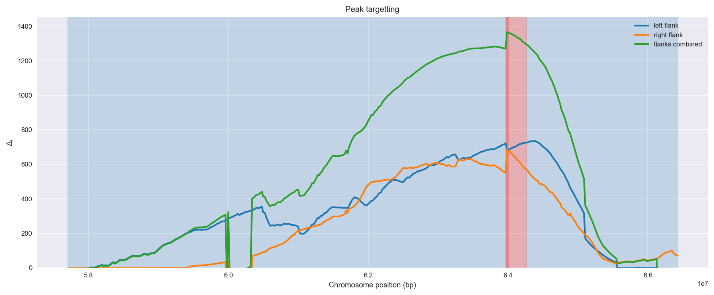

Burkina Faso *An. gambiae* | H12 | Chromosome 2 | Signal #1
================================================================================

This page describes a signal of selection found in the
:doc:`/populations/bfs` population using the
:doc:`/methods/h12` statistic.
The inferred focus of this signal is on chromosome arm 2L from
position 2,420,001 to 2,720,000.

The following 13 genes overlap the focal region: :doc:`/genes/AGAP004707` (para - voltage-gated sodium channel),  :doc:`/genes/AGAP004708` (arginyl-tRNA synthetase),  :doc:`/genes/AGAP004709` (mRpL18 - 39S ribosomal protein L18, mitochondrial),  :doc:`/genes/AGAP004710` (ubiquinol-cytochrome c reductase subunit 9),  :doc:`/genes/AGAP004711` (ATP-dependent RNA helicase DDX41),  :doc:`/genes/AGAP004712`,  :doc:`/genes/AGAP004713`,  :doc:`/genes/AGAP004714`,  :doc:`/genes/AGAP004715` (Pyruvate dehydrogenase phosphatase regulatory subunit, mitochondrial),  :doc:`/genes/AGAP004716` (Gr57 - gustatory receptor 57),  :doc:`/genes/AGAP004717`,  :doc:`/genes/AGAP004718`,  :doc:`/genes/AGAP004719` (CLIPC9 - CLIP-domain serine protease).

The following 4 genes are within 40 kbp of the focal
region: :doc:`/genes/AGAP004720`,  :doc:`/genes/AGAP004721` (N-acetylglucosamine-6-sulfatase),  :doc:`/genes/AGAP004722`,  :doc:`/genes/AGAP004723` (chromobox protein homolog 1).

.. figure:: signal_location.png
    :alt: signal location

    **Figure 1**. Location of the signal of selection. Blue markers show the
    value of the selection statistic in non-overlapping 20 kbp windows. The
    dashed black line shows the fitted peak model. The vertical red bar shows
    the inferred focus of the selection signal. The shaded blue area shows the
    inferred genomic region affected by the selection event.

Related signals
---------------

Overlapping signals
~~~~~~~~~~~~~~~~~~~

The following selection signals have an inferred focus which overlaps with the
focus of this signal:

.. cssclass:: table-hover
.. csv-table::
    :widths: auto
    :header: Signal, Focus, Score

    :doc:`/signals/h12/bfm/chr2/1/index`,"2L:2520001-2900000",1399
    :doc:`/signals/h12/ugs/chr2/2/index`,"2L:2000001-3100000",1003
    

Adjacent signals
~~~~~~~~~~~~~~~~

The following selection signals have an inferred focus that is immediately
adjacent to the focus of this signal:

.. cssclass:: table-hover
.. csv-table::
    :header: Signal, Chromosome, Start, Stop, Score, Genes

    :doc:`/signals/h12/bfs/1/index`, 2L, "2,420,000", "2,460,000", 511.2, AGAP001234
    :doc:`/signals/h12/bfs/1/index`, 2L, "2,420,000", "2,460,000", 511.2, AGAP001234
    :doc:`/signals/h12/bfs/1/index`, 2L, "2,420,000", "2,460,000", 511.2, AGAP001234
    :doc:`/signals/h12/bfs/1/index`, 2L, "2,420,000", "2,460,000", 511.2, AGAP001234

Nearby signals
~~~~~~~~~~~~~~

The following signals affect a genome region that overlaps with the genome region
affected by this signal:

.. cssclass:: table-hover
.. csv-table::
    :header: Signal, Chromosome, Start, Stop, Score, Genes

    :doc:`/signals/h12/bfs/1/index`, 2L, "2,420,000", "2,460,000", 511.2, AGAP001234
    :doc:`/signals/h12/bfs/1/index`, 2L, "2,420,000", "2,460,000", 511.2, AGAP001234
    :doc:`/signals/h12/bfs/1/index`, 2L, "2,420,000", "2,460,000", 511.2, AGAP001234
    :doc:`/signals/h12/bfs/1/index`, 2L, "2,420,000", "2,460,000", 511.2, AGAP001234

Diagnostics
-----------

The information below provides some diagnostics from the
:doc:`/methods/peak_modelling` procedure.

.. figure:: signal_context.png

    **Figure 2**. Chromosome-wide selection statistic and results from peak
    modelling. **a**, TODO. **b**, TODO.

    **Figure 3**. Diagnostics from targetting the selection signal to a focal
    region. TODO.

.. figure:: signal_fit.png

    **Figure 4**. Diagnostics from fitting a peak model to the selection signal.
    **a**, TODO. **b**, TODO. **c**, TODO.

Model fit reports
~~~~~~~~~~~~~~~~~

Left flank, peak model::

    [[Model]]
        Model(exponential)
    [[Fit Statistics]]
        # function evals   = 68
        # data points      = 310
        # variables        = 3
        chi-square         = 3.287
        reduced chi-square = 0.011
        Akaike info crit   = -1403.479
        Bayesian info crit = -1392.269
    [[Variables]]
        amplitude:   1.26033113 +/- 0.037991 (3.01%) (init= 0.5)
        decay:       1.15507529 +/- 0.067226 (5.82%) (init= 0.5)
        c:           0.05163917 +/- 0.015891 (30.77%) (init= 0.04)
        cap:         1 (fixed)
    [[Correlations]] (unreported correlations are <  0.100)
        C(decay, c)                  = -0.797 
        C(amplitude, decay)          = -0.628 
        C(amplitude, c)              =  0.141 

Right flank, peak model::

    [[Model]]
        Model(exponential)
    [[Fit Statistics]]
        # function evals   = 27
        # data points      = 179
        # variables        = 3
        chi-square         = 0.342
        reduced chi-square = 0.002
        Akaike info crit   = -1114.752
        Bayesian info crit = -1105.190
    [[Variables]]
        amplitude:   0.96862450 +/- 0.010743 (1.11%) (init= 0.5)
        decay:       1.31891607 +/- 0.040766 (3.09%) (init= 0.5)
        c:           0.02932117 +/- 0.006777 (23.12%) (init= 0.04)
        cap:         1 (fixed)
    [[Correlations]] (unreported correlations are <  0.100)
        C(decay, c)                  = -0.773 
        C(amplitude, c)              = -0.327 
        C(amplitude, decay)          = -0.101 

Left flank, null model::

    [[Model]]
        Model(constant)
    [[Fit Statistics]]
        # function evals   = 12
        # data points      = 308
        # variables        = 1
        chi-square         = 29.218
        reduced chi-square = 0.095
        Akaike info crit   = -723.440
        Bayesian info crit = -719.710
    [[Variables]]
        c:   0.41346148 +/- 0.017577 (4.25%) (init= 0.04)

Right flank, null model::

    [[Model]]
        Model(constant)
    [[Fit Statistics]]
        # function evals   = 12
        # data points      = 178
        # variables        = 1
        chi-square         = 15.796
        reduced chi-square = 0.089
        Akaike info crit   = -429.123
        Bayesian info crit = -425.941
    [[Variables]]
        c:   0.27525521 +/- 0.022390 (8.13%) (init= 0.04)

Comments
--------

.. raw:: html

    

    
    <noscript>Please enable JavaScript to view the <a href="https://disqus.com/?ref_noscript">comments powered by Disqus.</a></noscript>
