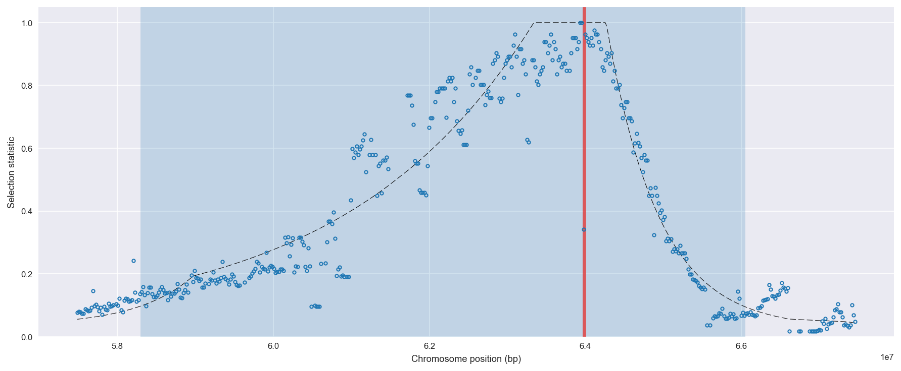
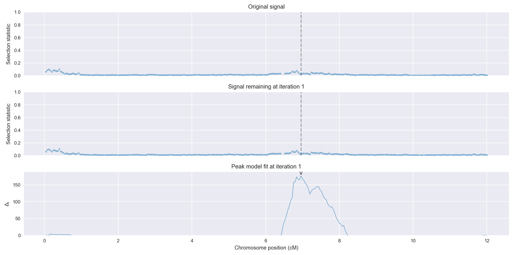
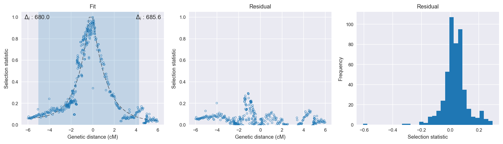

Burkina Faso *An. gambiae* | H12 | Chromosome 2 | Signal #1
================================================================================

This page describes a signal of selection found in the
:doc:`/populations/bfs` population using the
:doc:`/methods/h12` statistic.
The inferred focus of this signal is on chromosome arm 2L from
position 2,420,001 to 2,460,000.

Gene :doc:`/genes/AGAP004707` (para - voltage-gated sodium channel) overlaps the focal region.

No genes overlap the windows immediately adjacent to the focal region.

    **Figure 1**. Location of the signal of selection. Blue markers show the
    value of the selection statistic in non-overlapping 20 kbp windows. The
    dashed black line shows the fitted peak model. The vertical red bar shows
    the inferred focus of the selection signal. The shaded blue area shows the
    inferred genomic region affected by the selection event.

Related signals
---------------

Overlapping signals
~~~~~~~~~~~~~~~~~~~

The following selection signals have an inferred focus which overlaps with the
focus of this signal:

.. cssclass:: table-hover
.. csv-table::
    :header: Signal, Chromosome, Start, Stop, Score, Genes

    :doc:`/signals/h12/bfs/1/index`, 2L, "2,420,000", "2,460,000", 511.2, AGAP001234
    :doc:`/signals/h12/bfs/1/index`, 2L, "2,420,000", "2,460,000", 511.2, AGAP001234
    :doc:`/signals/h12/bfs/1/index`, 2L, "2,420,000", "2,460,000", 511.2, AGAP001234
    :doc:`/signals/h12/bfs/1/index`, 2L, "2,420,000", "2,460,000", 511.2, AGAP001234

Adjacent signals
~~~~~~~~~~~~~~~~

The following selection signals have an inferred focus that is immediately
adjacent to the focus of this signal:

.. cssclass:: table-hover
.. csv-table::
    :header: Signal, Chromosome, Start, Stop, Score, Genes

    :doc:`/signals/h12/bfs/1/index`, 2L, "2,420,000", "2,460,000", 511.2, AGAP001234
    :doc:`/signals/h12/bfs/1/index`, 2L, "2,420,000", "2,460,000", 511.2, AGAP001234
    :doc:`/signals/h12/bfs/1/index`, 2L, "2,420,000", "2,460,000", 511.2, AGAP001234
    :doc:`/signals/h12/bfs/1/index`, 2L, "2,420,000", "2,460,000", 511.2, AGAP001234

Nearby signals
~~~~~~~~~~~~~~

The following signals affect a genome region that overlaps with the genome region
affected by this signal:

.. cssclass:: table-hover
.. csv-table::
    :header: Signal, Chromosome, Start, Stop, Score, Genes

    :doc:`/signals/h12/bfs/1/index`, 2L, "2,420,000", "2,460,000", 511.2, AGAP001234
    :doc:`/signals/h12/bfs/1/index`, 2L, "2,420,000", "2,460,000", 511.2, AGAP001234
    :doc:`/signals/h12/bfs/1/index`, 2L, "2,420,000", "2,460,000", 511.2, AGAP001234
    :doc:`/signals/h12/bfs/1/index`, 2L, "2,420,000", "2,460,000", 511.2, AGAP001234

Diagnostics
-----------

The information below provides some diagnostics from the
:doc:`/methods/peak_modelling` procedure.

    **Figure 2**. Chromosome-wide selection statistic and results from peak
    modelling. **a**, TODO. **b**, TODO.

    **Figure 3**. Diagnostics from fitting a peak model to the selection signal.
    **a**, TODO. **b**, TODO. **c**, TODO.

Model fit reports
~~~~~~~~~~~~~~~~~

Left flank, peak model::

    [[Model]]
        Model(exponential)
    [[Fit Statistics]]
        # function evals   = 73
        # data points      = 297
        # variables        = 3
        chi-square         = 3.258
        reduced chi-square = 0.011
        Akaike info crit   = -1334.227
        Bayesian info crit = -1323.146
    [[Variables]]
        amplitude:   1.26565506 +/- 0.036842 (2.91%) (init= 0.5)
        decay:       1.44764272 +/- 0.098009 (6.77%) (init= 0.2)
        c:           0.03528829 +/- 0.020844 (59.07%) (init= 0.04)
        cap:         1 (fixed)
    [[Correlations]] (unreported correlations are <  0.100)
        C(decay, c)                  = -0.860 
        C(amplitude, decay)          = -0.541 
        C(amplitude, c)              =  0.125 

Right flank, peak model::

    [[Model]]
        Model(exponential)
    [[Fit Statistics]]
        # function evals   = 56
        # data points      = 162
        # variables        = 3
        chi-square         = 0.437
        reduced chi-square = 0.003
        Akaike info crit   = -952.252
        Bayesian info crit = -942.989
    [[Variables]]
        amplitude:   1.50194700 +/- 0.046944 (3.13%) (init= 0.5)
        decay:       1.34241621 +/- 0.060462 (4.50%) (init= 0.2)
        c:           0.02676044 +/- 0.009783 (36.56%) (init= 0.04)
        cap:         1 (fixed)
    [[Correlations]] (unreported correlations are <  0.100)
        C(amplitude, decay)          = -0.827 
        C(decay, c)                  = -0.808 
        C(amplitude, c)              =  0.449 

Left flank, null model::

    [[Model]]
        Model(constant)
    [[Fit Statistics]]
        # function evals   = 12
        # data points      = 295
        # variables        = 1
        chi-square         = 27.587
        reduced chi-square = 0.094
        Akaike info crit   = -697.037
        Bayesian info crit = -693.350
    [[Variables]]
        c:   0.42873244 +/- 0.017833 (4.16%) (init= 0.04)

Right flank, null model::

    [[Model]]
        Model(constant)
    [[Fit Statistics]]
        # function evals   = 12
        # data points      = 161
        # variables        = 1
        chi-square         = 14.809
        reduced chi-square = 0.093
        Akaike info crit   = -382.173
        Bayesian info crit = -379.092
    [[Variables]]
        c:   0.29943218 +/- 0.023976 (8.01%) (init= 0.04)

Comments
--------

.. raw:: html

    

    
    <noscript>Please enable JavaScript to view the <a href="https://disqus.com/?ref_noscript">comments powered by Disqus.</a></noscript>
