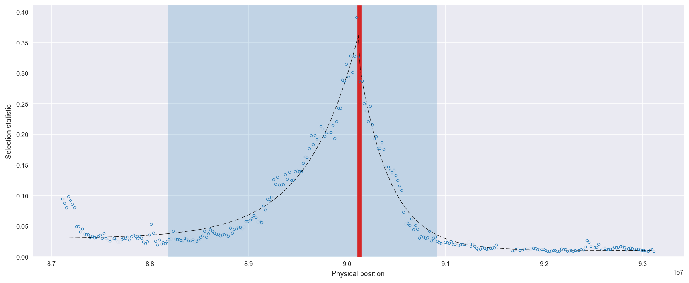
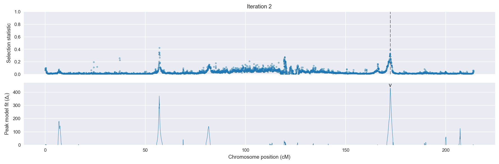
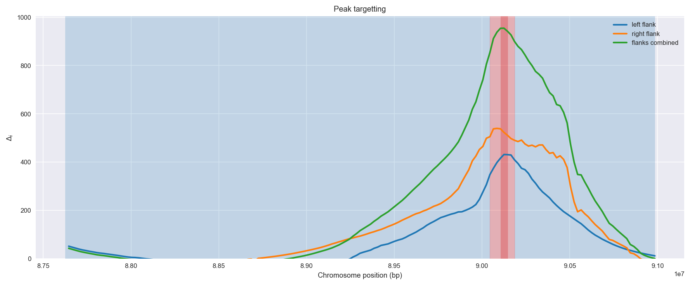
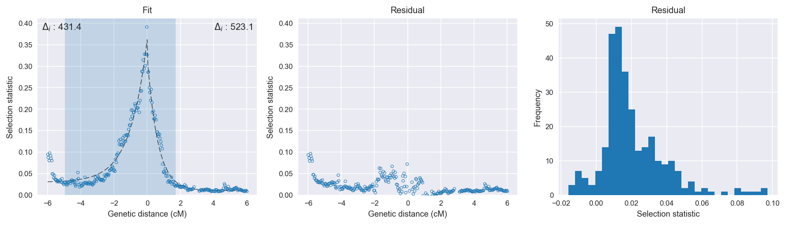

Burkina Faso *An. gambiae* | H12 | Chromosome 2 | Signal #2
================================================================================

This page describes a signal of selection found in the
:doc:`/populations/bfs` population using the
:doc:`/methods/h12` statistic.
The inferred focus of this signal is on chromosome arm 2L from
position 28,500,001 to 28,640,000.

The following 36 genes overlap the focal region: :doc:`/genes/AGAP006219` (receptor tyrosine kinase-like orphan receptor 1),  :doc:`/genes/AGAP006220` (aldehyde oxidase),  :doc:`/genes/AGAP006221` (aldehyde oxidase),  :doc:`/genes/AGAP006222` (glucosyl/glucuronosyl transferases),  :doc:`/genes/AGAP006223` (glucosyl/glucuronosyl transferases),  :doc:`/genes/AGAP006224` (aldehyde oxidase),  :doc:`/genes/AGAP006225` (aldehyde oxidase),  :doc:`/genes/AGAP006226` (Aldehyde_oxidase),  :doc:`/genes/AGAP006227` (alpha esterase),  :doc:`/genes/AGAP006228` (COEAE2F - carboxylesterase),  :doc:`/genes/AGAP006229` (Vps20 - vacuolar protein sorting 20),  :doc:`/genes/AGAP006231` (serine/threonine-protein phosphatase dullard homolog),  :doc:`/genes/AGAP006232` (peroxin-14),  :doc:`/genes/AGAP006233`,  :doc:`/genes/AGAP006234` (protein SHQ1),  :doc:`/genes/AGAP006235`,  :doc:`/genes/AGAP006236`,  :doc:`/genes/AGAP006237` (Negative elongation factor E),  :doc:`/genes/AGAP006238` (ubiquitin-conjugating enzyme E2 C),  :doc:`/genes/AGAP006239` (Protein TSSC1),  :doc:`/genes/AGAP006240` (splicing factor 3B subunit 2),  :doc:`/genes/AGAP006241` (Innexin inx2),  :doc:`/genes/AGAP006242`,  :doc:`/genes/AGAP006243` (phosphatidylinositol-4,5-bisphosphate 4-phosphatase),  :doc:`/genes/AGAP029069`,  :doc:`/genes/AGAP006244` (CTL-like protein 1),  :doc:`/genes/AGAP006245` (zinc finger matrin-type protein 2),  :doc:`/genes/AGAP006246` (Sorcin),  :doc:`/genes/AGAP006247` (Survival of motor neuron-related-splicing factor 30),  :doc:`/genes/AGAP006248` (Med10 - Mediator of RNA polymerase II transcription subunit 10),  :doc:`/genes/AGAP006249` (solute carrier family 12 (potassium/chloride transporters), member 8),  :doc:`/genes/AGAP006250` (eukaryotic elongation factor, selenocysteine-tRNA-specific),  :doc:`/genes/AGAP006251` (syntaxin 6),  :doc:`/genes/AGAP006252` (Cysteine-rich venom protein),  :doc:`/genes/AGAP006253` (Cysteine-rich venom protein),  :doc:`/genes/AGAP006254` (polypeptide N-acetylglucosaminyltransferase).

The following 8 genes are within 40 kbp of the focal
region: :doc:`/genes/AGAP006214`,  :doc:`/genes/AGAP006215` (GPRMTH1 - methuselah receptor 1),  :doc:`/genes/AGAP006216` (GPRMTH2 - methuselah receptor 2),  :doc:`/genes/AGAP006217`,  :doc:`/genes/AGAP006218` (GPRMTH4 - methuselah receptor 4),  :doc:`/genes/AGAP006255`,  :doc:`/genes/AGAP006256` (Cad74A),  :doc:`/genes/AGAP028399`.

    **Figure 1**. Location of the signal of selection. Blue markers show the
    value of the selection statistic in non-overlapping 20 kbp windows. The
    dashed black line shows the fitted peak model. The vertical red bar shows
    the inferred focus of the selection signal. The shaded blue area shows the
    inferred genomic region affected by the selection event.

Related signals
---------------

Overlapping signals
~~~~~~~~~~~~~~~~~~~

The following selection signals have an inferred focus which overlaps with the
focus of this signal:

.. cssclass:: table-hover
.. csv-table::
    :widths: auto
    :header: Signal, Focus, Score

    

Adjacent signals
~~~~~~~~~~~~~~~~

The following selection signals have an inferred focus that is immediately
adjacent to the focus of this signal:

.. cssclass:: table-hover
.. csv-table::
    :header: Signal, Chromosome, Start, Stop, Score, Genes

    :doc:`/signals/h12/bfs/1/index`, 2L, "2,420,000", "2,460,000", 511.2, AGAP001234
    :doc:`/signals/h12/bfs/1/index`, 2L, "2,420,000", "2,460,000", 511.2, AGAP001234
    :doc:`/signals/h12/bfs/1/index`, 2L, "2,420,000", "2,460,000", 511.2, AGAP001234
    :doc:`/signals/h12/bfs/1/index`, 2L, "2,420,000", "2,460,000", 511.2, AGAP001234

Nearby signals
~~~~~~~~~~~~~~

The following signals affect a genome region that overlaps with the genome region
affected by this signal:

.. cssclass:: table-hover
.. csv-table::
    :header: Signal, Chromosome, Start, Stop, Score, Genes

    :doc:`/signals/h12/bfs/1/index`, 2L, "2,420,000", "2,460,000", 511.2, AGAP001234
    :doc:`/signals/h12/bfs/1/index`, 2L, "2,420,000", "2,460,000", 511.2, AGAP001234
    :doc:`/signals/h12/bfs/1/index`, 2L, "2,420,000", "2,460,000", 511.2, AGAP001234
    :doc:`/signals/h12/bfs/1/index`, 2L, "2,420,000", "2,460,000", 511.2, AGAP001234

Diagnostics
-----------

The information below provides some diagnostics from the
:doc:`/methods/peak_modelling` procedure.

    **Figure 2**. Chromosome-wide selection statistic and results from peak
    modelling. **a**, TODO. **b**, TODO.

    **Figure 3**. Diagnostics from targetting the selection signal to a focal
    region. TODO.

    **Figure 4**. Diagnostics from fitting a peak model to the selection signal.
    **a**, TODO. **b**, TODO. **c**, TODO.

Model fit reports
~~~~~~~~~~~~~~~~~

Left flank, peak model::

    [[Model]]
        Model(exponential)
    [[Fit Statistics]]
        # function evals   = 31
        # data points      = 151
        # variables        = 3
        chi-square         = 0.055
        reduced chi-square = 0.000
        Akaike info crit   = -1190.502
        Bayesian info crit = -1181.451
    [[Variables]]
        amplitude:   0.33202395 +/- 0.007283 (2.19%) (init= 0.5)
        decay:       1.03514846 +/- 0.045489 (4.39%) (init= 0.5)
        c:           0.02994958 +/- 0.002679 (8.95%) (init= 0.04)
        cap:         1 (fixed)
    [[Correlations]] (unreported correlations are <  0.100)
        C(decay, c)                  = -0.695 
        C(amplitude, decay)          = -0.463 

Right flank, peak model::

    [[Model]]
        Model(exponential)
    [[Fit Statistics]]
        # function evals   = 27
        # data points      = 143
        # variables        = 3
        chi-square         = 0.014
        reduced chi-square = 0.000
        Akaike info crit   = -1315.591
        Bayesian info crit = -1306.702
    [[Variables]]
        amplitude:   0.31418225 +/- 0.005330 (1.70%) (init= 0.5)
        decay:       0.63545222 +/- 0.017267 (2.72%) (init= 0.5)
        c:           0.01037982 +/- 0.001099 (10.59%) (init= 0.04)
        cap:         1 (fixed)
    [[Correlations]] (unreported correlations are <  0.100)
        C(amplitude, decay)          = -0.633 
        C(decay, c)                  = -0.516 

Left flank, null model::

    [[Model]]
        Model(constant)
    [[Fit Statistics]]
        # function evals   = 11
        # data points      = 150
        # variables        = 1
        chi-square         = 0.939
        reduced chi-square = 0.006
        Akaike info crit   = -759.059
        Bayesian info crit = -756.048
    [[Variables]]
        c:   0.08576436 +/- 0.006481 (7.56%) (init= 0.04)

Right flank, null model::

    [[Model]]
        Model(constant)
    [[Fit Statistics]]
        # function evals   = 8
        # data points      = 142
        # variables        = 1
        chi-square         = 0.528
        reduced chi-square = 0.004
        Akaike info crit   = -792.472
        Bayesian info crit = -789.516
    [[Variables]]
        c:   0.04233241 +/- 0.005134 (12.13%) (init= 0.04)

Comments
--------

.. raw:: html

    

    
    <noscript>Please enable JavaScript to view the <a href="https://disqus.com/?ref_noscript">comments powered by Disqus.</a></noscript>
