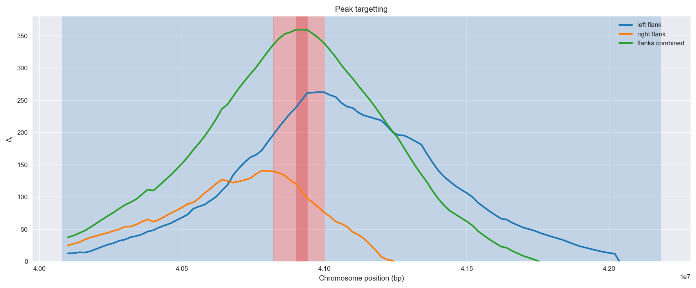

Burkina Faso *An. gambiae* | H12 | Chromosome 2 | Signal #6
================================================================================

This page describes a signal of selection found in the
:doc:`/populations/bfs` population using the
:doc:`/methods/h12` statistic.
The inferred focus of this signal is on chromosome arm 2R from
position 40,820,001 to 41,000,000.

The following 13 genes overlap the focal region: :doc:`/genes/AGAP003638`,  :doc:`/genes/AGAP003639` (Prolylcarboxypeptidase),  :doc:`/genes/AGAP003640` (SP8905),  :doc:`/genes/AGAP003641` (SP8907),  :doc:`/genes/AGAP003642` (SP8898),  :doc:`/genes/AGAP003643` (ubiquitin carboxyl-terminal hydrolase 34),  :doc:`/genes/AGAP003644` (mRpS11 - 28S ribosomal protein S11, mitochondrial),  :doc:`/genes/AGAP003645` (kelch-like protein 19),  :doc:`/genes/AGAP013307`,  :doc:`/genes/AGAP003646`,  :doc:`/genes/AGAP003647`,  :doc:`/genes/AGAP003648` (DNA-directed RNA polymerase II subunit RPB2),  :doc:`/genes/AGAP003649`.

The following 6 genes are within 40 kbp of the focal
region: :doc:`/genes/AGAP003632` (U3 small nucleolar RNA-associated protein 14),  :doc:`/genes/AGAP003633`,  :doc:`/genes/AGAP003635`,  :doc:`/genes/AGAP003636` (inositol oxygenase),  :doc:`/genes/AGAP003650` (translation initiation factor eIF-2B subunit alpha),  :doc:`/genes/AGAP003651` (Tyrosine-protein kinase Fes/Fps).

.. figure:: signal_location.png
    :alt: signal location

    **Figure 1**. Location of the signal of selection. Blue markers show the
    value of the selection statistic in non-overlapping 20 kbp windows. The
    dashed black line shows the fitted peak model. The vertical red bar shows
    the inferred focus of the selection signal. The shaded blue area shows the
    inferred genomic region affected by the selection event.

Related signals
---------------

Overlapping signals
~~~~~~~~~~~~~~~~~~~

The following selection signals have an inferred focus which overlaps with the
focus of this signal:

.. cssclass:: table-hover
.. csv-table::
    :widths: auto
    :header: Signal, Focus, Score

    :doc:`/signals/h12/bfm/chr2/4/index`,"2R:40880001-40980000",400
    

Adjacent signals
~~~~~~~~~~~~~~~~

The following selection signals have an inferred focus that is immediately
adjacent to the focus of this signal:

.. cssclass:: table-hover
.. csv-table::
    :header: Signal, Chromosome, Start, Stop, Score, Genes

    :doc:`/signals/h12/bfs/1/index`, 2L, "2,420,000", "2,460,000", 511.2, AGAP001234
    :doc:`/signals/h12/bfs/1/index`, 2L, "2,420,000", "2,460,000", 511.2, AGAP001234
    :doc:`/signals/h12/bfs/1/index`, 2L, "2,420,000", "2,460,000", 511.2, AGAP001234
    :doc:`/signals/h12/bfs/1/index`, 2L, "2,420,000", "2,460,000", 511.2, AGAP001234

Nearby signals
~~~~~~~~~~~~~~

The following signals affect a genome region that overlaps with the genome region
affected by this signal:

.. cssclass:: table-hover
.. csv-table::
    :header: Signal, Chromosome, Start, Stop, Score, Genes

    :doc:`/signals/h12/bfs/1/index`, 2L, "2,420,000", "2,460,000", 511.2, AGAP001234
    :doc:`/signals/h12/bfs/1/index`, 2L, "2,420,000", "2,460,000", 511.2, AGAP001234
    :doc:`/signals/h12/bfs/1/index`, 2L, "2,420,000", "2,460,000", 511.2, AGAP001234
    :doc:`/signals/h12/bfs/1/index`, 2L, "2,420,000", "2,460,000", 511.2, AGAP001234

Diagnostics
-----------

The information below provides some diagnostics from the
:doc:`/methods/peak_modelling` procedure.

.. figure:: signal_context.png

    **Figure 2**. Chromosome-wide selection statistic and results from peak
    modelling. **a**, TODO. **b**, TODO.

    **Figure 3**. Diagnostics from targetting the selection signal to a focal
    region. TODO.

.. figure:: signal_fit.png

    **Figure 4**. Diagnostics from fitting a peak model to the selection signal.
    **a**, TODO. **b**, TODO. **c**, TODO.

Model fit reports
~~~~~~~~~~~~~~~~~

Left flank, peak model::

    [[Model]]
        Model(exponential)
    [[Fit Statistics]]
        # function evals   = 23
        # data points      = 150
        # variables        = 3
        chi-square         = 0.028
        reduced chi-square = 0.000
        Akaike info crit   = -1279.995
        Bayesian info crit = -1270.963
    [[Variables]]
        amplitude:   0.12859787 +/- 0.005824 (4.53%) (init= 0.5)
        decay:       0.82830421 +/- 0.068595 (8.28%) (init= 0.5)
        c:           0.02779849 +/- 0.001682 (6.05%) (init= 0.04)
        cap:         1 (fixed)
    [[Correlations]] (unreported correlations are <  0.100)
        C(decay, c)                  = -0.611 
        C(amplitude, decay)          = -0.526 

Right flank, peak model::

    [[Model]]
        Model(exponential)
    [[Fit Statistics]]
        # function evals   = 27
        # data points      = 147
        # variables        = 3
        chi-square         = 0.064
        reduced chi-square = 0.000
        Akaike info crit   = -1131.103
        Bayesian info crit = -1122.131
    [[Variables]]
        amplitude:   0.11918125 +/- 0.011344 (9.52%) (init= 0.5)
        decay:       0.63462629 +/- 0.097185 (15.31%) (init= 0.5)
        c:           0.04258930 +/- 0.002291 (5.38%) (init= 0.04)
        cap:         1 (fixed)
    [[Correlations]] (unreported correlations are <  0.100)
        C(amplitude, decay)          = -0.638 
        C(decay, c)                  = -0.515 

Left flank, null model::

    [[Model]]
        Model(constant)
    [[Fit Statistics]]
        # function evals   = 9
        # data points      = 149
        # variables        = 1
        chi-square         = 0.146
        reduced chi-square = 0.001
        Akaike info crit   = -1030.029
        Bayesian info crit = -1027.025
    [[Variables]]
        c:   0.04523168 +/- 0.002575 (5.69%) (init= 0.04)

Right flank, null model::

    [[Model]]
        Model(constant)
    [[Fit Statistics]]
        # function evals   = 9
        # data points      = 146
        # variables        = 1
        chi-square         = 0.132
        reduced chi-square = 0.001
        Akaike info crit   = -1021.620
        Bayesian info crit = -1018.636
    [[Variables]]
        c:   0.05410447 +/- 0.002493 (4.61%) (init= 0.04)

Comments
--------

.. raw:: html

    

    
    <noscript>Please enable JavaScript to view the <a href="https://disqus.com/?ref_noscript">comments powered by Disqus.</a></noscript>
