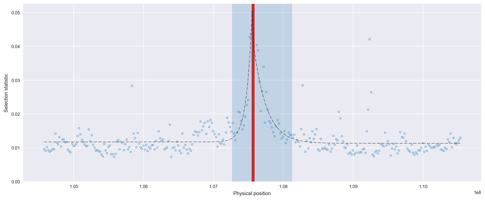
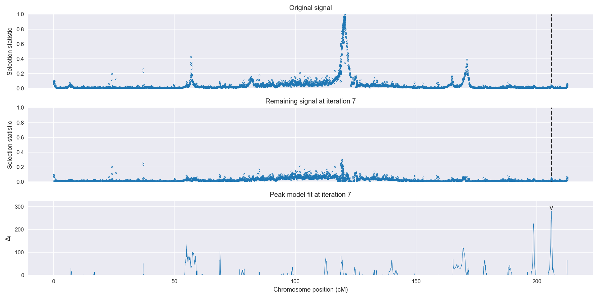
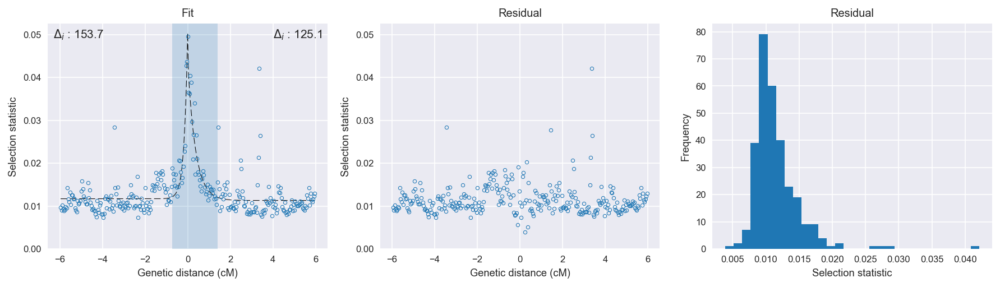

Burkina Faso *An. gambiae* | H12 | Chromosome 2 | Signal #7
================================================================================

This page describes a signal of selection found in the
:doc:`/populations/bfs` population using the
:doc:`/methods/h12` statistic.
The inferred focus of this signal is on chromosome arm 2L from
position 46,000,001 to 46,040,000.

The following 6 genes overlap the focal region: :doc:`/genes/AGAP007353` (phosphatidylinositol transfer protein SEC14),  :doc:`/genes/AGAP007354` (phosphatidylinositol transfer protein SEC14),  :doc:`/genes/AGAP007355` (cellular retinaldehyde binding protein),  :doc:`/genes/AGAP007356` (cellular retinaldehyde binding protein),  :doc:`/genes/AGAP007357` (retinaldehyde-binding protein 1-like protein 1),  :doc:`/genes/AGAP007358` (cellular retinaldehyde binding protein).

No genes overlap the windows immediately adjacent to the focal region.

    **Figure 1**. Location of the signal of selection. Blue markers show the
    value of the selection statistic in non-overlapping 20 kbp windows. The
    dashed black line shows the fitted peak model. The vertical red bar shows
    the inferred focus of the selection signal. The shaded blue area shows the
    inferred genomic region affected by the selection event.

Related signals
---------------

Overlapping signals
~~~~~~~~~~~~~~~~~~~

The following selection signals have an inferred focus which overlaps with the
focus of this signal:

.. cssclass:: table-hover
.. csv-table::
    :header: Signal, Chromosome, Start, Stop, Score, Genes

    :doc:`/signals/h12/bfs/1/index`, 2L, "2,420,000", "2,460,000", 511.2, AGAP001234
    :doc:`/signals/h12/bfs/1/index`, 2L, "2,420,000", "2,460,000", 511.2, AGAP001234
    :doc:`/signals/h12/bfs/1/index`, 2L, "2,420,000", "2,460,000", 511.2, AGAP001234
    :doc:`/signals/h12/bfs/1/index`, 2L, "2,420,000", "2,460,000", 511.2, AGAP001234

Adjacent signals
~~~~~~~~~~~~~~~~

The following selection signals have an inferred focus that is immediately
adjacent to the focus of this signal:

.. cssclass:: table-hover
.. csv-table::
    :header: Signal, Chromosome, Start, Stop, Score, Genes

    :doc:`/signals/h12/bfs/1/index`, 2L, "2,420,000", "2,460,000", 511.2, AGAP001234
    :doc:`/signals/h12/bfs/1/index`, 2L, "2,420,000", "2,460,000", 511.2, AGAP001234
    :doc:`/signals/h12/bfs/1/index`, 2L, "2,420,000", "2,460,000", 511.2, AGAP001234
    :doc:`/signals/h12/bfs/1/index`, 2L, "2,420,000", "2,460,000", 511.2, AGAP001234

Nearby signals
~~~~~~~~~~~~~~

The following signals affect a genome region that overlaps with the genome region
affected by this signal:

.. cssclass:: table-hover
.. csv-table::
    :header: Signal, Chromosome, Start, Stop, Score, Genes

    :doc:`/signals/h12/bfs/1/index`, 2L, "2,420,000", "2,460,000", 511.2, AGAP001234
    :doc:`/signals/h12/bfs/1/index`, 2L, "2,420,000", "2,460,000", 511.2, AGAP001234
    :doc:`/signals/h12/bfs/1/index`, 2L, "2,420,000", "2,460,000", 511.2, AGAP001234
    :doc:`/signals/h12/bfs/1/index`, 2L, "2,420,000", "2,460,000", 511.2, AGAP001234

Diagnostics
-----------

The information below provides some diagnostics from the
:doc:`/methods/peak_modelling` procedure.

    **Figure 2**. Chromosome-wide selection statistic and results from peak
    modelling. **a**, TODO. **b**, TODO.

    **Figure 3**. Diagnostics from fitting a peak model to the selection signal.
    **a**, TODO. **b**, TODO. **c**, TODO.

Model fit reports
~~~~~~~~~~~~~~~~~

Left flank, peak model::

    [[Model]]
        Model(exponential)
    [[Fit Statistics]]
        # function evals   = 39
        # data points      = 150
        # variables        = 3
        chi-square         = 0.001
        reduced chi-square = 0.000
        Akaike info crit   = -1733.554
        Bayesian info crit = -1724.522
    [[Variables]]
        amplitude:   0.03869332 +/- 0.002429 (6.28%) (init= 0.5)
        decay:       0.16183676 +/- 0.016647 (10.29%) (init= 0.2)
        c:           0.01170219 +/- 0.000265 (2.26%) (init= 0.04)
        cap:         1 (fixed)
    [[Correlations]] (unreported correlations are <  0.100)
        C(amplitude, decay)          = -0.587 
        C(decay, c)                  = -0.239 

Right flank, peak model::

    [[Model]]
        Model(exponential)
    [[Fit Statistics]]
        # function evals   = 27
        # data points      = 149
        # variables        = 3
        chi-square         = 0.002
        reduced chi-square = 0.000
        Akaike info crit   = -1633.095
        Bayesian info crit = -1624.083
    [[Variables]]
        amplitude:   0.03258401 +/- 0.003042 (9.34%) (init= 0.5)
        decay:       0.36906784 +/- 0.049738 (13.48%) (init= 0.2)
        c:           0.01129916 +/- 0.000389 (3.45%) (init= 0.04)
        cap:         1 (fixed)
    [[Correlations]] (unreported correlations are <  0.100)
        C(amplitude, decay)          = -0.701 
        C(decay, c)                  = -0.376 

Left flank, null model::

    [[Model]]
        Model(constant)
    [[Fit Statistics]]
        # function evals   = 12
        # data points      = 149
        # variables        = 1
        chi-square         = 0.004
        reduced chi-square = 0.000
        Akaike info crit   = -1579.873
        Bayesian info crit = -1576.869
    [[Variables]]
        c:   0.01263363 +/- 0.000407 (3.22%) (init= 0.04)

Right flank, null model::

    [[Model]]
        Model(constant)
    [[Fit Statistics]]
        # function evals   = 11
        # data points      = 148
        # variables        = 1
        chi-square         = 0.005
        reduced chi-square = 0.000
        Akaike info crit   = -1507.989
        Bayesian info crit = -1504.992
    [[Variables]]
        c:   0.01301404 +/- 0.000502 (3.86%) (init= 0.04)

Comments
--------

.. raw:: html

    

    
    <noscript>Please enable JavaScript to view the <a href="https://disqus.com/?ref_noscript">comments powered by Disqus.</a></noscript>
