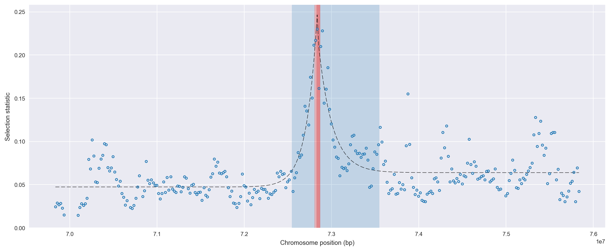
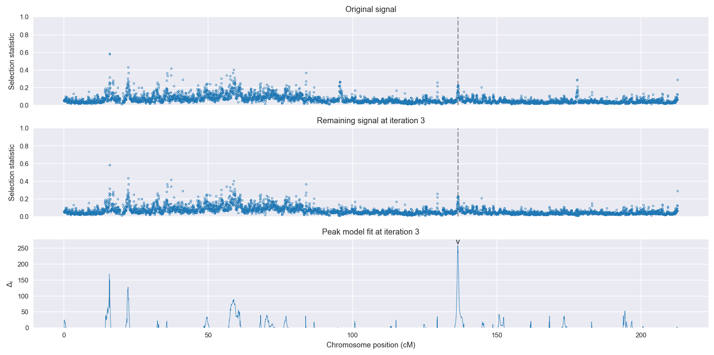
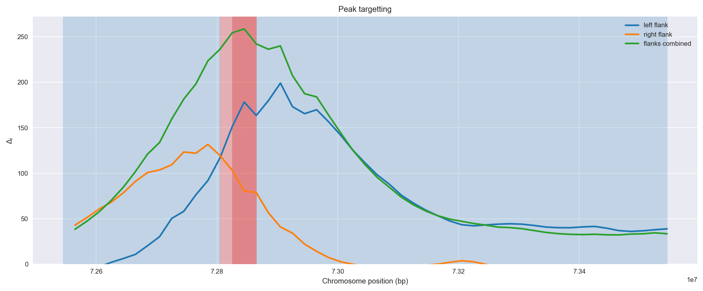
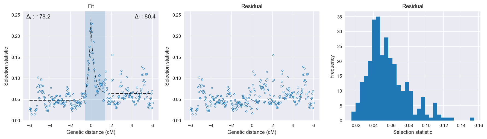

Guinea-Bissau | H12 | Chromosome 2 | Signal #3
================================================================================

This page describes a signal of selection found in the
:doc:`/populations/gwa` population using the
:doc:`/methods/h12` statistic.
The inferred focus of this signal is on chromosome arm 2L from
position 11,260,001 to 11,320,000.

The following 2 genes overlap the focal region: :doc:`/genes/AGAP005169`,  :doc:`/genes/AGAP005170`.

The following 3 genes are within 40 kbp of the focal
region: :doc:`/genes/AGAP005165`,  :doc:`/genes/AGAP005171` (Tctex1 domain-containing protein 4),  :doc:`/genes/AGAP005172`.

    **Figure 1**. Location of the signal of selection. Blue markers show the
    value of the selection statistic in non-overlapping 20 kbp windows. The
    dashed black line shows the fitted peak model. The vertical red bar shows
    the inferred focus of the selection signal. The shaded blue area shows the
    inferred genomic region affected by the selection event.

Related signals
---------------

Overlapping signals
~~~~~~~~~~~~~~~~~~~

The following selection signals have an inferred focus which overlaps with the
focus of this signal:

.. cssclass:: table-hover
.. csv-table::
    :widths: auto
    :header: Signal, Focus, Score

    

Adjacent signals
~~~~~~~~~~~~~~~~

The following selection signals have an inferred focus that is immediately
adjacent to the focus of this signal:

.. cssclass:: table-hover
.. csv-table::
    :header: Signal, Chromosome, Start, Stop, Score, Genes

    :doc:`/signals/h12/bfs/1/index`, 2L, "2,420,000", "2,460,000", 511.2, AGAP001234
    :doc:`/signals/h12/bfs/1/index`, 2L, "2,420,000", "2,460,000", 511.2, AGAP001234
    :doc:`/signals/h12/bfs/1/index`, 2L, "2,420,000", "2,460,000", 511.2, AGAP001234
    :doc:`/signals/h12/bfs/1/index`, 2L, "2,420,000", "2,460,000", 511.2, AGAP001234

Nearby signals
~~~~~~~~~~~~~~

The following signals affect a genome region that overlaps with the genome region
affected by this signal:

.. cssclass:: table-hover
.. csv-table::
    :header: Signal, Chromosome, Start, Stop, Score, Genes

    :doc:`/signals/h12/bfs/1/index`, 2L, "2,420,000", "2,460,000", 511.2, AGAP001234
    :doc:`/signals/h12/bfs/1/index`, 2L, "2,420,000", "2,460,000", 511.2, AGAP001234
    :doc:`/signals/h12/bfs/1/index`, 2L, "2,420,000", "2,460,000", 511.2, AGAP001234
    :doc:`/signals/h12/bfs/1/index`, 2L, "2,420,000", "2,460,000", 511.2, AGAP001234

Diagnostics
-----------

The information below provides some diagnostics from the
:doc:`/methods/peak_modelling` procedure.

    **Figure 2**. Chromosome-wide selection statistic and results from peak
    modelling. **a**, TODO. **b**, TODO.

    **Figure 3**. Diagnostics from targetting the selection signal to a focal
    region. TODO.

    **Figure 4**. Diagnostics from fitting a peak model to the selection signal.
    **a**, TODO. **b**, TODO. **c**, TODO.

Model fit reports
~~~~~~~~~~~~~~~~~

Left flank, peak model::

    [[Model]]
        Model(exponential)
    [[Fit Statistics]]
        # function evals   = 27
        # data points      = 142
        # variables        = 3
        chi-square         = 0.041
        reduced chi-square = 0.000
        Akaike info crit   = -1149.788
        Bayesian info crit = -1140.920
    [[Variables]]
        amplitude:   0.19911578 +/- 0.011957 (6.01%) (init= 0.5)
        decay:       0.24546960 +/- 0.023703 (9.66%) (init= 0.5)
        c:           0.04729236 +/- 0.001593 (3.37%) (init= 0.04)
        cap:         1 (fixed)
    [[Correlations]] (unreported correlations are <  0.100)
        C(amplitude, decay)          = -0.604 
        C(decay, c)                  = -0.308 

Right flank, peak model::

    [[Model]]
        Model(exponential)
    [[Fit Statistics]]
        # function evals   = 27
        # data points      = 148
        # variables        = 3
        chi-square         = 0.087
        reduced chi-square = 0.001
        Akaike info crit   = -1095.553
        Bayesian info crit = -1086.561
    [[Variables]]
        amplitude:   0.16294399 +/- 0.019723 (12.10%) (init= 0.5)
        decay:       0.31938714 +/- 0.054688 (17.12%) (init= 0.5)
        c:           0.06386592 +/- 0.002269 (3.55%) (init= 0.04)
        cap:         1 (fixed)
    [[Correlations]] (unreported correlations are <  0.100)
        C(amplitude, decay)          = -0.714 
        C(decay, c)                  = -0.348 

Left flank, null model::

    [[Model]]
        Model(constant)
    [[Fit Statistics]]
        # function evals   = 9
        # data points      = 141
        # variables        = 1
        chi-square         = 0.141
        reduced chi-square = 0.001
        Akaike info crit   = -971.598
        Bayesian info crit = -968.649
    [[Variables]]
        c:   0.05538852 +/- 0.002676 (4.83%) (init= 0.04)

Right flank, null model::

    [[Model]]
        Model(constant)
    [[Fit Statistics]]
        # function evals   = 11
        # data points      = 147
        # variables        = 1
        chi-square         = 0.145
        reduced chi-square = 0.001
        Akaike info crit   = -1015.132
        Bayesian info crit = -1012.141
    [[Variables]]
        c:   0.07105564 +/- 0.002602 (3.66%) (init= 0.04)

Comments
--------

.. raw:: html

    

    
    <noscript>Please enable JavaScript to view the <a href="https://disqus.com/?ref_noscript">comments powered by Disqus.</a></noscript>
