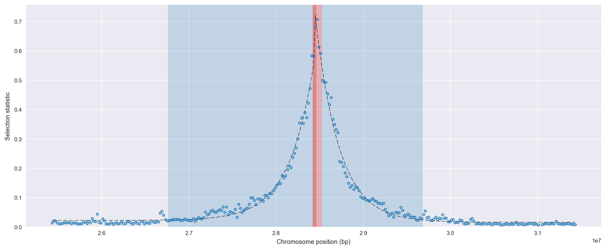
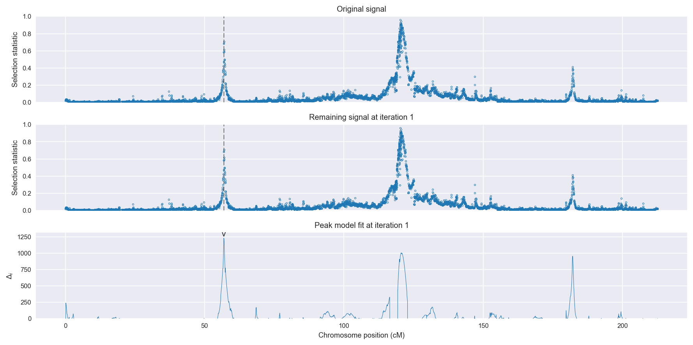
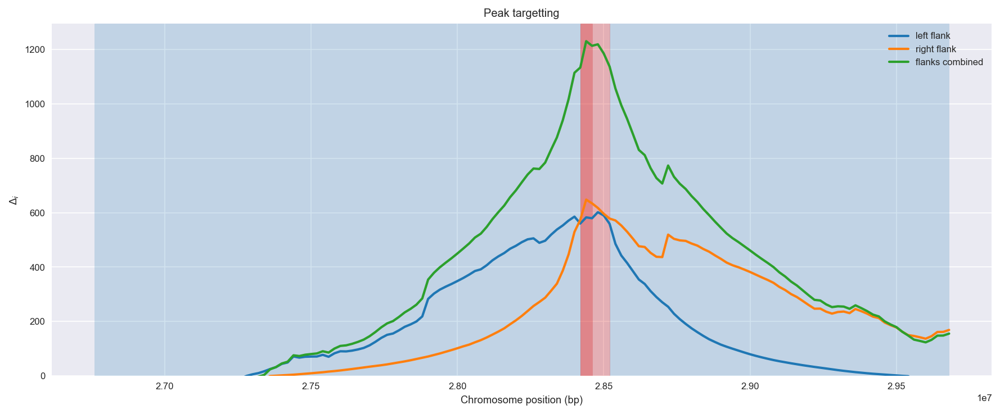
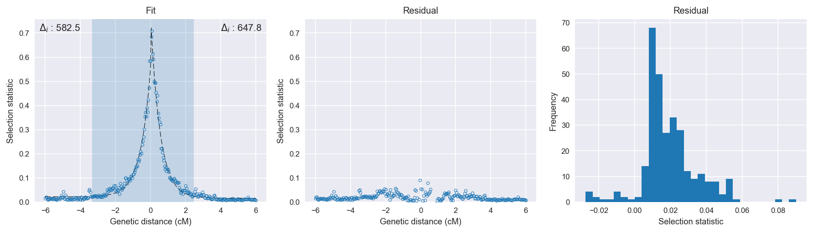

Uganda *An. gambiae* | H12 | Chromosome 2 | Signal #1
================================================================================

This page describes a signal of selection found in the
:doc:`/populations/ugs` population using the
:doc:`/methods/h12` statistic.
The inferred focus of this signal is on chromosome arm 2R from
position 28,420,001 to 28,520,000.

The following 12 genes overlap the focal region: :doc:`/genes/AGAP002859` (solute carrier family 8 (sodium/calcium exchanger)),  :doc:`/genes/AGAP002862` (CYP6AA1 - cytochrome P450),  :doc:`/genes/AGAP013128` (CYP6AA2 - cytochrome P450),  :doc:`/genes/AGAP002863` (COEAE6O - carboxylesterase alpha esterase),  :doc:`/genes/AGAP002864` (CYP6P15P - cytochrome P450),  :doc:`/genes/AGAP002865` (CYP6P3 - cytochrome P450),  :doc:`/genes/AGAP002866` (CYP6P5 - cytochrome P450),  :doc:`/genes/AGAP002867` (CYP6P4 - cytochrome P450),  :doc:`/genes/AGAP002868` (CYP6P1 - cytochrome P450),  :doc:`/genes/AGAP002869` (CYP6P2 - cytochrome P450),  :doc:`/genes/AGAP002870` (CYP6AD1 - cytochrome P450),  :doc:`/genes/AGAP013202`.

The following 6 genes are within 40 kbp of the focal
region: :doc:`/genes/AGAP002858` (Sodium/potassium-transporting ATPase subunit alpha),  :doc:`/genes/AGAP000586`,  :doc:`/genes/AGAP002872` (lipase),  :doc:`/genes/AGAP002873`,  :doc:`/genes/AGAP013069`,  :doc:`/genes/AGAP002874`.

    **Figure 1**. Location of the signal of selection. Blue markers show the
    value of the selection statistic in non-overlapping 20 kbp windows. The
    dashed black line shows the fitted peak model. The vertical red bar shows
    the inferred focus of the selection signal. The shaded blue area shows the
    inferred genomic region affected by the selection event.

Related signals
---------------

Overlapping signals
~~~~~~~~~~~~~~~~~~~

The following selection signals have an inferred focus which overlaps with the
focus of this signal:

.. cssclass:: table-hover
.. csv-table::
    :widths: auto
    :header: Signal, Focus, Score

    :doc:`/signals/h12/bfs/chr2/3/index`,"2R:28440001-28520000",753
    :doc:`/signals/h12/bfm/chr2/3/index`,"2R:28420001-28560000",557
    

Adjacent signals
~~~~~~~~~~~~~~~~

The following selection signals have an inferred focus that is immediately
adjacent to the focus of this signal:

.. cssclass:: table-hover
.. csv-table::
    :header: Signal, Chromosome, Start, Stop, Score, Genes

    :doc:`/signals/h12/bfs/1/index`, 2L, "2,420,000", "2,460,000", 511.2, AGAP001234
    :doc:`/signals/h12/bfs/1/index`, 2L, "2,420,000", "2,460,000", 511.2, AGAP001234
    :doc:`/signals/h12/bfs/1/index`, 2L, "2,420,000", "2,460,000", 511.2, AGAP001234
    :doc:`/signals/h12/bfs/1/index`, 2L, "2,420,000", "2,460,000", 511.2, AGAP001234

Nearby signals
~~~~~~~~~~~~~~

The following signals affect a genome region that overlaps with the genome region
affected by this signal:

.. cssclass:: table-hover
.. csv-table::
    :header: Signal, Chromosome, Start, Stop, Score, Genes

    :doc:`/signals/h12/bfs/1/index`, 2L, "2,420,000", "2,460,000", 511.2, AGAP001234
    :doc:`/signals/h12/bfs/1/index`, 2L, "2,420,000", "2,460,000", 511.2, AGAP001234
    :doc:`/signals/h12/bfs/1/index`, 2L, "2,420,000", "2,460,000", 511.2, AGAP001234
    :doc:`/signals/h12/bfs/1/index`, 2L, "2,420,000", "2,460,000", 511.2, AGAP001234

Diagnostics
-----------

The information below provides some diagnostics from the
:doc:`/methods/peak_modelling` procedure.

    **Figure 2**. Chromosome-wide selection statistic and results from peak
    modelling. **a**, TODO. **b**, TODO.

    **Figure 3**. Diagnostics from targetting the selection signal to a focal
    region. TODO.

    **Figure 4**. Diagnostics from fitting a peak model to the selection signal.
    **a**, TODO. **b**, TODO. **c**, TODO.

Model fit reports
~~~~~~~~~~~~~~~~~

Left flank, peak model::

    [[Model]]
        Model(exponential)
    [[Fit Statistics]]
        # function evals   = 23
        # data points      = 151
        # variables        = 3
        chi-square         = 0.032
        reduced chi-square = 0.000
        Akaike info crit   = -1269.823
        Bayesian info crit = -1260.771
    [[Variables]]
        amplitude:   0.52948486 +/- 0.007296 (1.38%) (init= 0.5)
        decay:       0.57330163 +/- 0.013208 (2.30%) (init= 0.5)
        c:           0.02210334 +/- 0.001526 (6.91%) (init= 0.04)
        cap:         1 (fixed)
    [[Correlations]] (unreported correlations are <  0.100)
        C(amplitude, decay)          = -0.583 
        C(decay, c)                  = -0.484 

Right flank, peak model::

    [[Model]]
        Model(exponential)
    [[Fit Statistics]]
        # function evals   = 23
        # data points      = 149
        # variables        = 3
        chi-square         = 0.034
        reduced chi-square = 0.000
        Akaike info crit   = -1244.401
        Bayesian info crit = -1235.389
    [[Variables]]
        amplitude:   0.75940106 +/- 0.008942 (1.18%) (init= 0.5)
        decay:       0.53929389 +/- 0.009796 (1.82%) (init= 0.5)
        c:           0.01598470 +/- 0.001559 (9.76%) (init= 0.04)
        cap:         1 (fixed)
    [[Correlations]] (unreported correlations are <  0.100)
        C(amplitude, decay)          = -0.660 
        C(decay, c)                  = -0.470 

Left flank, null model::

    [[Model]]
        Model(constant)
    [[Fit Statistics]]
        # function evals   = 11
        # data points      = 150
        # variables        = 1
        chi-square         = 1.515
        reduced chi-square = 0.010
        Akaike info crit   = -687.328
        Bayesian info crit = -684.317
    [[Variables]]
        c:   0.07073491 +/- 0.008231 (11.64%) (init= 0.04)

Right flank, null model::

    [[Model]]
        Model(constant)
    [[Fit Statistics]]
        # function evals   = 11
        # data points      = 148
        # variables        = 1
        chi-square         = 2.593
        reduced chi-square = 0.018
        Akaike info crit   = -596.558
        Bayesian info crit = -593.560
    [[Variables]]
        c:   0.07795459 +/- 0.010917 (14.01%) (init= 0.04)

Comments
--------

.. raw:: html

    

    
    <noscript>Please enable JavaScript to view the <a href="https://disqus.com/?ref_noscript">comments powered by Disqus.</a></noscript>
