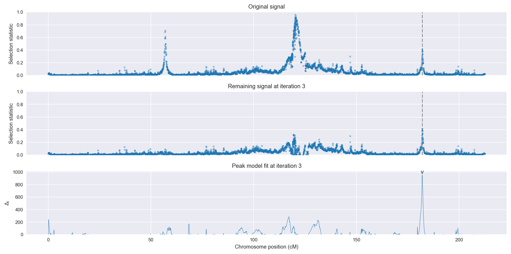
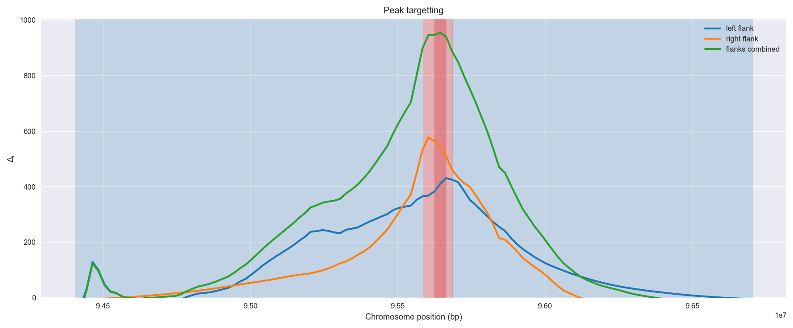
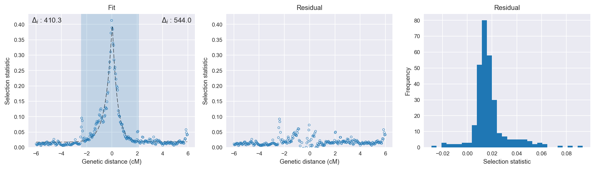

Uganda *An. gambiae* | H12 | Chromosome 2 | Signal #3
================================================================================

This page describes a signal of selection found in the
:doc:`/populations/ugs` population using the
:doc:`/methods/h12` statistic.
The inferred focus of this signal is on chromosome arm 2L from
position 34,040,001 to 34,140,000.

The following 20 genes overlap the focal region: :doc:`/genes/AGAP006539` (eupolytin),  :doc:`/genes/AGAP006540` (LIM homeobox protein),  :doc:`/genes/AGAP006541` (Transcriptional regulators containing a dna-binding hth domain and an aminotransferase domain transcription regulator protein),  :doc:`/genes/AGAP006542` (cactin),  :doc:`/genes/AGAP006543`,  :doc:`/genes/AGAP028608`,  :doc:`/genes/AGAP006546`,  :doc:`/genes/AGAP006547`,  :doc:`/genes/AGAP006548` (glycine cleavage system H protein),  :doc:`/genes/AGAP006549`,  :doc:`/genes/AGAP006550`,  :doc:`/genes/AGAP006551`,  :doc:`/genes/AGAP006552`,  :doc:`/genes/AGAP006553`,  :doc:`/genes/AGAP006554`,  :doc:`/genes/AGAP006555`,  :doc:`/genes/AGAP006556`,  :doc:`/genes/AGAP006557`,  :doc:`/genes/AGAP006558`,  :doc:`/genes/AGAP006559`.

The following 15 genes are within 40 kbp of the focal
region: :doc:`/genes/AGAP006536` (Arrowhead),  :doc:`/genes/AGAP006537` (Arrowhead),  :doc:`/genes/AGAP006560`,  :doc:`/genes/AGAP006561`,  :doc:`/genes/AGAP006562`,  :doc:`/genes/AGAP006563`,  :doc:`/genes/AGAP006564`,  :doc:`/genes/AGAP028429`,  :doc:`/genes/AGAP006566`,  :doc:`/genes/AGAP028428`,  :doc:`/genes/AGAP006567`,  :doc:`/genes/AGAP006568`,  :doc:`/genes/AGAP006569` (acetyl-CoA synthetase),  :doc:`/genes/AGAP006570` (myo-inositol-1(or 4)-monophosphatase),  :doc:`/genes/AGAP006571` (nuclear receptor subfamily 1 group D member 3).

.. figure:: signal_location.png
    :alt: signal location

    **Figure 1**. Location of the signal of selection. Blue markers show the
    value of the selection statistic in non-overlapping 20 kbp windows. The
    dashed black line shows the fitted peak model. The vertical red bar shows
    the inferred focus of the selection signal. The shaded blue area shows the
    inferred genomic region affected by the selection event.

Related signals
---------------

Overlapping signals
~~~~~~~~~~~~~~~~~~~

The following selection signals have an inferred focus which overlaps with the
focus of this signal:

.. cssclass:: table-hover
.. csv-table::
    :widths: auto
    :header: Signal, Focus, Score

    

Adjacent signals
~~~~~~~~~~~~~~~~

The following selection signals have an inferred focus that is immediately
adjacent to the focus of this signal:

.. cssclass:: table-hover
.. csv-table::
    :header: Signal, Chromosome, Start, Stop, Score, Genes

    :doc:`/signals/h12/bfs/1/index`, 2L, "2,420,000", "2,460,000", 511.2, AGAP001234
    :doc:`/signals/h12/bfs/1/index`, 2L, "2,420,000", "2,460,000", 511.2, AGAP001234
    :doc:`/signals/h12/bfs/1/index`, 2L, "2,420,000", "2,460,000", 511.2, AGAP001234
    :doc:`/signals/h12/bfs/1/index`, 2L, "2,420,000", "2,460,000", 511.2, AGAP001234

Nearby signals
~~~~~~~~~~~~~~

The following signals affect a genome region that overlaps with the genome region
affected by this signal:

.. cssclass:: table-hover
.. csv-table::
    :header: Signal, Chromosome, Start, Stop, Score, Genes

    :doc:`/signals/h12/bfs/1/index`, 2L, "2,420,000", "2,460,000", 511.2, AGAP001234
    :doc:`/signals/h12/bfs/1/index`, 2L, "2,420,000", "2,460,000", 511.2, AGAP001234
    :doc:`/signals/h12/bfs/1/index`, 2L, "2,420,000", "2,460,000", 511.2, AGAP001234
    :doc:`/signals/h12/bfs/1/index`, 2L, "2,420,000", "2,460,000", 511.2, AGAP001234

Diagnostics
-----------

The information below provides some diagnostics from the
:doc:`/methods/peak_modelling` procedure.

    **Figure 2**. Chromosome-wide selection statistic and results from peak
    modelling. **a**, TODO. **b**, TODO.

    **Figure 3**. Diagnostics from targetting the selection signal to a focal
    region. TODO.

    **Figure 4**. Diagnostics from fitting a peak model to the selection signal.
    **a**, TODO. **b**, TODO. **c**, TODO.

Model fit reports
~~~~~~~~~~~~~~~~~

Left flank, peak model::

    [[Model]]
        Model(exponential)
    [[Fit Statistics]]
        # function evals   = 27
        # data points      = 151
        # variables        = 3
        chi-square         = 0.046
        reduced chi-square = 0.000
        Akaike info crit   = -1215.868
        Bayesian info crit = -1206.816
    [[Variables]]
        amplitude:   0.36775417 +/- 0.009163 (2.49%) (init= 0.5)
        decay:       0.51129361 +/- 0.020977 (4.10%) (init= 0.5)
        c:           0.01722412 +/- 0.001768 (10.27%) (init= 0.04)
        cap:         1 (fixed)
    [[Correlations]] (unreported correlations are <  0.100)
        C(amplitude, decay)          = -0.593 
        C(decay, c)                  = -0.451 

Right flank, peak model::

    [[Model]]
        Model(exponential)
    [[Fit Statistics]]
        # function evals   = 23
        # data points      = 149
        # variables        = 3
        chi-square         = 0.015
        reduced chi-square = 0.000
        Akaike info crit   = -1368.419
        Bayesian info crit = -1359.407
    [[Variables]]
        amplitude:   0.41706546 +/- 0.007191 (1.72%) (init= 0.5)
        decay:       0.38610396 +/- 0.009678 (2.51%) (init= 0.5)
        c:           0.01843426 +/- 0.000955 (5.18%) (init= 0.04)
        cap:         1 (fixed)
    [[Correlations]] (unreported correlations are <  0.100)
        C(amplitude, decay)          = -0.697 
        C(decay, c)                  = -0.386 

Left flank, null model::

    [[Model]]
        Model(constant)
    [[Fit Statistics]]
        # function evals   = 9
        # data points      = 150
        # variables        = 1
        chi-square         = 0.689
        reduced chi-square = 0.005
        Akaike info crit   = -805.529
        Bayesian info crit = -802.518
    [[Variables]]
        c:   0.04716467 +/- 0.005551 (11.77%) (init= 0.04)

Right flank, null model::

    [[Model]]
        Model(constant)
    [[Fit Statistics]]
        # function evals   = 7
        # data points      = 148
        # variables        = 1
        chi-square         = 0.556
        reduced chi-square = 0.004
        Akaike info crit   = -824.442
        Bayesian info crit = -821.445
    [[Variables]]
        c:   0.04178215 +/- 0.005054 (12.10%) (init= 0.04)

Comments
--------

.. raw:: html

    

    
    <noscript>Please enable JavaScript to view the <a href="https://disqus.com/?ref_noscript">comments powered by Disqus.</a></noscript>
